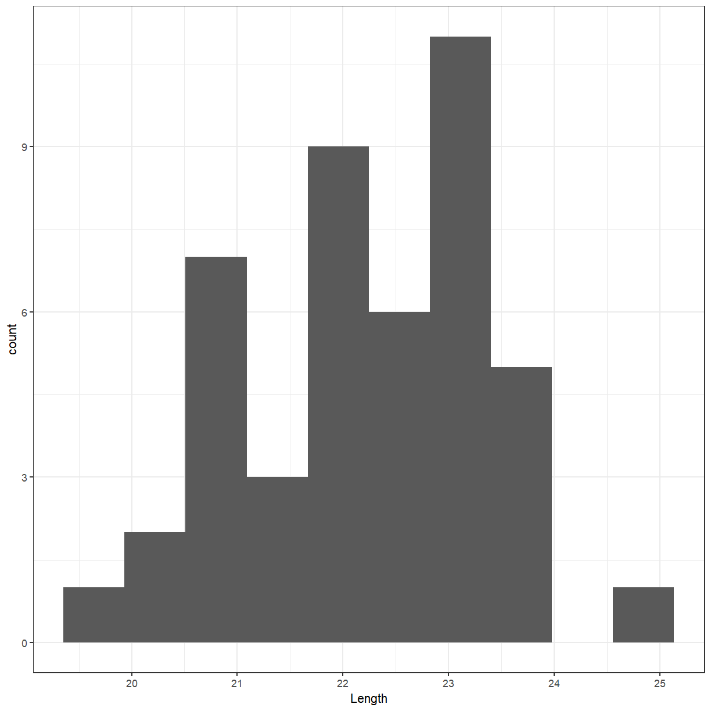
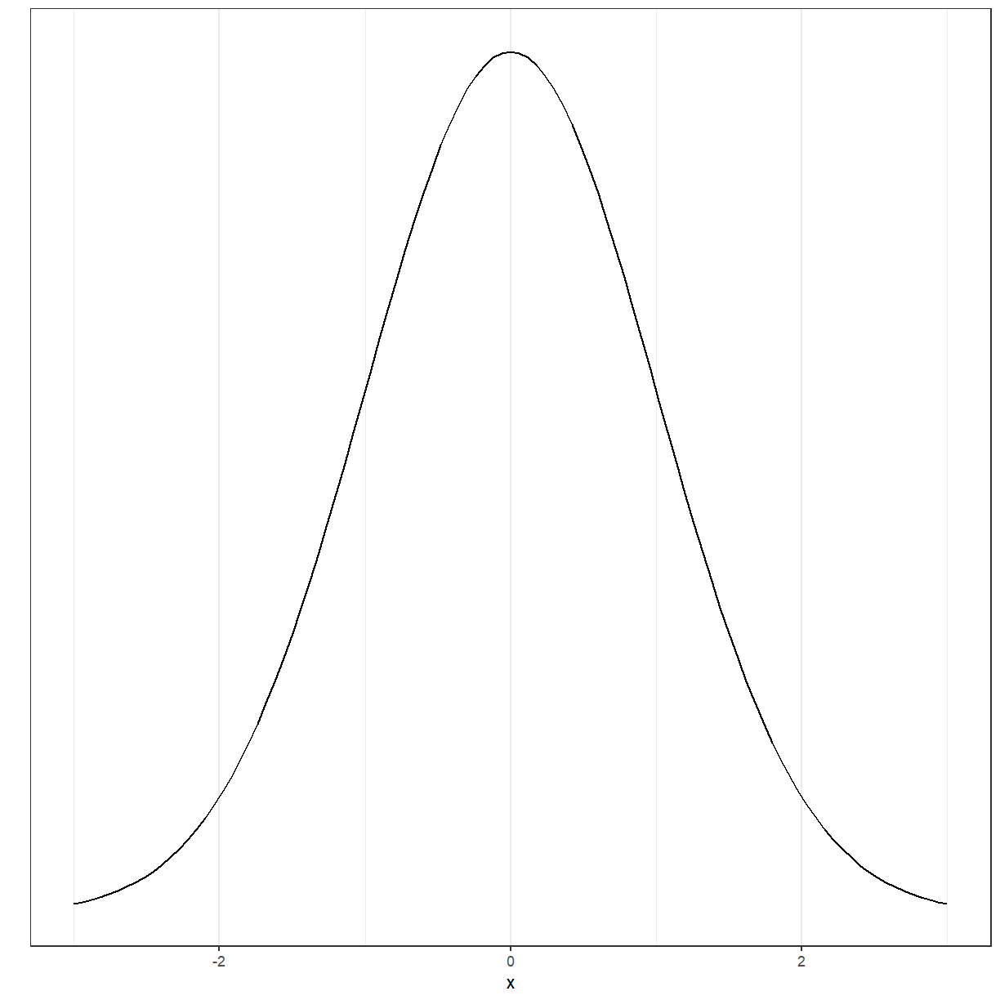
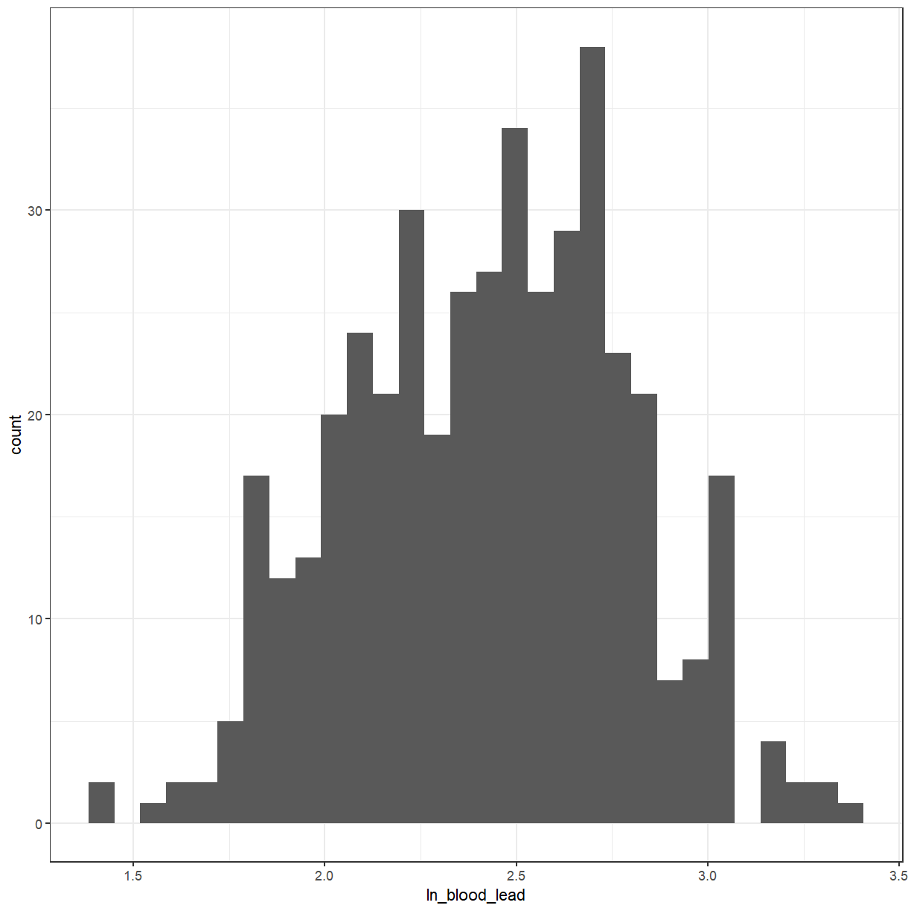
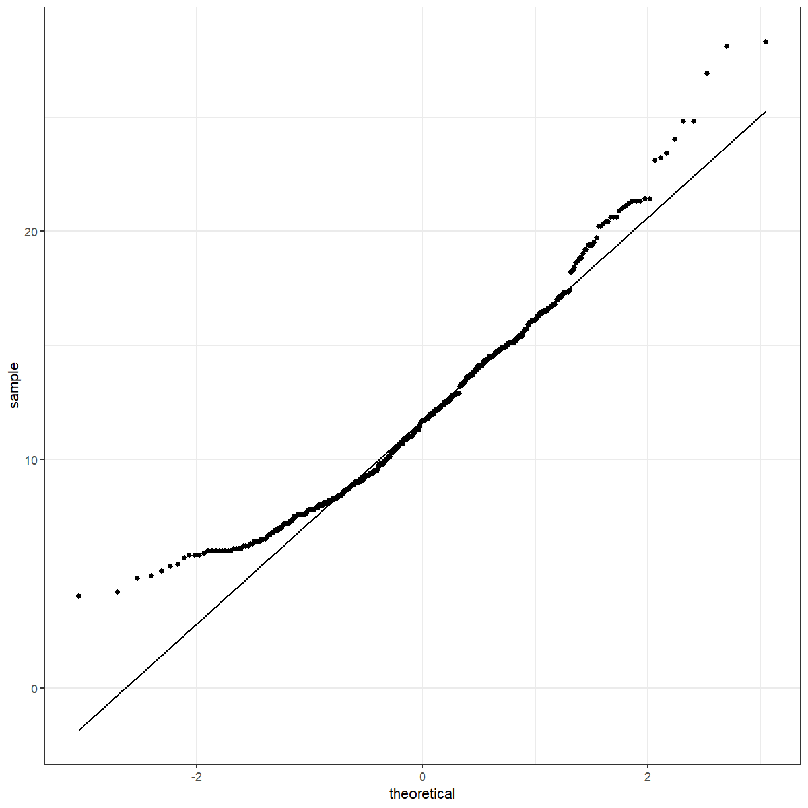
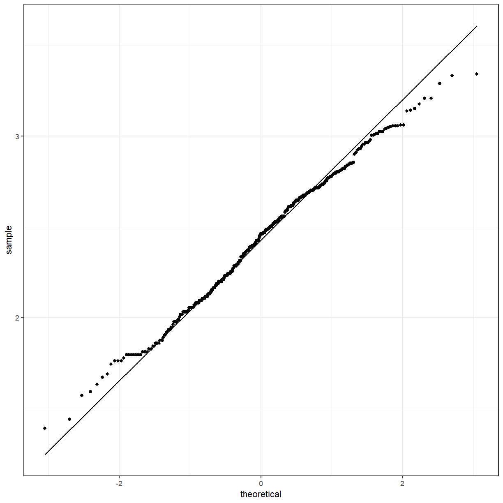
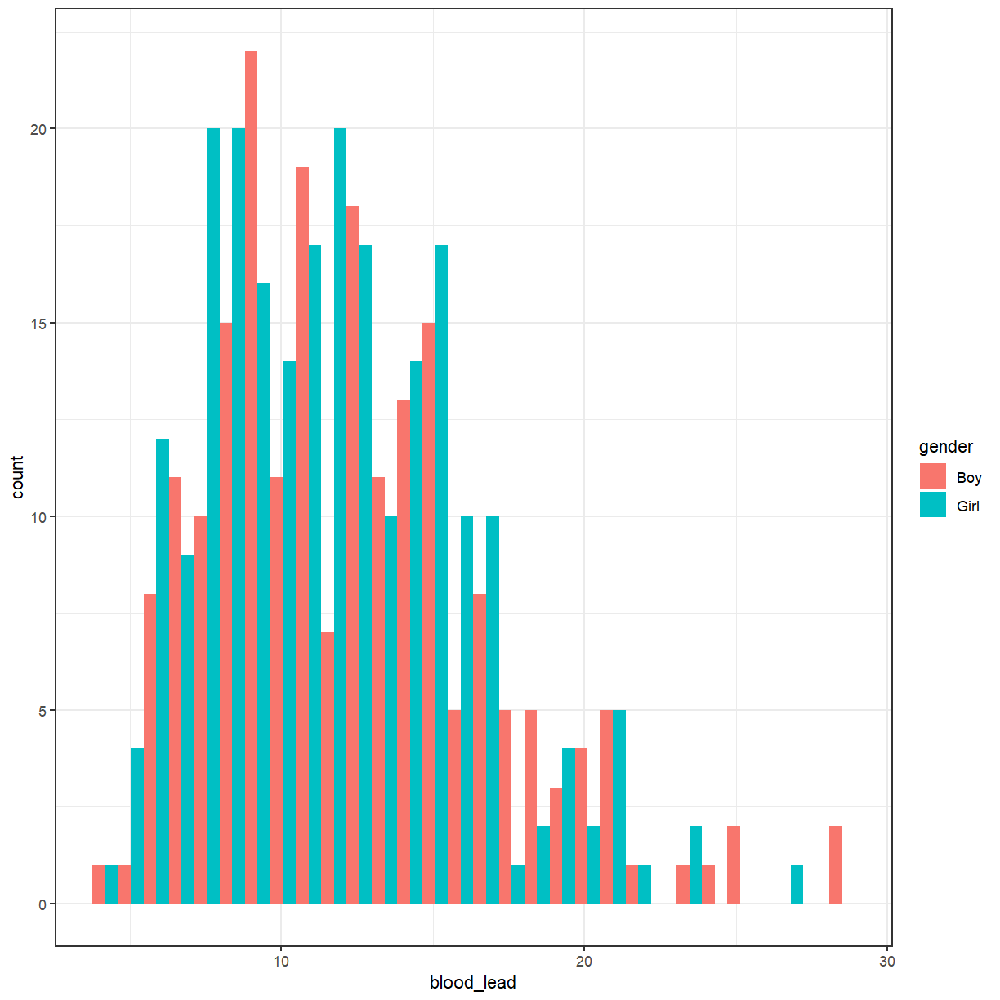
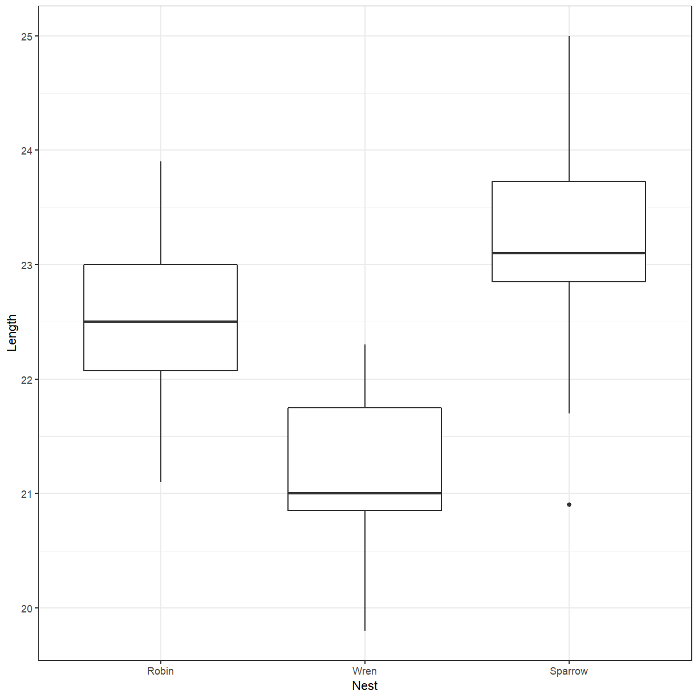

---
# Please do not edit this file directly; it is auto generated.
# Instead, please edit 02-preparing-data.md in _episodes_rmd/
title: "Preparing and Investigating Data"
teaching: 60
exercises: 30
questions:
- "What to do before you can bring the data into R?"
objectives:
- "Identify different data types"
- "Recognise different types of visualisations"
keypoints:
- "Data should have 1 observation per row."
source: "Rmd"
---

First, we need to load the `tidyverse` package (actually a collection of packages).

~~~
library(tidyverse)
~~~
{: .language-r}

We can now load the **Pattani** data from the Excel file. For the notes, this is stored
in the `data` directory. It might be different for you.

~~~
path <- file.path("..", "data", "Pattani.xlsx")
pattani <- readxl::read_excel(path, sheet = "Data", skip = 1)
~~~
{: .language-r}

`readxl::read_excel` is used to explicitly call the `read_excel` function in the `readxl`
package.

We would like to see what the data looks like now that it has been read into R. You can
just type the name of the dataset.

~~~
pattani
~~~
{: .language-r}

~~~
# A tibble: 434 x 8
      ID `blood lead`   age gender school   duration water `ln(blood lead)`
   <dbl>        <dbl> <dbl> <chr>  <chr>       <dbl> <chr>            <dbl>
 1     1         11.7    13 Boy    Tangkad~       13 Boil              2.46
 2     2         11.8    13 Boy    Tangkad~        5 Boil              2.47
 3     3          6.4    13 Girl   Tangkad~       13 Stand             1.86
 4     4          6.9    11 Girl   Tangkad~       11 Boil              1.93
 5     5         10.3    13 Girl   Tangkad~        5 Boil              2.33
 6     6          8.3    13 Girl   Tangkad~       13 Filt~             2.12
 7     7          6.2    13 Girl   Tangkad~        5 Filt~             1.82
 8     8          9.4    13 Boy    Tangkad~       13 Stand             2.24
 9     9         14.9    11 Boy    Tangkad~       11 Boil              2.70
10    10          8.1    11 Girl   Tangkad~       11 Filt~             2.09
# ... with 424 more rows
~~~
{: .output}

> ## Read in the cuckoo data
>
> Use the `read_csv` function in the `readr` package to load `cuckoo.csv`.
>
> > ## Solution
> >
> > 
> > ~~~
> > cuckoo <- readr::read_csv(file.path("..", "data", "cuckoo.csv"))
> > cuckoo
> > ~~~
> > {: .language-r}
> > 
> > 
> > 
> > ~~~
> > # A tibble: 45 x 2
> >    Nest  Length
> >    <chr>  <dbl>
> >  1 Robin   21.8
> >  2 Robin   23.9
> >  3 Robin   23  
> >  4 Robin   22.3
> >  5 Robin   23.3
> >  6 Robin   22  
> >  7 Robin   22.4
> >  8 Robin   22.6
> >  9 Robin   22.4
> > 10 Robin   22  
> > # ... with 35 more rows
> > ~~~
> > {: .output}
> {: .solution}
{: .challenge}

Having names with spaces in them can make them more difficult to work with. We can add to
the way that we read the file to modify the names.

~~~
pattani <- readxl::read_excel(path, sheet = "Data", skip = 1) %>%
  rename(blood_lead = `blood lead`, ln_blood_lead = `ln(blood lead)`)

pattani
~~~
{: .language-r}

~~~
# A tibble: 434 x 8
      ID blood_lead   age gender school     duration water  ln_blood_lead
   <dbl>      <dbl> <dbl> <chr>  <chr>         <dbl> <chr>          <dbl>
 1     1       11.7    13 Boy    Tangkadeng       13 Boil            2.46
 2     2       11.8    13 Boy    Tangkadeng        5 Boil            2.47
 3     3        6.4    13 Girl   Tangkadeng       13 Stand           1.86
 4     4        6.9    11 Girl   Tangkadeng       11 Boil            1.93
 5     5       10.3    13 Girl   Tangkadeng        5 Boil            2.33
 6     6        8.3    13 Girl   Tangkadeng       13 Filter          2.12
 7     7        6.2    13 Girl   Tangkadeng        5 Filter          1.82
 8     8        9.4    13 Boy    Tangkadeng       13 Stand           2.24
 9     9       14.9    11 Boy    Tangkadeng       11 Boil            2.70
10    10        8.1    11 Girl   Tangkadeng       11 Filter          2.09
# ... with 424 more rows
~~~
{: .output}

> ## What does `%>%` mean?
> 
> `%>%` is something from the `tidyverse` called a **pipe**. It allows you to take the output
> from 1 function (in this case `read_excel`) and put it directly into another function
> (`rename`). It is as though there is a **pipe** connecting the functions together.
{: .callout}

### Simple summary statistics

Previously we got a preview of the data, but we might want to get some summary statistics
about the columns. You can use the function `summary` for this.

~~~
summary(pattani)
~~~
{: .language-r}

~~~
       ID          blood_lead         age            gender         
 Min.   :  1.0   Min.   : 4.00   Min.   : 5.000   Length:434        
 1st Qu.:116.2   1st Qu.: 8.70   1st Qu.: 8.000   Class :character  
 Median :231.5   Median :11.70   Median : 9.000   Mode  :character  
 Mean   :229.5   Mean   :12.05   Mean   : 9.281                     
 3rd Qu.:344.8   3rd Qu.:14.70   3rd Qu.:11.000                     
 Max.   :454.0   Max.   :28.30   Max.   :13.000                     
                 NA's   :1                                          
    school             duration         water           ln_blood_lead  
 Length:434         Min.   : 2.000   Length:434         Min.   :1.386  
 Class :character   1st Qu.: 5.000   Class :character   1st Qu.:2.163  
 Mode  :character   Median : 8.000   Mode  :character   Median :2.460  
                    Mean   : 7.922                      Mean   :2.425  
                    3rd Qu.:10.000                      3rd Qu.:2.688  
                    Max.   :13.000                      Max.   :3.343  
                                                        NA's   :1      
~~~
{: .output}

Have a look at the `character` columns. What sort of variables are these?

If we convert these to `factor` then R knows that they are categorical variables and does
some helpful things for us. We will use the `as_factor` function, which is part of the
`tidyverse`. There is also a base R function `as.factor` (note the `.` instead of `_`)
but we will use the `tidyverse` version.

~~~
pattani <- readxl::read_excel(path, sheet = "Data", skip = 1) %>%
  rename(blood_lead = `blood lead`, ln_blood_lead = `ln(blood lead)`) %>%
  mutate(gender = as_factor(gender), school = as_factor(school), water = as_factor(water))
~~~
{: .language-r}

What happens if we run the summary now?

~~~
summary(pattani)
~~~
{: .language-r}

~~~
       ID          blood_lead         age          gender   
 Min.   :  1.0   Min.   : 4.00   Min.   : 5.000   Boy :204  
 1st Qu.:116.2   1st Qu.: 8.70   1st Qu.: 8.000   Girl:230  
 Median :231.5   Median :11.70   Median : 9.000             
 Mean   :229.5   Mean   :12.05   Mean   : 9.281             
 3rd Qu.:344.8   3rd Qu.:14.70   3rd Qu.:11.000             
 Max.   :454.0   Max.   :28.30   Max.   :13.000             
                 NA's   :1                                  
        school       duration          water     ln_blood_lead  
 Tangkadeng:136   Min.   : 2.000   Boil   :163   Min.   :1.386  
 Thamthalu : 46   1st Qu.: 5.000   Stand  :163   1st Qu.:2.163  
 Tachi     :128   Median : 8.000   Filter : 48   Median :2.460  
 Tesabal 3 : 62   Mean   : 7.922   Nothing: 56   Mean   :2.425  
 Sabarang  : 62   3rd Qu.:10.000   NA's   :  4   3rd Qu.:2.688  
                  Max.   :13.000                 Max.   :3.343  
                                                 NA's   :1      
~~~
{: .output}

The factor variables now show the number of each element in the variables.

> ## Convert cuckoo data to a factor
>
> Convert the `Nest` column to a factor and display the summary.
>
> > ## Solution
> >
> > 
> > ~~~
> > cuckoo <- readr::read_csv(file.path("..", "data", "cuckoo.csv")) %>%
> >   mutate(Nest = as_factor(Nest))
> > summary(cuckoo)
> > ~~~
> > {: .language-r}
> > 
> > 
> > 
> > ~~~
> >       Nest        Length     
> >  Robin  :16   Min.   :19.80  
> >  Wren   :15   1st Qu.:21.20  
> >  Sparrow:14   Median :22.30  
> >               Mean   :22.24  
> >               3rd Qu.:23.00  
> >               Max.   :25.00  
> > ~~~
> > {: .output}
> {: .solution}
{: .challenge}

## Visualising the data

We will start with a histogram of the levels of lead in the blood.

~~~
ggplot(pattani, aes(x = blood_lead)) +
  geom_histogram()
~~~
{: .language-r}

I am not a fan of the grey background that is the default with `ggplot` graphs. You can
change that by adding a theme.

~~~
ggplot(pattani, aes(x = blood_lead)) +
  geom_histogram() +
  theme_bw()
~~~
{: .language-r}

I will set the default theme so that I don't have to specify it each time.

~~~
theme_set(theme_bw())
~~~
{: .language-r}

> ## Create a histogram of the cuckoo egg lengths
>
> Create a histogram of the cuckoo egg lengths
>
> > ## Solution
> >
> > 
> > ~~~
> > ggplot(cuckoo, aes(x = Length)) +
> >   geom_histogram(bins = 10)
> > ~~~
> > {: .language-r}
> > 
> > 
> {: .solution}
{: .challenge}

### Distribution?

> - The **distribution** of a variable tells us what values it takes and how often it
>   takes these values.
> - When examining a distribution, look for **shape**, **center**, and **spread** and for
>   clear **deviations** from the overall shape.
>
> _Moore, McCabe & Craig (2017)_
{: .quotation}

You have probably heard of the Normal distribution, which has a **bell shape**.

~~~
ggplot(data = data.frame(x = c(-3, 3)), aes(x)) +
  stat_function(fun = dnorm, n = 101, args = list(mean = 0, sd = 1)) + ylab("") +
  scale_y_continuous(breaks = NULL)
~~~
{: .language-r}

There are several other distributions. Several of the tests and models that we will discuss
in this workshop have as one of the assumptions that either the data or the residuals
of the model are Normally distributed.

### Now back to what we were doing

For a lot of the statistical tests that we will be doing later, we would like the variable
to be normally distributed. Looking at the histogram, it should be symmetric and bell-shaped.

~~~
ggplot(pattani, aes(x = ln_blood_lead)) +
  geom_histogram()
~~~
{: .language-r}

It looks a little bit better. We can also use a QQ-plot to check for normality. The points
should lie approximately along the line.

~~~
ggplot(pattani, aes(sample = blood_lead)) +
  geom_qq() +
  geom_qq_line()
~~~
{: .language-r}

~~~
ggplot(pattani, aes(sample = ln_blood_lead)) +
  geom_qq() +
  geom_qq_line()
~~~
{: .language-r}

What if we wanted to see the difference between the boys and girls?

~~~
ggplot(pattani, aes(x = blood_lead, fill = gender)) +
  geom_histogram()
~~~
{: .language-r}

That produced a stacked histogram, which isn't all that easy to read. It might be better
if they were side-by-side.

~~~
ggplot(pattani, aes(x = blood_lead, fill = gender)) +
  geom_histogram(position = "dodge")
~~~
{: .language-r}

> ## Cuckoo egg lengths by host nest
>
> Create a histogram of the cuckoo egg lengths with colours showing the host nest species.
>
> > ## Solution
> >
> > 
> > ~~~
> > ggplot(cuckoo, aes(x = Length, fill = Nest)) +
> >   geom_histogram(position = "dodge", bins = 10)
> > ~~~
> > {: .language-r}
> > 
> > 
> {: .solution}
{: .challenge}

<!--
> ## Cuckoo egg lengths dotplot
>
> Create a dotplot of the cuckoo egg lengths. You can use the `geom_dotplot` function.
> You might want to use `binwidth = 0.5` in `geom_dotplot`.
>
> > ## Solution
> >
> > 
> > ~~~
> > ggplot(cuckoo, aes(x = Length, fill = Nest)) +
> >   geom_dotplot(binwidth = 0.5)
> > ~~~
> > {: .language-r}
> > 
> > 
> {: .solution}
{: .challenge}
-->

There doesn't seem to be much difference. Perhaps we should try a box plot. Notice that
`gender` is now the `x` variable and `blood_lead` is the `y` variable.

~~~
ggplot(pattani, aes(x = gender, y = blood_lead)) +
  geom_boxplot()
~~~
{: .language-r}

The box plot also suggests that there isn't much difference between boys and girls.
What about between schools?

~~~
ggplot(pattani, aes(x = school, y = blood_lead)) +
  geom_boxplot()
~~~
{: .language-r}

> ## Box plot of cuckoo egg lengths by host nest
>
> Create a box plot of the cuckoo egg lengths with colours showing the host nest species.
>
> > ## Solution
> >
> > 
> > ~~~
> > ggplot(cuckoo, aes(x = Nest, y = Length)) +
> >   geom_boxplot()
> > ~~~
> > {: .language-r}
> > 
> > 
> {: .solution}
{: .challenge}

There does seems to be more difference between schools than between genders. We can add
gender back in again. Again, we have to use `position = "dodge"`.

~~~
ggplot(pattani, aes(x = school, y = blood_lead, fill = gender)) +
  geom_boxplot(position = "dodge")
~~~
{: .language-r}

You can add a little bit of space between the boxes.

~~~
ggplot(pattani, aes(x = school, y = blood_lead, fill = gender)) +
  geom_boxplot(position = position_dodge(1))
~~~
{: .language-r}


