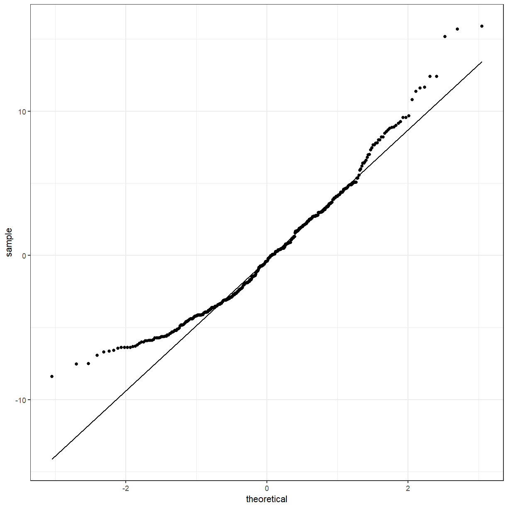

---
# Please do not edit this file directly; it is auto generated.
# Instead, please edit 03-testing-differences.md in _episodes_rmd/
title: "Testing differences in categories"
author: "Tim Keighley"
teaching: 60
exercises: 0
questions:
- ""
objectives:
- "Choose the appropriate test for the data you have."
- ""
keypoints:
- "You can use _t_ tests and ANOVAs if you have a continuous response and categorical predictors."
source: "Rmd"
---

## Numeric summaries of groups

In the previous lesson we looked at some visualisations of the data that suggested that there
might be differences between some of the groups, but we would like to test this.

To start, we might want to look at the different groups in numbers. We can use one of the
`tidyverse` packages, `dplyr`, to calculate these numbers.

~~~
library(tidyverse)

pattani %>%
  summarise(mean = mean(blood_lead), sd = sd(blood_lead))
~~~
{: .language-r}

~~~
# A tibble: 1 x 2
   mean    sd
  <dbl> <dbl>
1    NA   NaN
~~~
{: .output}

We don't get any results! Remember that the `blood_lead` variable had some missing values. By
default, the functions `mean` and `sd` will not give you a result if the input has missing
values. We can ask the functions to ignore them by using the argument `na.rm = TRUE`.

~~~
pattani %>%
  summarise(mean = mean(blood_lead, na.rm = TRUE), sd = sd(blood_lead, na.rm = TRUE))
~~~
{: .language-r}

~~~
# A tibble: 1 x 2
   mean    sd
  <dbl> <dbl>
1  12.0  4.34
~~~
{: .output}

> ## Naming the arguments in `summarise`
>
> It isn't necessary to name the arguments in `summarise` but it makes the output neater.
{: .callout}

These give us the mean and standard deviation for the entire variable, but we want to split
that up by some other variables. For this we will use the `group_by` function.

~~~
pattani %>%
  group_by(gender) %>%
  summarise(mean = mean(blood_lead, na.rm = TRUE), sd = sd(blood_lead, na.rm = TRUE))
~~~
{: .language-r}

~~~
# A tibble: 2 x 3
  gender  mean    sd
  <fct>  <dbl> <dbl>
1 Boy     12.4  4.57
2 Girl    11.7  4.11
~~~
{: .output}

Or by school:

~~~
pattani %>%
  group_by(school) %>%
  summarise(mean = mean(blood_lead, na.rm = TRUE), sd = sd(blood_lead, na.rm = TRUE))
~~~
{: .language-r}

~~~
# A tibble: 5 x 3
  school      mean    sd
  <fct>      <dbl> <dbl>
1 Tangkadeng  8.48  2.31
2 Thamthalu  16.5   4.32
3 Tachi      12.9   4.03
4 Tesabal 3  15.2   3.32
5 Sabarang   11.6   2.92
~~~
{: .output}

You can also do both:

~~~
pattani %>%
  group_by(gender, school) %>%
  summarise(mean = mean(blood_lead, na.rm = TRUE), sd = sd(blood_lead, na.rm = TRUE))
~~~
{: .language-r}

~~~
# A tibble: 10 x 4
# Groups:   gender [2]
   gender school      mean    sd
   <fct>  <fct>      <dbl> <dbl>
 1 Boy    Tangkadeng  8.72  2.24
 2 Boy    Thamthalu  17.6   4.66
 3 Boy    Tachi      13.4   4.18
 4 Boy    Tesabal 3  15.3   2.60
 5 Boy    Sabarang   11.7   3.07
 6 Girl   Tangkadeng  8.22  2.38
 7 Girl   Thamthalu  14.8   3.25
 8 Girl   Tachi      12.6   3.92
 9 Girl   Tesabal 3  15.1   3.95
10 Girl   Sabarang   11.5   2.87
~~~
{: .output}

## Testing the difference between 2 groups

Going back to the difference by gender,

~~~
pattani %>%
  group_by(gender) %>%
  summarise(mean = mean(blood_lead, na.rm = TRUE), sd = sd(blood_lead, na.rm = TRUE))
~~~
{: .language-r}

~~~
# A tibble: 2 x 3
  gender  mean    sd
  <fct>  <dbl> <dbl>
1 Boy     12.4  4.57
2 Girl    11.7  4.11
~~~
{: .output}

We can see that the means of the boys are similar to the means of the girls, but we would like
to formally test if they are statistically different from each other. One way to do this is
with a **_t_ test**, using the R function `t.test`.

The question we are asking is **Is the mean blood lead level for the boys different to the mean
blood lead level for the girls?** Formally, we could say:

$$H_0: \mu_{boys} = \mu_{girls} \\
H_1: \mu_{boys} \neq \mu_{girls}$$

~~~
t.test(blood_lead ~ gender, data = pattani)
~~~
{: .language-r}

~~~

	Welch Two Sample t-test

data:  blood_lead by gender
t = 1.5858, df = 410.97, p-value = 0.1136
alternative hypothesis: true difference in means is not equal to 0
95 percent confidence interval:
 -0.1594838  1.4905952
sample estimates:
 mean in group Boy mean in group Girl 
          12.40049           11.73493 
~~~
{: .output}

Notice that the means shown for each group are the same as what we calculated earlier. The
**alternative hypothesis** is that the **difference in means is not equal to 0**, as we
mentioned. The **p-value** is
0.1136. This indicates that the
the mean blood lead level for the boys and girls is not significantly different at the 0.05
level. The 95% confidence interval includes 0, which is another way to see that the means
are not different from each other.

## Analysis of Variance (ANOVA)

A **_t_ test** can only be used when you have 2 groups, like boys and girls, so we need to use
a different technique when you have more than 2 groups, like the 5 schools. This is the
**analysis of variance** or **ANOVA**. The main R function to perform this analysis is
`aov`. Be aware that there is also a function `anova` although this is used after you have
fit the model using `aov`.

You can still use ANOVAs for 2 groups:

~~~
gender_aov <- aov(blood_lead ~ gender, data = pattani)
gender_aov
~~~
{: .language-r}

~~~
Call:
   aov(formula = blood_lead ~ gender, data = pattani)

Terms:
                  gender Residuals
Sum of Squares    47.791  8091.610
Deg. of Freedom        1       431

Residual standard error: 4.332902
Estimated effects may be unbalanced
1 observation deleted due to missingness
~~~
{: .output}

This give us some information, but there are some other things that we might like to know,
like the p-value. Previously we used the `summary` function to get a summary of the data.
We can also use it to get a summary of an ANOVA object.

~~~
summary(gender_aov)
~~~
{: .language-r}

~~~
             Df Sum Sq Mean Sq F value Pr(>F)
gender        1     48   47.79   2.546  0.111
Residuals   431   8092   18.77               
1 observation deleted due to missingness
~~~
{: .output}

Actually not that useful. But ANOVAs are a special type of linear model (which we will talk
about in more detail tomorrow) so we can directly call the `summary.lm` function which deals
with linear models.

~~~
summary.lm(gender_aov)
~~~
{: .language-r}

~~~

Call:
aov(formula = blood_lead ~ gender, data = pattani)

Residuals:
    Min      1Q  Median      3Q     Max 
-8.4005 -3.4005 -0.4005  2.6995 15.8995 

Coefficients:
            Estimate Std. Error t value Pr(>|t|)    
(Intercept)  12.4005     0.3034  40.877   <2e-16 ***
genderGirl   -0.6656     0.4171  -1.595    0.111    
---
Signif. codes:  0 '***' 0.001 '**' 0.01 '*' 0.05 '.' 0.1 ' ' 1

Residual standard error: 4.333 on 431 degrees of freedom
  (1 observation deleted due to missingness)
Multiple R-squared:  0.005872,	Adjusted R-squared:  0.003565 
F-statistic: 2.546 on 1 and 431 DF,  p-value: 0.1113
~~~
{: .output}

Now we can see the p-value and several other pieces of information about the fitted model.

We should check if the model fit well. To do this we will need to get some of the parameters
from the fitted model. The `augment` function in the `broom` package helps with this.

~~~
gender_aov_augment <- broom::augment(gender_aov, pattani)
gender_aov_augment
~~~
{: .language-r}

~~~
# A tibble: 433 x 15
      ID blood_lead   age gender school duration water ln_blood_lead
   <dbl>      <dbl> <dbl> <fct>  <fct>     <dbl> <fct>         <dbl>
 1     1       11.7    13 Boy    Tangk~       13 Boil           2.46
 2     2       11.8    13 Boy    Tangk~        5 Boil           2.47
 3     3        6.4    13 Girl   Tangk~       13 Stand          1.86
 4     4        6.9    11 Girl   Tangk~       11 Boil           1.93
 5     5       10.3    13 Girl   Tangk~        5 Boil           2.33
 6     6        8.3    13 Girl   Tangk~       13 Filt~          2.12
 7     7        6.2    13 Girl   Tangk~        5 Filt~          1.82
 8     8        9.4    13 Boy    Tangk~       13 Stand          2.24
 9     9       14.9    11 Boy    Tangk~       11 Boil           2.70
10    10        8.1    11 Girl   Tangk~       11 Filt~          2.09
# ... with 423 more rows, and 7 more variables: .fitted <dbl>,
#   .se.fit <dbl>, .resid <dbl>, .hat <dbl>, .sigma <dbl>, .cooksd <dbl>,
#   .std.resid <dbl>
~~~
{: .output}

One of the assumptions of the ANOVA model is that the residuals are Normally distributed.
Like before, we can use a QQ plot to check for normality.

~~~
ggplot(gender_aov_augment, aes(sample = .resid)) +
  geom_qq() +
  geom_qq_line()
~~~
{: .language-r}

The points deviate from the line, so the residuals are probably not normally distributed.
Something to consider, but we will move on with the model.

### ANOVA with more than 2 groups

