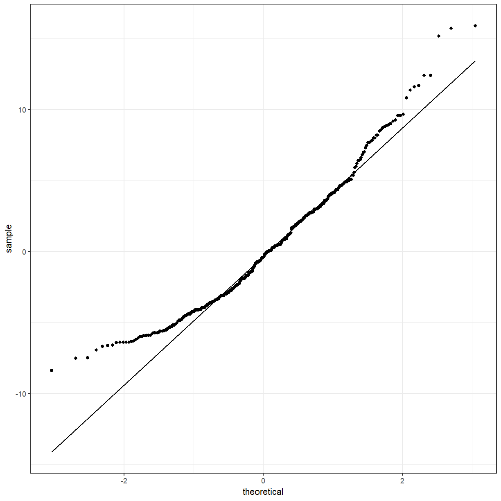
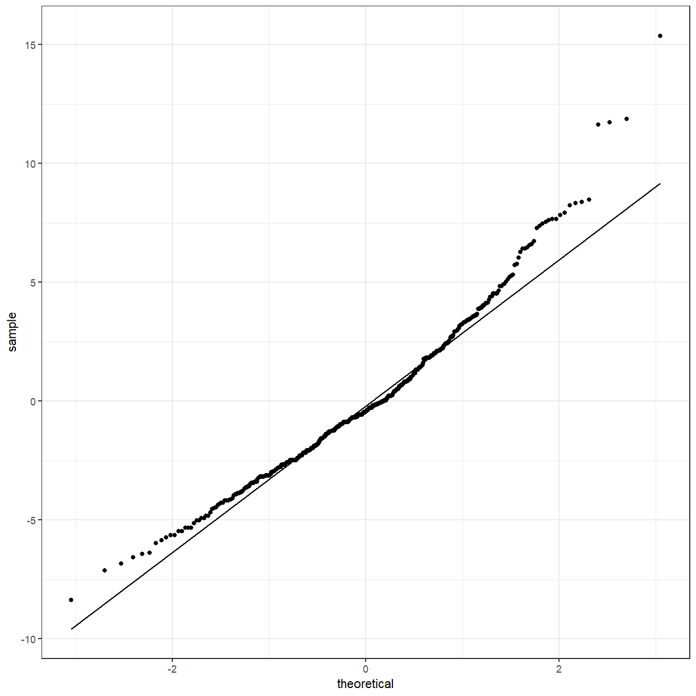
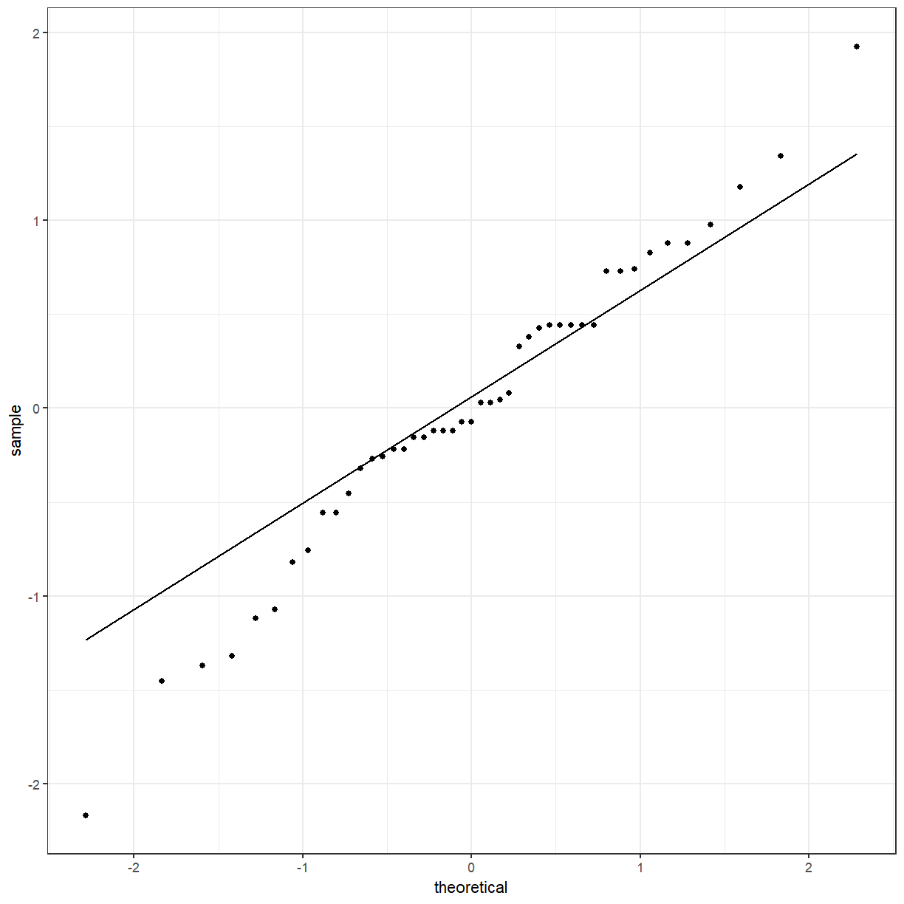

---
# Please do not edit this file directly; it is auto generated.
# Instead, please edit 03-testing-differences.md in _episodes_rmd/
title: "Testing differences in categories"
author: "Tim Keighley"
teaching: 60
exercises: 30
questions:
- ""
objectives:
- "Choose the appropriate test for the data you have."
- ""
keypoints:
- "You can use _t_ tests and ANOVAs if you have a continuous response and categorical
  predictors."
source: "Rmd"
mathjax: true
---

## Numeric summaries of groups

In the previous lesson we looked at some visualisations of the data that suggested that there
might be differences between some of the groups, but we would like to test this.

To start, we might want to look at the different groups in numbers. We can use one of the
`tidyverse` packages, `dplyr`, to calculate these numbers.

~~~
library(tidyverse)

pattani %>%
  summarise(mean = mean(blood_lead), sd = sd(blood_lead))
~~~
{: .language-r}

~~~
# A tibble: 1 x 2
   mean    sd
  <dbl> <dbl>
1    NA   NaN
~~~
{: .output}

We don't get any results! Remember that the `blood_lead` variable had some missing values. By
default, the functions `mean` and `sd` will not give you a result if the input has missing
values. We can ask the functions to ignore them by using the argument `na.rm = TRUE`.

~~~
pattani %>%
  summarise(mean = mean(blood_lead, na.rm = TRUE), sd = sd(blood_lead, na.rm = TRUE))
~~~
{: .language-r}

~~~
# A tibble: 1 x 2
   mean    sd
  <dbl> <dbl>
1  12.0  4.34
~~~
{: .output}

> ## Naming the arguments in `summarise`
>
> It isn't necessary to name the arguments in `summarise` but it makes the output neater.
{: .callout}

These give us the mean and standard deviation for the entire variable, but we want to split
that up by some other variables. For this we will use the `group_by` function.

~~~
pattani %>%
  group_by(gender) %>%
  summarise(mean = mean(blood_lead, na.rm = TRUE), sd = sd(blood_lead, na.rm = TRUE))
~~~
{: .language-r}

~~~
# A tibble: 2 x 3
  gender  mean    sd
  <fct>  <dbl> <dbl>
1 Boy     12.4  4.57
2 Girl    11.7  4.11
~~~
{: .output}

Or by school:

~~~
pattani %>%
  group_by(school) %>%
  summarise(mean = mean(blood_lead, na.rm = TRUE), sd = sd(blood_lead, na.rm = TRUE))
~~~
{: .language-r}

~~~
# A tibble: 5 x 3
  school      mean    sd
  <fct>      <dbl> <dbl>
1 Tangkadeng  8.48  2.31
2 Thamthalu  16.5   4.32
3 Tachi      12.9   4.03
4 Tesabal 3  15.2   3.32
5 Sabarang   11.6   2.92
~~~
{: .output}

You can also do both:

~~~
pattani %>%
  group_by(gender, school) %>%
  summarise(mean = mean(blood_lead, na.rm = TRUE), sd = sd(blood_lead, na.rm = TRUE))
~~~
{: .language-r}

~~~
# A tibble: 10 x 4
# Groups:   gender [2]
   gender school      mean    sd
   <fct>  <fct>      <dbl> <dbl>
 1 Boy    Tangkadeng  8.72  2.24
 2 Boy    Thamthalu  17.6   4.66
 3 Boy    Tachi      13.4   4.18
 4 Boy    Tesabal 3  15.3   2.60
 5 Boy    Sabarang   11.7   3.07
 6 Girl   Tangkadeng  8.22  2.38
 7 Girl   Thamthalu  14.8   3.25
 8 Girl   Tachi      12.6   3.92
 9 Girl   Tesabal 3  15.1   3.95
10 Girl   Sabarang   11.5   2.87
~~~
{: .output}

> ## Cuckoo egg lengths
>
> Find the mean and standard deviation for the cuckoo eggs by host nest type.
>
> > ## Solution
> >
> > 
> > ~~~
> > cuckoo %>%
> >   group_by(Nest) %>%
> >   summarise(mean = mean(Length), sd = sd(Length))
> > ~~~
> > {: .language-r}
> > 
> > 
> > 
> > ~~~
> > # A tibble: 3 x 3
> >   Nest     mean    sd
> >   <fct>   <dbl> <dbl>
> > 1 Robin    22.6 0.682
> > 2 Wren     21.1 0.754
> > 3 Sparrow  23.1 1.02 
> > ~~~
> > {: .output}
> >
> > We don't have to use `na.rm = TRUE` because there aren't any missing values.
> {: .solution}
{: .challenge}

## Testing the difference between 2 groups

Going back to the difference by gender,

~~~
pattani %>%
  group_by(gender) %>%
  summarise(mean = mean(blood_lead, na.rm = TRUE), sd = sd(blood_lead, na.rm = TRUE))
~~~
{: .language-r}

~~~
# A tibble: 2 x 3
  gender  mean    sd
  <fct>  <dbl> <dbl>
1 Boy     12.4  4.57
2 Girl    11.7  4.11
~~~
{: .output}

We can see that the means of the boys are similar to the means of the girls, but we would like
to formally test if they are statistically different from each other. One way to do this is
with a **_t_ test**, using the R function `t.test`.

The question we are asking is **Is the mean blood lead level for the boys different to the mean
blood lead level for the girls?** Formally, we could say:

$$H_0: \mu_{boys} = \mu_{girls} \\
H_1: \mu_{boys} \neq \mu_{girls}$$

<!--
H0: &mu;boys = &mu;girls \\
H1: &mu;boys &ne; &mu;girls
-->

~~~
t.test(blood_lead ~ gender, data = pattani)
~~~
{: .language-r}

~~~

	Welch Two Sample t-test

data:  blood_lead by gender
t = 1.5858, df = 410.97, p-value = 0.1136
alternative hypothesis: true difference in means is not equal to 0
95 percent confidence interval:
 -0.1594838  1.4905952
sample estimates:
 mean in group Boy mean in group Girl 
          12.40049           11.73493 
~~~
{: .output}

Notice that the means shown for each group are the same as what we calculated earlier. The
**alternative hypothesis** is that the **difference in means is not equal to 0**, as we
mentioned. The **p-value** is
0.1136.
This indicates that the
the mean blood lead level for the boys and girls is not significantly different at the 0.05
level. The 95% confidence interval includes 0, which is another way to see that the means
are not different from each other.

## Analysis of Variance (ANOVA)

A **_t_ test** can only be used when you have 2 groups, like boys and girls, so we need to use
a different technique when you have more than 2 groups, like the 5 schools. This is the
**analysis of variance** or **ANOVA**. The main R function to perform this analysis is
`aov`. Be aware that there is also a function `anova` although this is used after you have
fit the model using `aov`.

One-way anova is a statistical technique that can be used to investigate the effect of a single
categorical predictor variable on a continuous response variable. The effect is measured by
looking at the values from different groups and comparing the averages. Of course, in any such
situation there will be variability. If the variability _within_ each group is noticeably less
than the variability _between_ the groups, then we decide that there are significant differences
between the groups.

One-way anova generalises the two-sample _t_ test. You can think of the two-sample _t_ test as
comparing the values from two groups. Alternatively, you can think of it as seeing whether the
grouping variable has an effect on the response variable (and so here we can look at grouping
variables with 3, 4 or more values).

You can still use ANOVAs for 2 groups:

~~~
gender_aov <- aov(blood_lead ~ gender, data = pattani)
gender_aov
~~~
{: .language-r}

~~~
Call:
   aov(formula = blood_lead ~ gender, data = pattani)

Terms:
                  gender Residuals
Sum of Squares    47.791  8091.610
Deg. of Freedom        1       431

Residual standard error: 4.332902
Estimated effects may be unbalanced
1 observation deleted due to missingness
~~~
{: .output}

This give us some information, but there are some other things that we might like to know,
like the p-value. Previously we used the `summary` function to get a summary of the data.
We can also use it to get a summary of an ANOVA object.

~~~
summary(gender_aov)
~~~
{: .language-r}

~~~
             Df Sum Sq Mean Sq F value Pr(>F)
gender        1     48   47.79   2.546  0.111
Residuals   431   8092   18.77               
1 observation deleted due to missingness
~~~
{: .output}

Actually not that useful. But ANOVAs are a special type of linear model (which we will talk
about in more detail tomorrow) so we can directly call the `summary.lm` function which deals
with linear models.

~~~
summary.lm(gender_aov)
~~~
{: .language-r}

~~~

Call:
aov(formula = blood_lead ~ gender, data = pattani)

Residuals:
    Min      1Q  Median      3Q     Max 
-8.4005 -3.4005 -0.4005  2.6995 15.8995 

Coefficients:
            Estimate Std. Error t value Pr(>|t|)    
(Intercept)  12.4005     0.3034  40.877   <2e-16 ***
genderGirl   -0.6656     0.4171  -1.595    0.111    
---
Signif. codes:  0 '***' 0.001 '**' 0.01 '*' 0.05 '.' 0.1 ' ' 1

Residual standard error: 4.333 on 431 degrees of freedom
  (1 observation deleted due to missingness)
Multiple R-squared:  0.005872,	Adjusted R-squared:  0.003565 
F-statistic: 2.546 on 1 and 431 DF,  p-value: 0.1113
~~~
{: .output}

Now we can see the p-value and several other pieces of information about the fitted model.
Looking at the line for the gender variable, you can see that the p-value is
0.1113,
which is equivalent to the p-value from the _t_ test.
It is slightly different from the previous p-value because the standard
_t_ test makes slightly different assumptions from the ANOVA. We can get them to match by
using the `var.equal = TRUE` argument to `t.test`.

~~~
t.test(blood_lead ~ gender, data = pattani, var.equal = TRUE)
~~~
{: .language-r}

~~~

	Two Sample t-test

data:  blood_lead by gender
t = 1.5955, df = 431, p-value = 0.1113
alternative hypothesis: true difference in means is not equal to 0
95 percent confidence interval:
 -0.1543414  1.4854528
sample estimates:
 mean in group Boy mean in group Girl 
          12.40049           11.73493 
~~~
{: .output}

We should check if the model fit well. To do this we will need to get some of the parameters
from the fitted model. The `augment` function in the `broom` package helps with this.

~~~
gender_aov_augment <- broom::augment(gender_aov, pattani)
gender_aov_augment
~~~
{: .language-r}

~~~
# A tibble: 433 x 15
      ID blood_lead   age gender school duration water ln_blood_lead
   <dbl>      <dbl> <dbl> <fct>  <fct>     <dbl> <fct>         <dbl>
 1     1       11.7    13 Boy    Tangk~       13 Boil           2.46
 2     2       11.8    13 Boy    Tangk~        5 Boil           2.47
 3     3        6.4    13 Girl   Tangk~       13 Stand          1.86
 4     4        6.9    11 Girl   Tangk~       11 Boil           1.93
 5     5       10.3    13 Girl   Tangk~        5 Boil           2.33
 6     6        8.3    13 Girl   Tangk~       13 Filt~          2.12
 7     7        6.2    13 Girl   Tangk~        5 Filt~          1.82
 8     8        9.4    13 Boy    Tangk~       13 Stand          2.24
 9     9       14.9    11 Boy    Tangk~       11 Boil           2.70
10    10        8.1    11 Girl   Tangk~       11 Filt~          2.09
# ... with 423 more rows, and 7 more variables: .fitted <dbl>,
#   .se.fit <dbl>, .resid <dbl>, .hat <dbl>, .sigma <dbl>, .cooksd <dbl>,
#   .std.resid <dbl>
~~~
{: .output}

One of the assumptions of the ANOVA model is that the residuals are Normally distributed.
Like before, we can use a QQ plot to check for normality.

~~~
ggplot(gender_aov_augment, aes(sample = .resid)) +
  geom_qq() +
  geom_qq_line()
~~~
{: .language-r}

The points deviate from the line, so the residuals are probably not normally distributed.
Something to consider, but we will move on with the model.

### ANOVA with more than 2 groups

We have used ANOVA on a variable with 2 groups, which we could have done with a _t_ test, but
now we should use it on a variable with more than 2 groups.

~~~
school_aov <- aov(blood_lead ~ school, data = pattani)
summary.lm(school_aov)
~~~
{: .language-r}

~~~

Call:
aov(formula = blood_lead ~ school, data = pattani)

Residuals:
    Min      1Q  Median      3Q     Max 
-8.3652 -2.2844 -0.4312  1.8688 15.3688 

Coefficients:
                Estimate Std. Error t value Pr(>|t|)    
(Intercept)       8.4844     0.2885  29.413  < 2e-16 ***
schoolThamthalu   7.9808     0.5722  13.948  < 2e-16 ***
schoolTachi       4.4468     0.4135  10.755  < 2e-16 ***
schoolTesabal 3   6.6914     0.5142  13.014  < 2e-16 ***
schoolSabarang    3.0978     0.5142   6.025 3.65e-09 ***
---
Signif. codes:  0 '***' 0.001 '**' 0.01 '*' 0.05 '.' 0.1 ' ' 1

Residual standard error: 3.352 on 428 degrees of freedom
  (1 observation deleted due to missingness)
Multiple R-squared:  0.4093,	Adjusted R-squared:  0.4038 
F-statistic: 74.15 on 4 and 428 DF,  p-value: < 2.2e-16
~~~
{: .output}

As a reminder, the names of the schools were Tangkadeng, Thamthalu, Tachi, Tesabal 3, Sabarang.
Notice that the first school, Tangkadeng, does not appear in the
summary output. The other schools are being compared with this school. The p-values of all the
schools are less than 0.05, so they are all statistically different from the first school.
The overall p-value is also less than 0.05.

> ## Cuckoo egg lengths ANOVA
>
> Perform an ANOVA on the cuckoo data.
>
> > ## Solution
> >
> > 
> > ~~~
> > cuckoo_aov <- aov(Length ~ Nest, data = cuckoo)
> > summary.lm(cuckoo_aov)
> > ~~~
> > {: .language-r}
> > 
> > 
> > 
> > ~~~
> > 
> > Call:
> > aov(formula = Length ~ Nest, data = cuckoo)
> > 
> > Residuals:
> >      Min       1Q   Median       3Q      Max 
> > -2.17143 -0.32000 -0.07143  0.44375  1.92857 
> > 
> > Coefficients:
> >             Estimate Std. Error t value Pr(>|t|)    
> > (Intercept)  22.5563     0.2061 109.468  < 2e-16 ***
> > NestWren     -1.4363     0.2962  -4.849 1.74e-05 ***
> > NestSparrow   0.5152     0.3016   1.708    0.095 .  
> > ---
> > Signif. codes:  0 '***' 0.001 '**' 0.01 '*' 0.05 '.' 0.1 ' ' 1
> > 
> > Residual standard error: 0.8242 on 42 degrees of freedom
> > Multiple R-squared:  0.5133,	Adjusted R-squared:  0.4901 
> > F-statistic: 22.15 on 2 and 42 DF,  p-value: 2.705e-07
> > ~~~
> > {: .output}
> {: .solution}
{: .challenge}

Again, we should check the residuals to see if they are Normal.

~~~
school_aov_augment <- broom::augment(school_aov, pattani)

ggplot(school_aov_augment, aes(sample = .resid)) +
  geom_qq() +
  geom_qq_line()
~~~
{: .language-r}

They seem closer to normality than the model with gender, but still a small amount of concern.

> ## Cuckoo ANOVA residuals
>
> Check the residuals for the cuckoo ANOVA.
>
> > ## Solution
> >
> > 
> > ~~~
> > cuckoo_aov_augment <- broom::augment(cuckoo_aov, cuckoo)
> > 
> > ggplot(cuckoo_aov_augment, aes(sample = .resid)) +
> >   geom_qq() +
> >   geom_qq_line()
> > ~~~
> > {: .language-r}
> > 
> > 
> {: .solution}
{: .challenge}

### ANOVA with 2 variables

So far we have only looked at models with 1 variable. You can extend the ANOVA model to look
at multiple variables, for example both gender and school.

~~~
both_aov <- aov(blood_lead ~ gender * school, data = pattani)
summary.lm(both_aov)
~~~
{: .language-r}

~~~

Call:
aov(formula = blood_lead ~ gender * school, data = pattani)

Residuals:
    Min      1Q  Median      3Q     Max 
-9.5148 -2.2727 -0.4159  1.7806 14.9231 

Coefficients:
                           Estimate Std. Error t value Pr(>|t|)    
(Intercept)                  8.7194     0.3926  22.210  < 2e-16 ***
genderGirl                  -0.5036     0.5747  -0.876 0.381405    
schoolThamthalu              8.8954     0.7518  11.833  < 2e-16 ***
schoolTachi                  4.6575     0.6063   7.682  1.1e-13 ***
schoolTesabal 3              6.5677     0.7156   9.177  < 2e-16 ***
schoolSabarang               2.9533     0.8115   3.639 0.000307 ***
genderGirl:schoolThamthalu  -2.2797     1.1513  -1.980 0.048334 *  
genderGirl:schoolTachi      -0.2470     0.8305  -0.297 0.766264    
genderGirl:schoolTesabal 3   0.2810     1.0229   0.275 0.783674    
genderGirl:schoolSabarang    0.3633     1.0546   0.345 0.730615    
---
Signif. codes:  0 '***' 0.001 '**' 0.01 '*' 0.05 '.' 0.1 ' ' 1

Residual standard error: 3.331 on 423 degrees of freedom
  (1 observation deleted due to missingness)
Multiple R-squared:  0.4233,	Adjusted R-squared:  0.411 
F-statistic: 34.49 on 9 and 423 DF,  p-value: < 2.2e-16
~~~
{: .output}

> ## A note on nesting models
> Another way of writing this model would be
> 
> 
> ~~~
> aov(blood_lead ~ gender + school + gender:school, data = pattani)
> ~~~
> {: .language-r}
{: .callout}

The interaction term is not significant so we can run the model again without it.

~~~
both_aov2 <- aov(blood_lead ~ gender + school, data = pattani)
summary.lm(both_aov2)
~~~
{: .language-r}

~~~

Call:
aov(formula = blood_lead ~ gender + school, data = pattani)

Residuals:
    Min      1Q  Median      3Q     Max 
-8.6655 -2.3123 -0.4629  1.7763 14.9371 

Coefficients:
                Estimate Std. Error t value Pr(>|t|)    
(Intercept)       8.8237     0.3247  27.173  < 2e-16 ***
genderGirl       -0.7271     0.3251  -2.237   0.0258 *  
schoolThamthalu   7.9418     0.5698  13.938  < 2e-16 ***
schoolTachi       4.5392     0.4136  10.974  < 2e-16 ***
schoolTesabal 3   6.7156     0.5119  13.119  < 2e-16 ***
schoolSabarang    3.2276     0.5151   6.266 9.04e-10 ***
---
Signif. codes:  0 '***' 0.001 '**' 0.01 '*' 0.05 '.' 0.1 ' ' 1

Residual standard error: 3.336 on 427 degrees of freedom
  (1 observation deleted due to missingness)
Multiple R-squared:  0.4162,	Adjusted R-squared:  0.4093 
F-statistic: 60.88 on 5 and 427 DF,  p-value: < 2.2e-16
~~~
{: .output}

We can compare these models with the `anova` function.

~~~
anova(school_aov, both_aov2, both_aov)
~~~
{: .language-r}

~~~
Analysis of Variance Table

Model 1: blood_lead ~ school
Model 2: blood_lead ~ gender + school
Model 3: blood_lead ~ gender * school
  Res.Df    RSS Df Sum of Sq      F  Pr(>F)  
1    428 4807.6                              
2    427 4752.0  1    55.674 5.0168 0.02562 *
3    423 4694.3  4    57.678 1.2993 0.26953  
---
Signif. codes:  0 '***' 0.001 '**' 0.01 '*' 0.05 '.' 0.1 ' ' 1
~~~
{: .output}

> ## Thanks
>
> Some of these notes are based on material in Moore, McCabe & Craig (2017), Peter
> Petocz's lecture notes for STAT270, and Drew Allen's _Intro to Statistics in R_ workshop.
{: .callout}


