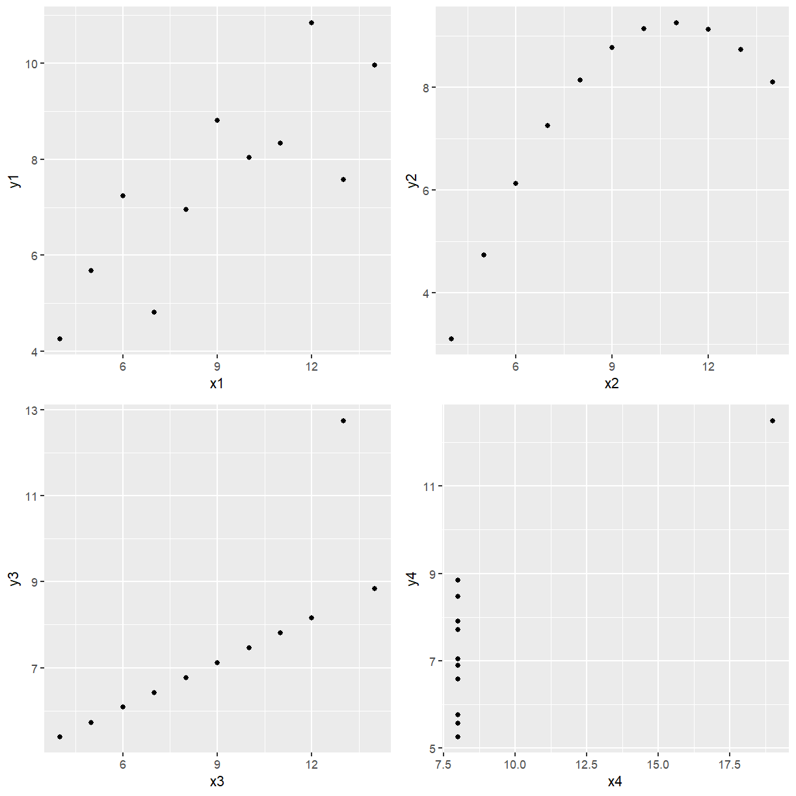

---
# Please do not edit this file directly; it is auto generated.
# Instead, please edit 04-correlation.md in _episodes_rmd/
title: "Correlation and Covariance"
author: "Dr Tania Prvan"
teaching: 60
exercises: 30
questions:
    - ""
objectives:
    - ""
keypoints:
    - ""
source: "Rmd"
mathjax: true
---

## Covariance and Correlation Coefficient

We are interested in studying the relationship between a response variable $Y$ and a single
predictor $X$.The covariance between $Y$ and $X$ measures the direction of the linear
relationship between $Y$ and $X$ but tells us nothing about the strength of the relationship
since it changes if we change the unit of measurement. If $Cov(Y,X)>0$ then there is a positive
relationship between $Y$ and $X$ but if $Cov(Y,X)<0$ the relationship is negative.

The correlation coefficient between $Y$ and $X$ is scale invariant so it measures both the
direction and strength of the linear relationship between $Y$ and $X$.

**EXAMPLE:** Anscomb (1973) used four data sets to illustrate the importance of investigating
the data using scatter plots and not relying totally on the correlation coefficient. The four
data sets are given below. Explore the data graphically and obtain the correlation coefficient
for each data set.
($r^2=\frac{\sum(x_i-\bar{x})(y_i-\bar{y})}{\sum(x_i-\bar{x})^2\sum(y_i-\bar{y})^2)}$)

$$ \begin{array}{cccccccc}\hline
\mbox{Data} & \mbox{Set 1} & \mbox{Data} & \mbox{Set 2} & \mbox{Data} & \mbox{Set 3} & \mbox{Data} & \mbox{Set 4}\\
x1 & y1 & x2 & y2 & x3 & y3 & x4 & y4\\ \hline
10 &	8.04 &	10	& 9.14 &	10 &	7.46 &	8	& 6.58\\
8	& 6.95 &	8	& 8.14 & 8 &	6.77 &	8 &	5.76\\
13 &	7.58 &	13 &	8.74 &	13 &	12.74 &	8	& 7.71\\
9 &	8.81 &	9 &	8.77 &	9 &	7.11 &	8 &	8.84\\
11 &	8.33 &	11 &	9.26 &	11 &	7.81 &	8 &	8.47\\
14 &	9.96 &	14 &	8.10 &	14 &	8.84 &	8 &	7.04\\
6 &	7.24 &	6 &	6.13 &	6 &	6.08 &	8 &	5.25\\
4 &	4.26 &	4 &	3.10 &	4 &	5.39 &	19 &	12.5\\
12 &	10.84 &	12 &	9.13 &	12 &	8.15 &	8 &	5.56\\
7 &	4.82 &	7 &	7.26 &	7 &	6.42 &	8 &	7.91\\
5 &	5.68 &	5 &	4.74 &	5 &	5.73 &	8 &	6.89\\ \hline
\end{array}$$

The file `Anscombe.csv` contains this data.

~~~
library(tidyverse)
~~~
{: .language-r}

~~~
Warning: package 'tibble' was built under R version 3.6.1
~~~
{: .error}

~~~
Warning: package 'dplyr' was built under R version 3.6.1
~~~
{: .error}

~~~
library(readr)
library(ggpubr)
~~~
{: .language-r}

~~~
Warning: package 'ggpubr' was built under R version 3.6.1
~~~
{: .error}

~~~
anscomb <- read_csv(file.path("..", "data", "Anscomb.csv"))
anscomb
~~~
{: .language-r}

~~~
# A tibble: 11 x 8
      x1    y1    x2    y2    x3    y3    x4    y4
   <dbl> <dbl> <dbl> <dbl> <dbl> <dbl> <dbl> <dbl>
 1    10  8.04    10  9.14    10  7.46     8  6.58
 2     8  6.95     8  8.14     8  6.77     8  5.76
 3    13  7.58    13  8.74    13 12.7      8  7.71
 4     9  8.81     9  8.77     9  7.11     8  8.84
 5    11  8.33    11  9.26    11  7.81     8  8.47
 6    14  9.96    14  8.1     14  8.84     8  7.04
 7     6  7.24     6  6.13     6  6.08     8  5.25
 8     4  4.26     4  3.1      4  5.39    19 12.5 
 9    12 10.8     12  9.13    12  8.15     8  5.56
10     7  4.82     7  7.26     7  6.42     8  7.91
11     5  5.68     5  4.74     5  5.73     8  6.89
~~~
{: .output}

Now we want to see what each data set looks like.

~~~
p1 <- ggplot(anscomb, aes(x = x1, y = y1)) + geom_point()
p2 <- ggplot(anscomb, aes(x = x2, y = y2)) + geom_point()
p3 <- ggplot(anscomb, aes(x = x3, y = y3)) + geom_point()
p4 <- ggplot(anscomb, aes(x = x4, y = y4)) + geom_point()

ggarrange(p1, p2, p3, p4, ncol = 2, nrow = 2)
~~~
{: .language-r}

Base R has the `cor` function to produce correlations and the `cov` function to produce
covariances. The default is Pearson's correlation.

~~~
cor(anscomb$x1, anscomb$y1)
~~~
{: .language-r}

~~~
[1] 0.8164205
~~~
{: .output}

~~~
cor(anscomb$x2, anscomb$y2)
~~~
{: .language-r}

~~~
[1] 0.8162365
~~~
{: .output}

~~~
cor(anscomb$x3, anscomb$y3)
~~~
{: .language-r}

~~~
[1] 0.8162867
~~~
{: .output}

~~~
cor(anscomb$x4, anscomb$y4)
~~~
{: .language-r}

~~~
[1] 0.8165214
~~~
{: .output}

To two decimal places, all 4 sets of data have
0.82
correlation yet the plots don't all look linear. Just because you have a high correlation is not
a sufficient reason to fit a straight line to the data. Even though Data Set 2 has high positive
correlation it is obvious from the plot of `y2` vs `x2` that a perfect nonlinear relationship
describes the relationship between the two variables better. Looking at the plot of `y3` versus
`x3` it is obvious if it wasn't for the second last data point the relationship would be
perfectly linear with a positive slope. Look at the last plot, if it wasn't for the point on its
own there would be no relationship between `y4` and `x4`, such a point is called highly
influential because if it was removed the curve fitted would be very different. Only the plot of
`y1` versus `x1` could be considered to be approximately linear.


