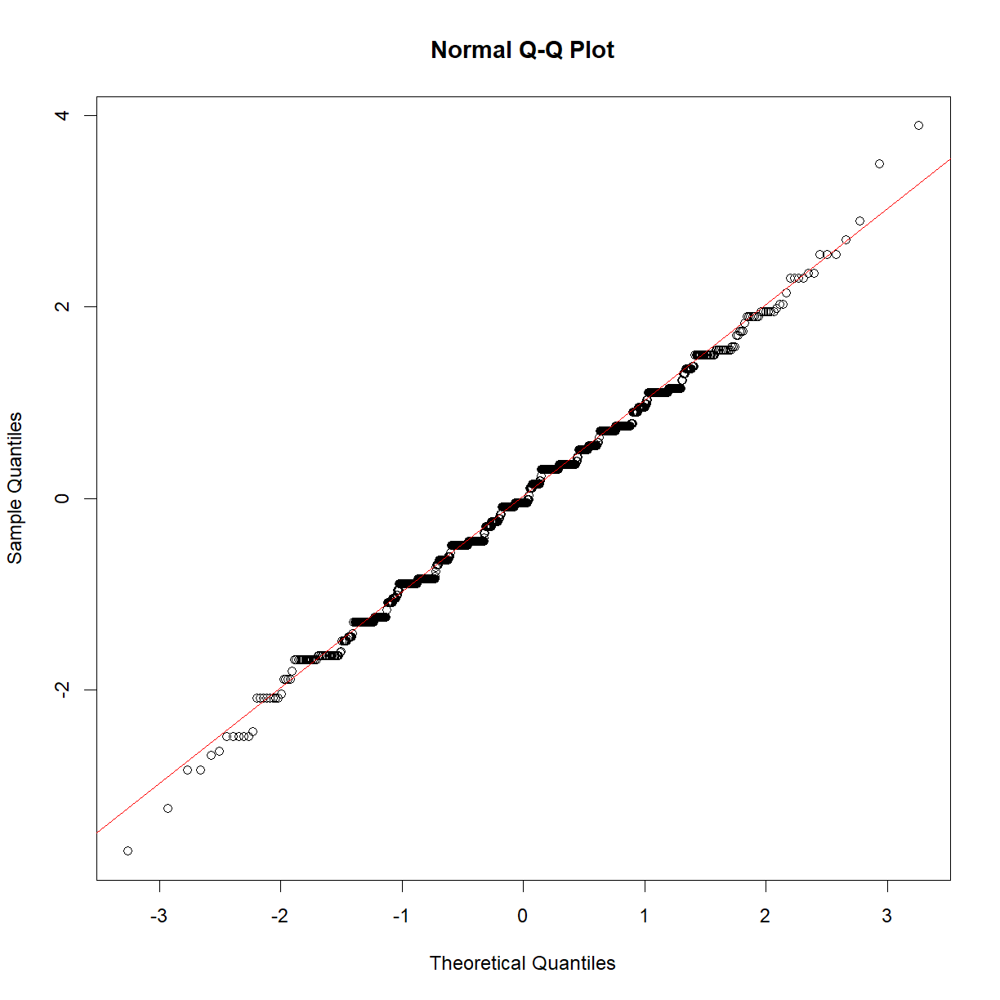

---
# Please do not edit this file directly; it is auto generated.
# Instead, please edit 05-mixed-effects.md in _episodes_rmd/
title: "Mixed Effects Models"
author: "Dr Tania Prvan and Peter Humburg"
teaching: 60
exercises: 30
questions:
- "How do you analyse data if observations are not independent of each other?"
objectives:
- "Model data with correlated observations."
keypoints:
- "Use `lmer()` to fit mixed effects models that account for clustered observations."
- "Use diagnostic plots (`dotplot()` and `qqmath()`) to assess the model fit for mixed models."
- "Use the `ranova()` function to assess which random effects should be included in the model."
source: "Rmd"
mathjax: true
---

> ## Prerequisites
>
> * Experience with R, including importing, processing, and plotting of data.
> * Basic familiarity with multiple linear regression.
>
> R packages used: dplyr, ggplot2, lattice, lme4, lmerTest, readr
{: .prereq}

> ## Discuss
>
> One assumption of multiple linear regression is that observations are independent of each other.
> What are examples where this assumption may be violated?
{: .challenge}

## Modelling clustered data

> ## Definition
>
> A unit of observation is an object about which information is collected independently of other units.
>
> Examples include an individual, a family, a neighbourhood.
{: .callout}

Units of observation may be *related* to each other, forming *groups* or *clusters*.

Individuals could be grouped in families, or schools. Families could be clustered by neighbourhood. Schools could be clustered by state.

Longitudinal data also consist of clusters of observations made at different occasions for the same subject.

Clustered data violate the assumption of independent observations. It is usually helpful, and often critical, to reflect the structure present in the data in the model. Careful modelling of these clusters will help you to separate variations in the response due to experimental conditions (or other effect of interest) from those that are due to the intrinsic structure of the data.

### Modelling the height of siblings

Let's look how this works with some real data. In this section we will analyse the height data collected by [Francis Galton in 1885](https://www.jstor.org/stable/2841583?seq=1#metadata_info_tab_contents). It consists of the heights (measured in inches) of the adult children from 197 families. We start by importing the data.

~~~
library(readr)
height <- read_table2("../data/Galton.tab", col_types = cols(Family = col_character()))
height
~~~
{: .language-r}

~~~
# A tibble: 898 x 6
   Family Father Mother Gender Height  Kids
   <chr>   <dbl>  <dbl> <chr>   <dbl> <dbl>
 1 1        78.5   67   M        73.2     4
 2 1        78.5   67   F        69.2     4
 3 1        78.5   67   F        69       4
 4 1        78.5   67   F        69       4
 5 2        75.5   66.5 M        73.5     4
 6 2        75.5   66.5 M        72.5     4
 7 2        75.5   66.5 F        65.5     4
 8 2        75.5   66.5 F        65.5     4
 9 3        75     64   M        71       2
10 3        75     64   F        68       2
# ... with 888 more rows
~~~
{: .output}

As you can see there are 898 individual observations with information on family membership and gender. Before delving into the analysis we should take a closer look at the data.

~~~
length(unique(height$Family))
~~~
{: .language-r}

~~~
[1] 197
~~~
{: .output}

~~~
table(height$Gender)
~~~
{: .language-r}

~~~

  F   M 
433 465 
~~~
{: .output}

~~~
summary(height$Kids)
~~~
{: .language-r}

~~~
   Min. 1st Qu.  Median    Mean 3rd Qu.    Max. 
  1.000   4.000   6.000   6.136   8.000  15.000 
~~~
{: .output}

We would expect that height is influenced by gender. We can confirm this based on numerical and graphical summaries of the data. We'll use `dplyr` for processing the data and `ggplot2` for plotting.

~~~
library(dplyr)
height %>% group_by(Gender) %>% summarise(mean=mean(Height)) %>% ungroup()
~~~
{: .language-r}

~~~
# A tibble: 2 x 2
  Gender  mean
  <chr>  <dbl>
1 F       64.1
2 M       69.2
~~~
{: .output}

~~~
library(ggplot2)
~~~
{: .language-r}

~~~
Warning: package 'ggplot2' was built under R version 3.6.1
~~~
{: .error}

~~~
ggplot(height, aes(x=Gender, y=Height, fill=Gender)) + geom_violin() + theme_bw()
~~~
{: .language-r}

Based on this, a reasonable first model might be to simply estimate the average height of males and females in the population. Using `lm` we can express this as

~~~
fit_lm <- lm(Height ~ Gender, data=height)
~~~
{: .language-r}

We can look at some model diagnostics to confirm that this is an appropriate model.

~~~
qqnorm(rstandard(fit_lm))
qqline(rstandard(fit_lm), col=2)
~~~
{: .language-r}

> ## Exercise
>
> When fitting a linear regression model you should always inspect the residuals and their relationship with the fitted values. Usually a scatter plot is helpful for this purpose. Since this model only produces two different predictions (one for males and one for females), that isn't very helpful here.
>
> * What type of plot could you use to examine the residuals instead?
> * What would you expect that plot to look like?
> * Create and examine the plot.
>
> > ## Solution
> >
> > A boxplot or violin plot can help to summarise the distribution of residuals by group. Since the model simply estimates the mean heights of males and females a violin plot of the residuals should look very similar to the violin plot of heights above, but with the means of both groups aligned at 0.
> > 
> > ~~~
> > ggplot(height, aes(x=Gender, y=resid(fit_lm), fill=Gender)) +
> >    geom_violin() +
> >    theme_bw()
> > ~~~
> > {: .language-r}
> > 
> > 
> {: .solution}
{: .challenge}

Now let's take a look at the model output:

~~~
summary(fit_lm)
~~~
{: .language-r}

~~~

Call:
lm(formula = Height ~ Gender, data = height)

Residuals:
    Min      1Q  Median      3Q     Max 
-9.2288 -1.6102 -0.1102  1.7712  9.7712 

Coefficients:
            Estimate Std. Error t value Pr(>|t|)    
(Intercept)  64.1102     0.1206  531.70   <2e-16 ***
GenderM       5.1187     0.1676   30.55   <2e-16 ***
---
Signif. codes:  0 '***' 0.001 '**' 0.01 '*' 0.05 '.' 0.1 ' ' 1

Residual standard error: 2.509 on 896 degrees of freedom
Multiple R-squared:  0.5102,	Adjusted R-squared:  0.5096 
F-statistic: 933.2 on 1 and 896 DF,  p-value: < 2.2e-16
~~~
{: .output}

According to this the average height of women is 64.11 inches and
men are, on average, 5.12 inches taller than women.

This all looks fairly reasonable but clearly there is a lot of variation in height not explained by gender. We would expect siblings to be somewhat similar in height as they share genetic factors through their parents and environmental factors through their shared upbringing.

We can model this structure of the data, children clustering in families, using linear mixed effects models. In addition to estimating population means (*fixed* effects) these models will also allow us to estimate how average family heights vary around these population means (*random* effects).

We will use the `lmer()` function from the `lme4` R package to fit mixed effects models.

~~~
library(lme4)
~~~
{: .language-r}

~~~
Loading required package: Matrix
~~~
{: .output}

~~~
fit_me <- lmer(Height ~ Gender + (1|Family), data=height)
~~~
{: .language-r}

As you can see, `lmer()` uses a formula syntax similar to `lm()`. In addition to the already familiar fixed effect for gender this model includes an additional term, *(1\|Family)*. This specifies the random effect for family, indicating that the mean height of each family may differ from the population mean.

Now, let's take a closer look at the model.

~~~
summary(fit_me)
~~~
{: .language-r}

~~~
Linear mixed model fit by REML ['lmerMod']
Formula: Height ~ Gender + (1 | Family)
   Data: height

REML criterion at convergence: 4007.8

Scaled residuals: 
    Min      1Q  Median      3Q     Max 
-3.9475 -0.5661  0.0067  0.5937  3.5069 

Random effects:
 Groups   Name        Variance Std.Dev.
 Family   (Intercept) 2.448    1.564   
 Residual             3.843    1.960   
Number of obs: 898, groups:  Family, 197

Fixed effects:
            Estimate Std. Error t value
(Intercept)  64.1489     0.1542  415.92
GenderM       5.1529     0.1418   36.33

Correlation of Fixed Effects:
        (Intr)
GenderM -0.486
~~~
{: .output}

In addition to the gender fixed effect that we have already seen in the simple linear regression model, this model also provides us with an estimate of the variance in average height between families (2.45) as well as the remaining (residual) variance within families (3.84).

A dot plot, also known as a caterpillar plot, can help to visualise random effects. The `lme4` package, in conjunction with the `lattice` package, provides a convenient function to create these plots.

~~~
library(lattice)

randoms <- ranef(fit_me)
dotplot(randoms)
~~~
{: .language-r}

~~~
$Family
~~~
{: .output}

This plot shows the deviation from the mean population height for each family, together with standard errors. Note how some families fall clearly below or above the population mean.

You can create Q-Q plots for random effects in a similar way, using the `qqmath()` function.

~~~
qqmath(randoms)
~~~
{: .language-r}

~~~
$Family
~~~
{: .output}

#### Model comparison with `ranova()`

In this case it seems fairly clear that inclusion of the family random effect improves model fit. It is sometimes desirable to test whether inclusion of a specific random effect is justified, similar to how you would compare multiple regression models to test for the inclusion of (fixed) effects using likelihood ratio tests. Although `lme4` doesn't provide an easy way to do that, you can however, augment its abilities with the `lmerTest` package. To do so, you'll have to load the `lmerTest` package after `lme4` but prior to fitting the model.

~~~
library(lme4)
library(lmerTest)

fit_me <- lmer(Height ~ Gender + (1|Family), data=height)
~~~
{: .language-r}

Then you can use the `ranova()` function to compare models with different random effects structure.

~~~
ranova(fit_me)
~~~
{: .language-r}

~~~
ANOVA-like table for random-effects: Single term deletions

Model:
Height ~ Gender + (1 | Family)
             npar  logLik    AIC    LRT Df Pr(>Chisq)    
<none>          4 -2003.9 4015.8                         
(1 | Family)    3 -2101.7 4209.4 195.56  1  < 2.2e-16 ***
---
Signif. codes:  0 '***' 0.001 '**' 0.01 '*' 0.05 '.' 0.1 ' ' 1
~~~
{: .output}

The comparison between the model with a random intercept for family (the mixed effects model) and the model without any random effects (the simple regression model) shows that the mixed effects model is clearly preferred.

### Investigating the relationship between pitch and politeness

In this section you will apply what you just learned to explore a dataset from a study (Winter and Grawunder, 2012) designed to investigate the relationship between voice pitch and politeness.

> ## How is voice pitch related to politeness?
>
> Subjects are asked to respond to hypothetical scenarios that are from either formal situations that require politeness or more informal situations and voice pitch is measured. Each subject is given a list of all the scenarios, so each subject gives multiple polite or informal responses. Gender is also recorded, since it is known to influence voice pitch.
>
{: .callout}

Let's take a look at the structure of the data:

~~~
politeness_data <- read_csv(file.path("..", "data", "politeness_data.csv"))

politeness_data
~~~
{: .language-r}

~~~
# A tibble: 80 x 6
   subject gender scenario attitude total_duration frequency
   <chr>   <chr>     <dbl> <chr>             <dbl>     <dbl>
 1 F1      F             1 pol               18.4       215.
 2 F1      F             1 inf               13.6       211.
 3 F1      F             2 pol                5.22      285.
 4 F1      F             2 inf                4.25      266.
 5 F1      F             3 pol                6.79      211.
 6 F1      F             3 inf                4.13      286.
 7 F1      F             4 pol                6.24      252.
 8 F1      F             4 inf                3.24      282.
 9 F1      F             5 pol                5.62      230.
10 F1      F             5 inf                3.95      250.
# ... with 70 more rows
~~~
{: .output}

~~~
table(politeness_data$subject)
~~~
{: .language-r}

~~~

F1 F3 F7 F8 M1 M3 M5 M7 
10 10 10 10 10 10 10 10 
~~~
{: .output}

~~~
table(politeness_data$subject, politeness_data$attitude)
~~~
{: .language-r}

~~~
    
     inf pol
  F1   5   5
  F3   5   5
  F7   5   5
  F8   5   5
  M1   5   5
  M3   5   5
  M5   5   5
  M7   5   5
~~~
{: .output}

There are observations from 8 subjects. Each subject has provided speech samples for 5 different scenarios using both a polite and informal voice.

> ## Exercise
>
> Download the exercise [starter code](../exercises/politeness.R). Follow the instructions in the R script
> file to carry out an analysis of the pitch and politeness data.
>
> > ## Solution
> >
> > You can take a look at a [sample solution](../exercises/solutions/politeness.html) online.
> {: .solution}
{: .challenge}

## References

Winter, B. (2013). Linear models and linear mixed effects models in R with linguistic applications. arXiv:1308.5499.

<https://web.stanford.edu/class/psych252/section/Mixed_models_tutorial.html#model-comparison>

<https://www.youtube.com/watch?v=VhMWPkTbXoY>

<https://stat.ethz.ch/R-manual/R-devel/library/MASS/html/oats.html>

<https://www.statmethods.net/management/typeconversion.html>

<https://cran.r-project.org/web/packages/lme4/lme4.pdf>

<https://cran.r-project.org/web/packages/lme4/vignettes/lmer.pdf>

<https://www.r-bloggers.com/linear-mixed-models-in-r/>

<https://bbolker.github.io/morelia_2018/notes/mixedlab.html>


