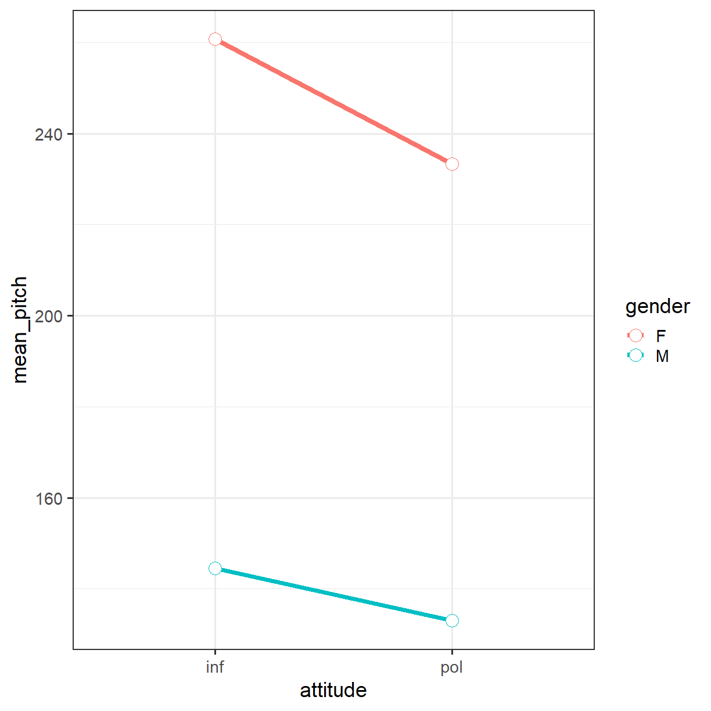
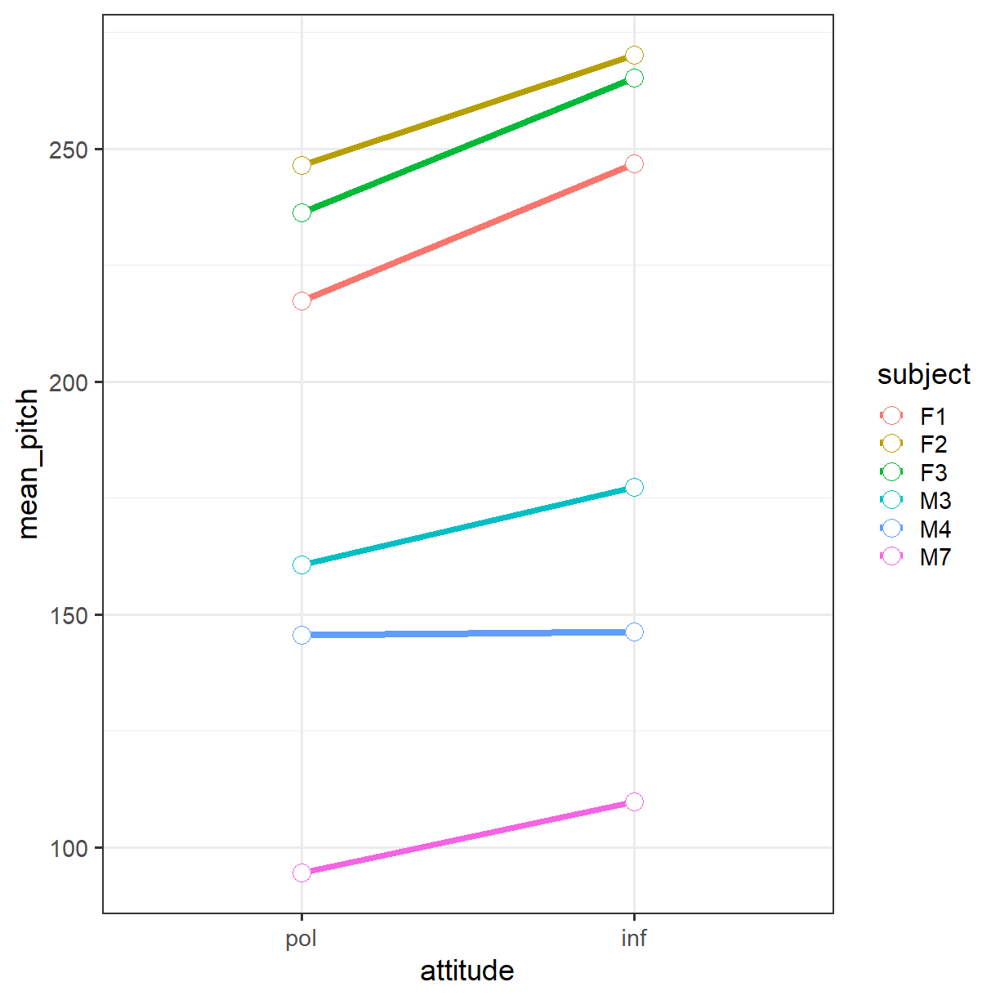
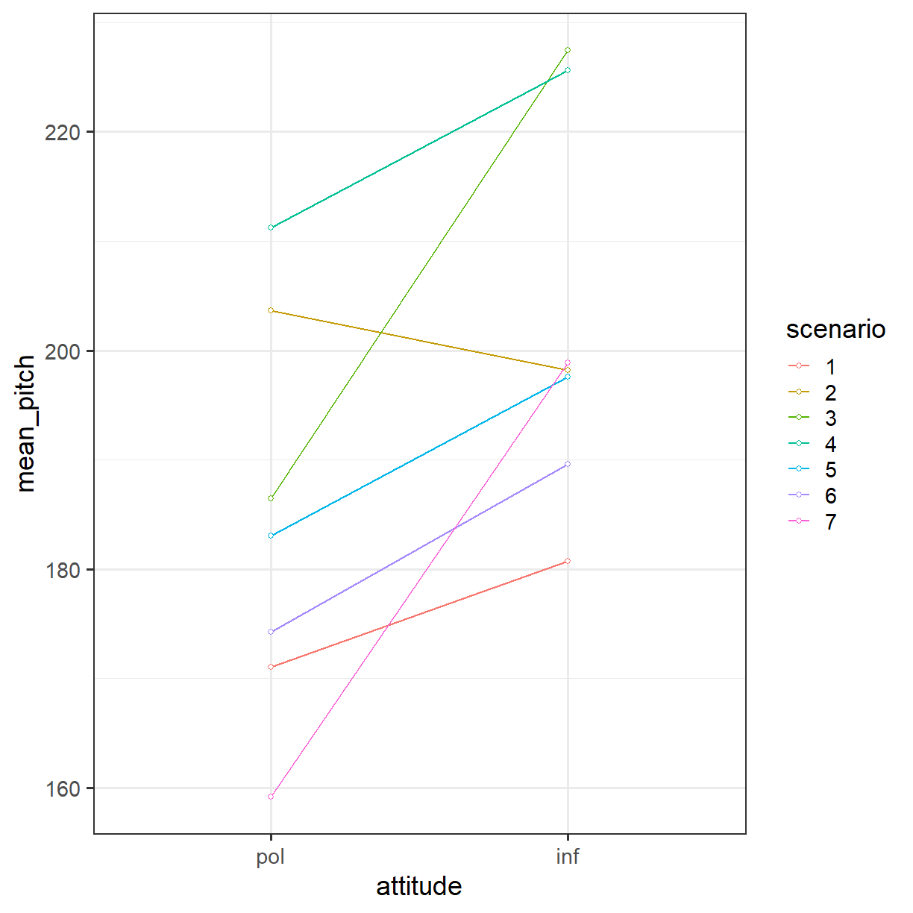
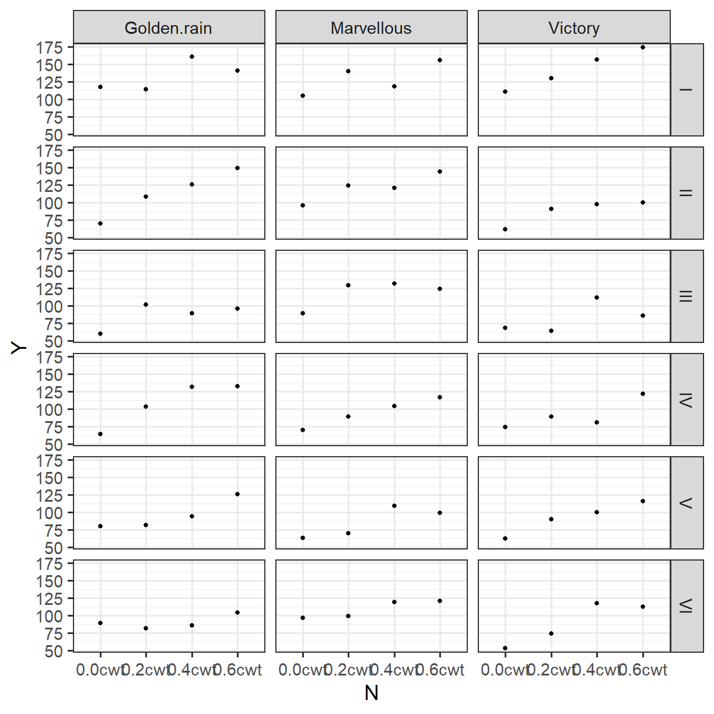
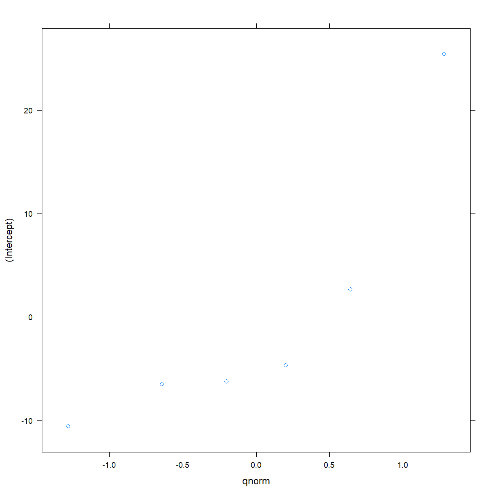

---
# Please do not edit this file directly; it is auto generated.
# Instead, please edit 05-mixed-effects.md in _episodes_rmd/
title: "Mixed Effects Models"
author: "Dr Tania Prvan"
teaching: 60
exercises: 30
questions:
- ""
objectives:
- ""
keypoints:
- ""
source: "Rmd"
mathjax: true
---


## PDF version

[PDF notes](../files/Mixed Effects and Bayesian Statistics.pdf)


~~~
library(tidyverse)
library(ggplot2)
library(lme4)
library(dplyr)
~~~
{: .language-r}


## 1 Mixed Effects Models

### 1.1 Simple Mixed Effects Models

**DEFN:** A unit of observation is an object about which information is collected. 

**EXAMPLES:** An individual. A family. A neighbourhood.

Units of observation may fall into groups or clusters.

**EXAMPLES:** Individuals could be nested in families. Individuals could be nested within schools. Individuals could be nested within neighbourhoods. Individuals could be nested within firms.

Longitudinal data also consist of clusters of observations made at different occasions for the same subject.

In clustered data it may be important to allow for correlations among the responses observed for units belonging to the same cluster.

**EXAMPLES:** Adult height of siblings (if have same parents) will be correlated because siblings are genetically related to each other and often have been raised within the same family.

We can model and estimate within cluster correlations using mixed effects models. The simplest model is where we don't have explanatory variables (predictors, independent variables).

Linear mixed effects models (sometimes called multilevel models depending on the context) have extra term(s) in addition to those found in the linear model (including multiple regression model) to allow for variation that is not explained by the independent variables of interest.

We will use the R package `lme4` to fit mixed effects models.

The following example is from Winter and Grawunder (2012). 

**EXAMPLE:** How is voice pitch related to politeness? Subjects are asked to respond to hypothetical scenarios (independent variable, within subject) that are from either formal situations that require politeness or more informal situations and voice pitch is measured (dependent variable). Each subject is given a list of all the scenarios, so each subject gives multiple polite or informal responses. Gender is also recorded (independent variable, between-subject), since it is known to influence on voice pitch.

This could be modelled as

$$ \mbox{pitch} = \mbox{politeness} + \mbox{gender} + \varepsilon $$

where we only have one error term which is our unexplained random variation.

Since each subject gave multiple responses (a repeated measures design) this model is inappropriate because the multiple responses made by one subject are not independent from each other. Also, every person has a slightly different pitch (frequency) which is a factor that affects all responses from the same subject so these responses will be correlated within the subject.


~~~
mydata <- read_csv(file.path("..", "data", "politeness_data.csv"))

summary(mydata)
~~~
{: .language-r}


~~~
   subject             gender             scenario   attitude        
 Length:84          Length:84          Min.   :1   Length:84         
 Class :character   Class :character   1st Qu.:2   Class :character  
 Mode  :character   Mode  :character   Median :4   Mode  :character  
                                       Mean   :4                     
                                       3rd Qu.:6                     
                                       Max.   :7                     
                                                                     
   frequency    
 Min.   : 82.2  
 1st Qu.:131.6  
 Median :203.9  
 Mean   :193.6  
 3rd Qu.:248.6  
 Max.   :306.8  
 NA's   :1      
~~~
{: .output}


~~~
str(mydata)
~~~
{: .language-r}


~~~
Classes 'spec_tbl_df', 'tbl_df', 'tbl' and 'data.frame':	84 obs. of  5 variables:
 $ subject  : chr  "F1" "F1" "F1" "F1" ...
 $ gender   : chr  "F" "F" "F" "F" ...
 $ scenario : num  1 1 2 2 3 3 4 4 5 5 ...
 $ attitude : chr  "pol" "inf" "pol" "inf" ...
 $ frequency: num  213 204 285 260 204 ...
 - attr(*, "spec")=
  .. cols(
  ..   subject = col_character(),
  ..   gender = col_character(),
  ..   scenario = col_double(),
  ..   attitude = col_character(),
  ..   frequency = col_double()
  .. )
~~~
{: .output}


~~~
table(mydata$subject)
~~~
{: .language-r}


~~~

F1 F2 F3 M3 M4 M7 
14 14 14 14 14 14 
~~~
{: .output}


~~~
table(mydata$subject, mydata$attitude)
~~~
{: .language-r}


~~~
    
     inf pol
  F1   7   7
  F2   7   7
  F3   7   7
  M3   7   7
  M4   7   7
  M7   7   7
~~~
{: .output}

We should look at the data using statistical graphics.


~~~
theme_set(theme_bw(base_size = 18))

qplot(attitude, frequency, facets = . ~ subject,
    colour = subject, geom = "boxplot", data = mydata)
~~~
{: .language-r}


Subjects F1, F2, F3 are female and M1, M2, M3 are male. You can see straight away that males have lower voices than females (as expected). But you can also see that, within the male and the female groups, there is lots of individual variation, with some people having relatively higher frequency values for their sex and others having relatively lower frequency values, regardless of the attitude. Within subjects we have correlation between frequency (pitch) and attitude (politeness).


~~~
polite   <- subset(mydata, attitude == "pol")
informal <- subset(mydata, attitude == "inf")

as_tibble(polite)
~~~
{: .language-r}


~~~
# A tibble: 42 x 5
   subject gender scenario attitude frequency
   <chr>   <chr>     <dbl> <chr>        <dbl>
 1 F1      F             1 pol           213.
 2 F1      F             2 pol           285.
 3 F1      F             3 pol           204.
 4 F1      F             4 pol           251.
 5 F1      F             5 pol           232.
 6 F1      F             6 pol           181.
 7 F1      F             7 pol           155.
 8 F3      F             1 pol           230.
 9 F3      F             2 pol           237.
10 F3      F             3 pol           267 
# ... with 32 more rows
~~~
{: .output}


~~~
as_tibble(informal)
~~~
{: .language-r}


~~~
# A tibble: 42 x 5
   subject gender scenario attitude frequency
   <chr>   <chr>     <dbl> <chr>        <dbl>
 1 F1      F             1 inf           204.
 2 F1      F             2 inf           260.
 3 F1      F             3 inf           287.
 4 F1      F             4 inf           277.
 5 F1      F             5 inf           252.
 6 F1      F             6 inf           231.
 7 F1      F             7 inf           216.
 8 F3      F             1 inf           237.
 9 F3      F             2 inf           251 
10 F3      F             3 inf           266 
# ... with 32 more rows
~~~
{: .output}


~~~
new <- data.frame(polite$frequency, informal$frequency)
names(new) <- c("Polite_Pitch", "Informal_Pitch")

ggplot(data = new, aes(x = Polite_Pitch, y = Informal_Pitch)) +
    geom_point() +
    geom_smooth(method = "lm")
~~~
{: .language-r}


#### Modeling individual means with random intercepts

These individual differences in our politeness example can be modelled by assuming different random intercepts for each subject. This is reasonable to do because our subjects can be thought of as a random sample from a (very large) population. Each participant is given a different intercept value (i.e., a different mean voice pitch). These intercepts can be estimated using the function `lmer` in the package `lme`.

Our fixed effects model was

$$ \mbox{pitch} = \mbox{politeness} + \mbox{gender} + \varepsilon $$

Our mixed effects model, using R syntax, is

$$ \mbox{pitch} = \mbox{politeness} + \mbox{gender} + \mbox{(1|subject)} + \varepsilon $$

The term `(1|subject)` models the random intercept; that is, a different intercept is given for each subject and the 1 stands for intercept. The formula `(1|subject)` informs your model that it should expect multiple responses per subject, and these responses will depend on each subject’s baseline level. The non-independence arising from multiple responses by the same subject is now no longer a problem. We still have $\varepsilon$ because even allowing for individual by-subject variation, there will still be “random” differences between different measurements made on the same subject.

Getting an idea of these different means:


~~~
pitch_bysubj <- with(mydata, aggregate(frequency ~ subject, FUN = "mean"))
pitch_bysubj
~~~
{: .language-r}


~~~
  subject frequency
1      F1  232.0357
2      F2  258.1857
3      F3  250.7357
4      M3  168.9786
5      M4  145.9769
6      M7  102.1786
~~~
{: .output}

Now using the function `lmer` in the `lme4` package to fit the above mixed effects model:


~~~
fit1 <- lmer(frequency ~ (1 | subject), data = mydata)
# summary(fit1)
coef(fit1)$subject[1]
~~~
{: .language-r}


~~~
   (Intercept)
F1    231.3842
F2    257.0975
F3    249.7719
M3    169.3802
M4    146.8220
M7    103.6958
~~~
{: .output}

The estimates are very close to the actual mean frequencies (pitches).

It can be shown that the actual mean frequency (pitch) across subjects is the estimated Intercept, and the standard deviation across the subjects’ mean frequency (pitch) is the standard deviation (Std.Dev.) of the random effects.


~~~
mean(pitch_bysubj$frequency)
~~~
{: .language-r}


~~~
[1] 193.0152
~~~
{: .output}


~~~
sd(pitch_bysubj$frequency)
~~~
{: .language-r}


~~~
[1] 63.47142
~~~
{: .output}

Using the estimated intercepts for each subject


~~~
mean(coef(fit1)$subject[1][, '(Intercept)'])
~~~
{: .language-r}


~~~
[1] 193.0253
~~~
{: .output}


~~~
sd(coef(fit1)$subject[1][, '(Intercept)'])
~~~
{: .language-r}


~~~
[1] 62.40261
~~~
{: .output}

This is also in the model output when using `summary`.


~~~
summary(fit1)
~~~
{: .language-r}


~~~
Linear mixed model fit by REML ['lmerMod']
Formula: frequency ~ (1 | subject)
   Data: mydata

REML criterion at convergence: 819

Scaled residuals: 
    Min      1Q  Median      3Q     Max 
-2.4962 -0.6518 -0.1498  0.6523  2.6786 

Random effects:
 Groups   Name        Variance Std.Dev.
 subject  (Intercept) 3958.5   62.92   
 Residual              941.2   30.68   
Number of obs: 83, groups:  subject, 6

Fixed effects:
            Estimate Std. Error t value
(Intercept)   193.03      25.91   7.451
~~~
{: .output}

#### Including fixed effects

We should also include the hypothesised scenario (polite vs informal) in our model. Recall that our original question was "How is voice pitch is related to politeness?". Since we know there is a gender difference this has to be controlled for in the model and since even within a subject there are differences this has to also be accomodated.

Our final model is

```r
lmer(frequency ~ attitude+sex+(1|subject))
```
 
$$E(\mbox{pitch}_j)=\mbox{intercept}+\mbox{intercept}_j+\mbox{attitude}+\mbox{gender}$$


~~~
mydata_bycond <- na.omit(mydata) %>%
    group_by(gender, attitude) %>%
    summarise(mean_pitch = mean(frequency))
  
ggplot(mydata_bycond, aes(x = attitude, y = mean_pitch, colour = gender, group = gender)) +
    geom_line(size = 2) +
    geom_point(size = 5, shape = 21, fill = "white")
~~~
{: .language-r}



Note we will use library `dplyr` which was loaded at the beginning.

We can also create contrasts. We will contrast code attitude and gender, so that we can see the effect of attitude at the “mean” between females and males, and the effect of gender at the mean between “informal” and “polite”.


~~~
mydata$attitude <- as_factor(mydata$attitude)

contrasts(mydata$attitude) <- cbind(inf_vs_pol = c(1, -1))
contrasts(mydata$attitude)
~~~
{: .language-r}


~~~
    inf_vs_pol
pol          1
inf         -1
~~~
{: .output}


~~~
mydata$gender <- as_factor(mydata$gender)

contrasts(mydata$gender) <- cbind(f_vs_m = c(1, -1))
contrasts(mydata$gender)
~~~
{: .language-r}


~~~
  f_vs_m
F      1
M     -1
~~~
{: .output}


~~~
fit2 <- lmer(frequency ~ attitude + gender + (1|subject), data = mydata)
summary(fit2)
~~~
{: .language-r}


~~~
Linear mixed model fit by REML ['lmerMod']
Formula: frequency ~ attitude + gender + (1 | subject)
   Data: mydata

REML criterion at convergence: 789.5

Scaled residuals: 
    Min      1Q  Median      3Q     Max 
-2.3619 -0.5305 -0.1724  0.4647  3.2260 

Random effects:
 Groups   Name        Variance Std.Dev.
 subject  (Intercept) 603.9    24.57   
 Residual             850.9    29.17   
Number of obs: 83, groups:  subject, 6

Fixed effects:
                   Estimate Std. Error t value
(Intercept)         192.883     10.532  18.315
attitudeinf_vs_pol   -9.705      3.203  -3.030
genderf_vs_m         54.102     10.532   5.137

Correlation of Fixed Effects:
            (Intr) attt__
atttdnf_vs_  0.004       
gendrf_vs_m -0.001 -0.004
~~~
{: .output}

Our mean frequency (pitch) is 192.883, pitch is lower higher for informal than polite scenarios, coefficient of attitudeinf_vs_pol=9.7105, t=3.203, and pitch (frequency) is higher for females than males, b=54.102, t=5.137. By a rough rule-of-thumb _t_ is probably significant if it’s greater than 2. If time permits, testing significance of parameter estimates will be discussed.

#### More model information

One useful measure to assess model fit is the AIC (An Information Criterion also known incorrectly as Akaike's Information Criterion according to an eminent Time Series researcher), which is $\mbox{deviance}+2∗(p+1)$, where $p$ is the number of parameters in the model (here, 1 is for the estimated residual variance, and $p$ is all the other parameters, e.g., our coefficents for fixed effects + our estimated variances, etc. for the random effects). Lower AICs are better, since higher deviances mean that the model is not fitting the data well. Since AIC increases as $p$ increases, AIC has a penalty term for more parameters.

$$\mbox{deviance}=−2∗\log \mbox{likelihood}$$

$$\mbox{AIC}=\mbox{deviance}+2\cdot(p+1)$$


~~~
logLikelihood <- logLik(fit2)
deviance <- -2 * logLikelihood[1]
deviance
~~~
{: .language-r}


~~~
[1] 789.5165
~~~
{: .output}

#### Extracting all the coefficients


~~~
mydata_bysubj <- na.omit(mydata) %>%
    group_by(subject) %>%
    summarise(mean_pitch = mean(frequency))

ggplot(mydata_bysubj, aes(x = factor(subject), y = mean_pitch)) +
    geom_point(size = 4, aes(colour = factor(subject)))
~~~
{: .language-r}


~~~
coef(fit2)
~~~
{: .language-r}


~~~
$subject
   (Intercept) attitudeinf_vs_pol genderf_vs_m
F1    179.3003          -9.704823     54.10244
F2    203.0591          -9.704823     54.10244
F3    196.2904          -9.704823     54.10244
M3    220.3196          -9.704823     54.10244
M4    198.7021          -9.704823     54.10244
M7    159.6280          -9.704823     54.10244

attr(,"class")
[1] "coef.mer"
~~~
{: .output}

This model yields a separate intercept for each subject, in addition to a parameter estimate/slope for condition and gender that is constant across subjects. From here, we could try to estimate a given subject’s mean pitch based on these coefficients. To estimate subject F1’s mean ($\bar{x} =232.0357$) using their estimated intercept, and the effect of being a female:


~~~
179.3003 + 0 * (9.7) + 1 * (54.10244)
~~~
{: .language-r}


~~~
[1] 233.4027
~~~
{: .output}


~~~
pitch_bysubj
~~~
{: .language-r}


~~~
  subject frequency
1      F1  232.0357
2      F2  258.1857
3      F3  250.7357
4      M3  168.9786
5      M4  145.9769
6      M7  102.1786
~~~
{: .output}

It is very close.

**EXERCISE:**  Estimate M3's mean and compare it with the model fit.

#### Random slopes

In the models above the effect of politeness was the same for all subjects, hence one coefficient for politeness. However, the effect of politeness might be different for different subjects; that is, there might be a politeness*subject interaction. For example, it might be expected that some people are more polite in polite scenarios, others less. So, we need a random slope model, where subjects and items are not only allowed to have differing intercepts, but where they are also allowed to have different slopes for the effect of politeness (i.e., different effects of condition (attitude) on pitch (frequency)).

```r
lmer(pitch ~ attitude + gender + (1 + attitude | subject))
```

pitch for subject A = intercept + subject A's intercept shift + condition + subject A's condition slope shift + gender

##### Visualise the data by subject


~~~
mydata_bycond <- na.omit(mydata) %>%
    group_by(subject, attitude) %>%
    summarise(mean_pitch = mean(frequency))
  
ggplot(mydata_bycond, aes(x = attitude, y = mean_pitch, colour = subject, group = subject)) +
    geom_line(size = 2) +
    geom_point(size = 5, shape = 21, fill = "white")
~~~
{: .language-r}



The slopes don't look parallel.

Now fitting a model with random slopes.


~~~
fit3 <- lmer(frequency ~ attitude + gender + (1 + attitude | subject),
    REML = TRUE, data = mydata)
~~~
{: .language-r}


~~~
boundary (singular) fit: see ?isSingular
~~~
{: .output}


~~~
summary(fit3)
~~~
{: .language-r}


~~~
Linear mixed model fit by REML ['lmerMod']
Formula: frequency ~ attitude + gender + (1 + attitude | subject)
   Data: mydata

REML criterion at convergence: 789.5

Scaled residuals: 
    Min      1Q  Median      3Q     Max 
-2.3484 -0.5487 -0.2009  0.4836  3.2157 

Random effects:
 Groups   Name               Variance Std.Dev. Corr
 subject  (Intercept)        604.3685 24.5839      
          attitudeinf_vs_pol   0.4331  0.6581  1.00
 Residual                    850.5693 29.1645      
Number of obs: 83, groups:  subject, 6

Fixed effects:
                   Estimate Std. Error t value
(Intercept)         192.887     10.535  18.309
attitudeinf_vs_pol   -9.701      3.214  -3.018
genderf_vs_m         55.156     10.498   5.254

Correlation of Fixed Effects:
            (Intr) attt__
atttdnf_vs_  0.084       
gendrf_vs_m -0.001 -0.003
convergence code: 0
boundary (singular) fit: see ?isSingular
~~~
{: .output}

Let's check out the message. You do this by typing `?isSingular` in R. Look at the information.

This model may not be suitable.


~~~
coef(fit3)
~~~
{: .language-r}


~~~
$subject
   (Intercept) attitudeinf_vs_pol genderf_vs_m
F1    178.2286         -10.093413     55.15603
F2    202.0455          -9.455816     55.15603
F3    195.2150          -9.638675     55.15603
M3    221.2954          -8.940481     55.15603
M4    199.8862          -9.513621     55.15603
M7    160.6519         -10.563953     55.15603

attr(,"class")
[1] "coef.mer"
~~~
{: .output}

Comparing the two models.


~~~
anova(fit2, fit3, refit = FALSE)
~~~
{: .language-r}


~~~
Data: mydata
Models:
fit2: frequency ~ attitude + gender + (1 | subject)
fit3: frequency ~ attitude + gender + (1 + attitude | subject)
     Df    AIC    BIC  logLik deviance  Chisq Chi Df Pr(>Chisq)
fit2  5 799.52 811.61 -394.76   789.52                         
fit3  7 803.49 820.42 -394.75   789.49 0.0241      2      0.988
~~~
{: .output}

Hardly any difference between the two deviances so you woud go for the simpler model. We already knew `fit3` was problematic.
Formally, look at $\chi^2(2)=0.02$ which has p-value = 0.988, no point in having random slopes. Could have made the decision based on AIC values, you go for the model with the smaller AIC which is `fit2`.

#### Testing significance

Debatable whether you should get p-values for models fitted using `lmer`, determining the degrees of freedom (df) is the sticking point. The `lmerTest` can be used to get approximation to dfs hence p-values.

#### Model comparison

A way to do this is likelihood ratio tests. Just like in multiple linear regression you have a reduced model nested inside a full model. The test statistic is

$$D=-2 \cdot \log \frac{\mbox{likelihood for reduced model}}{\mbox{likelihood for full model}}$$

$$=-2\cdot \log (\mbox{likelihood for reduced model})+2 \cdot \log (\mbox{likelihood for full model})$$

$D$ has an approximate Chi-square distribution with $df(reduced)-df(full)$ degrees of freedom.


~~~
fit4 <- lmer(frequency ~ gender + (1 | subject), REML = FALSE, data = mydata)
fit4b <- lmer(frequency ~ attitude + gender + (1 | subject), REML = FALSE, data = mydata)

anova(fit4, fit4b)
~~~
{: .language-r}


~~~
Data: mydata
Models:
fit4: frequency ~ gender + (1 | subject)
fit4b: frequency ~ attitude + gender + (1 | subject)
      Df    AIC    BIC  logLik deviance  Chisq Chi Df Pr(>Chisq)   
fit4   4 823.13 832.80 -407.56   815.13                            
fit4b  5 816.34 828.43 -403.17   806.34 8.7887      1   0.003031 **
---
Signif. codes:  0 '***' 0.001 '**' 0.01 '*' 0.05 '.' 0.1 ' ' 1
~~~
{: .output}

Gender needs to stay in the model (when you look at the output the full model has a highly significan p-value, p=0.003).

I won't be looking at REML versus ML.

#### Item effects

Still with the pitch example, different stimuli (here scenario) might cause a different value for "pitch" (frequency). If this true then, pitch for a given scenario  subject could be correlated across subjects, and even within a subject for the polite and informal attributes. This can be modelled this as a random effect.


~~~
mydata$scenario <- factor(mydata$scenario)

ggplot(mydata, aes(x = scenario, y = frequency, colour = scenario)) +
    geom_boxplot()
~~~
{: .language-r}


Scenario seems to influence pitch (frequency).


~~~
fit4 <- lmer(frequency ~ attitude + gender + (1|subject) + (1|scenario), data = mydata)

summary(fit4)
~~~
{: .language-r}


~~~
Linear mixed model fit by REML ['lmerMod']
Formula: frequency ~ attitude + gender + (1 | subject) + (1 | scenario)
   Data: mydata

REML criterion at convergence: 778.2

Scaled residuals: 
    Min      1Q  Median      3Q     Max 
-2.2591 -0.6235 -0.0773  0.5389  3.4795 

Random effects:
 Groups   Name        Variance Std.Dev.
 scenario (Intercept) 219.3    14.81   
 subject  (Intercept) 615.7    24.81   
 Residual             645.9    25.41   
Number of obs: 83, groups:  scenario, 7; subject, 6

Fixed effects:
                   Estimate Std. Error t value
(Intercept)         192.728     11.905  16.188
attitudeinf_vs_pol   -9.861      2.792  -3.532
genderf_vs_m         54.258     10.507   5.164

Correlation of Fixed Effects:
            (Intr) attt__
atttdnf_vs_  0.003       
gendrf_vs_m -0.001 -0.004
~~~
{: .output}


~~~
anova(fit2, fit4, refit = FALSE)
~~~
{: .language-r}


~~~
Data: mydata
Models:
fit2: frequency ~ attitude + gender + (1 | subject)
fit4: frequency ~ attitude + gender + (1 | subject) + (1 | scenario)
     Df    AIC    BIC  logLik deviance  Chisq Chi Df Pr(>Chisq)    
fit2  5 799.52 811.61 -394.76   789.52                             
fit4  6 790.23 804.74 -389.11   778.23 11.289      1  0.0007796 ***
---
Signif. codes:  0 '***' 0.001 '**' 0.01 '*' 0.05 '.' 0.1 ' ' 1
~~~
{: .output}

There appears to be a significant item (scenario) effect (p-value=0.0007796).


~~~
coef(fit4)
~~~
{: .language-r}


~~~
$scenario
  (Intercept) attitudeinf_vs_pol genderf_vs_m
1    179.2226          -9.860535     54.25815
2    199.3097          -9.860535     54.25815
3    204.1341          -9.860535     54.25815
4    213.3546          -9.860535     54.25815
5    190.7917          -9.860535     54.25815
6    180.5552          -9.860535     54.25815
7    181.7251          -9.860535     54.25815

$subject
   (Intercept) attitudeinf_vs_pol genderf_vs_m
F1    178.8198          -9.860535     54.25815
F2    203.1468          -9.860535     54.25815
F3    196.2161          -9.860535     54.25815
M3    221.1098          -9.860535     54.25815
M4    198.1062          -9.860535     54.25815
M7    158.9667          -9.860535     54.25815

attr(,"class")
[1] "coef.mer"
~~~
{: .output}


~~~
ranef(fit4)
~~~
{: .language-r}


~~~
$scenario
  (Intercept)
1  -13.504966
2    6.582118
3   11.406498
4   20.627018
5   -1.935823
6  -12.172401
7  -11.002444

$subject
   (Intercept)
F1  -13.907789
F2   10.419213
F3    3.488576
M3   28.382275
M4    5.378612
M7  -33.760887

with conditional variances for "scenario" "subject" 
~~~
{: .output}

Similar to the random intercepts for subjects but we also have a mean level of pitch (frequency) for each scenario.

What happens when we vary the slope for each item?


~~~
mydata_byscenario <- na.omit(mydata) %>%
    group_by(scenario, attitude) %>%
    summarise(mean_pitch = mean(frequency))

ggplot(mydata_byscenario, aes(x = attitude, y = mean_pitch, colour = scenario, group = scenario)) +
    geom_line() +
    geom_point(shape = 21, fill = "white")
~~~
{: .language-r}




~~~
fit4b <- lmer(frequency ~ attitude + gender + (1|subject) + (1 + attitude|scenario),
    data = mydata)
~~~
{: .language-r}


~~~
Warning in checkConv(attr(opt, "derivs"), opt$par, ctrl =
control$checkConv, : Model failed to converge with max|grad| = 0.0076045
(tol = 0.002, component 1)
~~~
{: .error}


~~~
summary(fit4b)
~~~
{: .language-r}


~~~
Linear mixed model fit by REML ['lmerMod']
Formula: frequency ~ attitude + gender + (1 | subject) + (1 + attitude |  
    scenario)
   Data: mydata

REML criterion at convergence: 777.9

Scaled residuals: 
    Min      1Q  Median      3Q     Max 
-2.1456 -0.6158 -0.0765  0.5071  3.3703 

Random effects:
 Groups   Name               Variance Std.Dev. Corr
 scenario (Intercept)        221.33   14.877       
          attitudeinf_vs_pol  17.59    4.194   0.29
 subject  (Intercept)        614.05   24.780       
 Residual                    628.15   25.063       
Number of obs: 83, groups:  scenario, 7; subject, 6

Fixed effects:
                   Estimate Std. Error t value
(Intercept)         192.707     11.897  16.198
attitudeinf_vs_pol   -9.881      3.178  -3.109
genderf_vs_m         54.278     10.485   5.177

Correlation of Fixed Effects:
            (Intr) attt__
atttdnf_vs_  0.071       
gendrf_vs_m -0.001 -0.003
convergence code: 0
Model failed to converge with max|grad| = 0.0076045 (tol = 0.002, component 1)
~~~
{: .output}


~~~
anova(fit4, fit4b, refit = FALSE)
~~~
{: .language-r}


~~~
Data: mydata
Models:
fit4: frequency ~ attitude + gender + (1 | subject) + (1 | scenario)
fit4b: frequency ~ attitude + gender + (1 | subject) + (1 + attitude | 
fit4b:     scenario)
      Df    AIC    BIC  logLik deviance  Chisq Chi Df Pr(>Chisq)
fit4   6 790.23 804.74 -389.11   778.23                         
fit4b  8 793.88 813.23 -388.94   777.88 0.3523      2     0.8385
~~~
{: .output}

The p-value=0.8385 for the extra term in the full model is not significant, so having random slopes for scenario doesn't make much difference. That two scenarios are probably very similar in extracting similar differences between informal and polite situations.

Now we consider an example with regression.


~~~
library(MASS)
~~~
{: .language-r}

The library MASS has the data set `oats` which we can illustrate fitting a simple linear mixed effects model.


~~~
as_tibble(oats)
~~~
{: .language-r}


~~~
# A tibble: 72 x 4
   B     V           N          Y
   <fct> <fct>       <fct>  <int>
 1 I     Victory     0.0cwt   111
 2 I     Victory     0.2cwt   130
 3 I     Victory     0.4cwt   157
 4 I     Victory     0.6cwt   174
 5 I     Golden.rain 0.0cwt   117
 6 I     Golden.rain 0.2cwt   114
 7 I     Golden.rain 0.4cwt   161
 8 I     Golden.rain 0.6cwt   141
 9 I     Marvellous  0.0cwt   105
10 I     Marvellous  0.2cwt   140
# ... with 62 more rows
~~~
{: .output}


~~~
str(oats)
~~~
{: .language-r}


~~~
'data.frame':	72 obs. of  4 variables:
 $ B: Factor w/ 6 levels "I","II","III",..: 1 1 1 1 1 1 1 1 1 1 ...
 $ V: Factor w/ 3 levels "Golden.rain",..: 3 3 3 3 1 1 1 1 2 2 ...
 $ N: Factor w/ 4 levels "0.0cwt","0.2cwt",..: 1 2 3 4 1 2 3 4 1 2 ...
 $ Y: int  111 130 157 174 117 114 161 141 105 140 ...
~~~
{: .output}

The yield of oats from a split-plot field trial using three varieties and four levels of nitrogen content. The experiment was laid out in 6 blocks of 3 main plots, each split into 4 sub-plots. The varieties were applied to the main plots and the nitrogen treatments to the sub-plots.

The original blocks come from an infinite number of possible blocks so blocks should be a random effect. If you like, blocks are sampled from an infinite population.


~~~
ggplot(data = oats, aes(N, Y)) +
    geom_point() +
    facet_grid(B ~ V)
~~~
{: .language-r}


 
This is an example of a trellis graphic but when using `ggplot` you need to use `facet_grid` to get it. We have plotted Yield versus Nitrogen paneled by Block (rows) and Variety (columns). Always good, when possible, to obtain a visualisation of your data.
 
More nitrogen higher the yield.

#### Random effects

If we can assume that a factor with $n$ levels comes from a probability distribution we have a random effect. So blocks are a random effect because they come from a factor with an infinite number of levels. The blocks can be put anywhere in the area under consideration.

#### Mixed Effects Models

Fixed **and** random effects 

**Classical Regression:** $Y=\alpha+\beta X +\varepsilon$

**Mixed Effects:** $Y=\alpha+\beta X + \gamma \cdot \zeta +\varepsilon$

We have the extra term $\gamma \cdot \zeta$ which is capturing the random effect.

If we just fitted a linear model to the data ignoring block.


~~~
model1 <- lm(Y ~ V * N, data = oats)

summary(model1)
~~~
{: .language-r}


~~~

Call:
lm(formula = Y ~ V * N, data = oats)

Residuals:
    Min      1Q  Median      3Q     Max 
-38.500 -16.125   0.167  10.583  55.500 

Coefficients:
                    Estimate Std. Error t value Pr(>|t|)    
(Intercept)          80.0000     9.1070   8.784 2.28e-12 ***
VMarvellous           6.6667    12.8792   0.518 0.606620    
VVictory             -8.5000    12.8792  -0.660 0.511793    
N0.2cwt              18.5000    12.8792   1.436 0.156076    
N0.4cwt              34.6667    12.8792   2.692 0.009199 ** 
N0.6cwt              44.8333    12.8792   3.481 0.000937 ***
VMarvellous:N0.2cwt   3.3333    18.2140   0.183 0.855407    
VVictory:N0.2cwt     -0.3333    18.2140  -0.018 0.985459    
VMarvellous:N0.4cwt  -4.1667    18.2140  -0.229 0.819832    
VVictory:N0.4cwt      4.6667    18.2140   0.256 0.798662    
VMarvellous:N0.6cwt  -4.6667    18.2140  -0.256 0.798662    
VVictory:N0.6cwt      2.1667    18.2140   0.119 0.905707    
---
Signif. codes:  0 '***' 0.001 '**' 0.01 '*' 0.05 '.' 0.1 ' ' 1

Residual standard error: 22.31 on 60 degrees of freedom
Multiple R-squared:  0.4257,	Adjusted R-squared:  0.3204 
F-statistic: 4.043 on 11 and 60 DF,  p-value: 0.0001964
~~~
{: .output}

Ignore p-values and just try to see what this model is fitting. Variety Golden Rain is the referrent category so the intercept is the Golden Rain yield for nitrogen equal zero so we have 80 bushels/hectare on average. Variety Marvellous would have on average 6.7 bushels/hectare yield more than Golden rain for no fertilser (nitrogen equals zero) whereas Variety Victory would have on average 8.5 bushels/hectare yield less than Golden rain for no fertiliser (nitrogen equals zero). Now nitrogen has been treated as a factor and its referrent category is no fertiliser (no nitrogen). Conditioning on all the other independent variables you see that as the nitrogen level increases so does the yield. If you now look at the interaction terms we can work out the expected (average) yield for each variety at each level of nitrogen.

**EXERCISE** Calculate the expected (average) yield for each variety of oats at each level of nitrogen. We already have done the calculation for no nitrogen.

The package `lme4` contains the function `lmer` which can be used to fit linear mixed effects models. Details can be found at <https://cran.r-project.org/web/packages/lme4/vignettes/lmer.pdf> and <https://cran.r-project.org/web/packages/lme4/lme4.pdf>. The table of page 7 of the first reference gives an overview of the models that can be fitted using the `lme4` package.

Now fitting the mixed effects model for the oats data set.


~~~
model2 <- lmer(Y ~ V*N + (1|B/V), data = oats)

summary(model2)
~~~
{: .language-r}


~~~
Linear mixed model fit by REML ['lmerMod']
Formula: Y ~ V * N + (1 | B/V)
   Data: oats

REML criterion at convergence: 529

Scaled residuals: 
     Min       1Q   Median       3Q      Max 
-1.81301 -0.56145  0.01757  0.63865  1.57035 

Random effects:
 Groups   Name        Variance Std.Dev.
 V:B      (Intercept) 106.1    10.30   
 B        (Intercept) 214.5    14.65   
 Residual             177.1    13.31   
Number of obs: 72, groups:  V:B, 18; B, 6

Fixed effects:
                    Estimate Std. Error t value
(Intercept)          80.0000     9.1072   8.784
VMarvellous           6.6667     9.7150   0.686
VVictory             -8.5000     9.7150  -0.875
N0.2cwt              18.5000     7.6829   2.408
N0.4cwt              34.6667     7.6829   4.512
N0.6cwt              44.8333     7.6829   5.835
VMarvellous:N0.2cwt   3.3333    10.8653   0.307
VVictory:N0.2cwt     -0.3333    10.8653  -0.031
VMarvellous:N0.4cwt  -4.1667    10.8653  -0.383
VVictory:N0.4cwt      4.6667    10.8653   0.430
VMarvellous:N0.6cwt  -4.6667    10.8653  -0.430
VVictory:N0.6cwt      2.1667    10.8653   0.199

Correlation of Fixed Effects:
            (Intr) VMrvll VVctry N0.2cw N0.4cw N0.6cw VM:N0.2 VV:N0.2
VMarvellous -0.533                                                   
VVictory    -0.533  0.500                                            
N0.2cwt     -0.422  0.395  0.395                                     
N0.4cwt     -0.422  0.395  0.395  0.500                              
N0.6cwt     -0.422  0.395  0.395  0.500  0.500                       
VMrvll:N0.2  0.298 -0.559 -0.280 -0.707 -0.354 -0.354                
VVctry:N0.2  0.298 -0.280 -0.559 -0.707 -0.354 -0.354  0.500         
VMrvll:N0.4  0.298 -0.559 -0.280 -0.354 -0.707 -0.354  0.500   0.250 
VVctry:N0.4  0.298 -0.280 -0.559 -0.354 -0.707 -0.354  0.250   0.500 
VMrvll:N0.6  0.298 -0.559 -0.280 -0.354 -0.354 -0.707  0.500   0.250 
VVctry:N0.6  0.298 -0.280 -0.559 -0.354 -0.354 -0.707  0.250   0.500 
            VM:N0.4 VV:N0.4 VM:N0.6
VMarvellous                        
VVictory                           
N0.2cwt                            
N0.4cwt                            
N0.6cwt                            
VMrvll:N0.2                        
VVctry:N0.2                        
VMrvll:N0.4                        
VVctry:N0.4  0.500                 
VMrvll:N0.6  0.500   0.250         
VVctry:N0.6  0.250   0.500   0.500 
~~~
{: .output}


~~~
anova(model2)
~~~
{: .language-r}


~~~
Analysis of Variance Table
    Df  Sum Sq Mean Sq F value
V    2   526.1   263.0  1.4854
N    3 20020.5  6673.5 37.6860
V:N  6   321.7    53.6  0.3028
~~~
{: .output}

Looking at Random effects: this gives the variance attributable at different levels of the design. We see that there was quite a bit of variation between blocks, between varieties and residuals variation between the  nitrogen concentrations. Now looking at the Fixed Effects and comparing to the model without random effects (model 1) we see that the estimated parameters are the same but the estimated standard deviations are different.

The take home message is that fitting a random effects model does not change the parameter estimates compared to fitting a model without random effects but that the standard deviations of the parameters are different.


~~~
coef(model1)
~~~
{: .language-r}


~~~
        (Intercept)         VMarvellous            VVictory 
         80.0000000           6.6666667          -8.5000000 
            N0.2cwt             N0.4cwt             N0.6cwt 
         18.5000000          34.6666667          44.8333333 
VMarvellous:N0.2cwt    VVictory:N0.2cwt VMarvellous:N0.4cwt 
          3.3333333          -0.3333333          -4.1666667 
   VVictory:N0.4cwt VMarvellous:N0.6cwt    VVictory:N0.6cwt 
          4.6666667          -4.6666667           2.1666667 
~~~
{: .output}


~~~
coef(model2)
~~~
{: .language-r}


~~~
$`V:B`
                (Intercept) VMarvellous VVictory N0.2cwt  N0.4cwt  N0.6cwt
Golden.rain:I      82.34769    6.666667     -8.5    18.5 34.66667 44.83333
Golden.rain:II     84.29863    6.666667     -8.5    18.5 34.66667 44.83333
Golden.rain:III    72.08423    6.666667     -8.5    18.5 34.66667 44.83333
Golden.rain:IV     85.78955    6.666667     -8.5    18.5 34.66667 44.83333
Golden.rain:V      81.11701    6.666667     -8.5    18.5 34.66667 44.83333
Golden.rain:VI     74.36289    6.666667     -8.5    18.5 34.66667 44.83333
Marvellous:I       76.14507    6.666667     -8.5    18.5 34.66667 44.83333
Marvellous:II      86.20939    6.666667     -8.5    18.5 34.66667 44.83333
Marvellous:III     90.75089    6.666667     -8.5    18.5 34.66667 44.83333
Marvellous:IV      72.88457    6.666667     -8.5    18.5 34.66667 44.83333
Marvellous:V       70.15219    6.666667     -8.5    18.5 34.66667 44.83333
Marvellous:VI      83.85789    6.666667     -8.5    18.5 34.66667 44.83333
Victory:I          94.07682    6.666667     -8.5    18.5 34.66667 44.83333
Victory:II         70.80572    6.666667     -8.5    18.5 34.66667 44.83333
Victory:III        73.93620    6.666667     -8.5    18.5 34.66667 44.83333
Victory:IV         78.99900    6.666667     -8.5    18.5 34.66667 44.83333
Victory:V          83.49811    6.666667     -8.5    18.5 34.66667 44.83333
Victory:VI         78.68414    6.666667     -8.5    18.5 34.66667 44.83333
                VMarvellous:N0.2cwt VVictory:N0.2cwt VMarvellous:N0.4cwt
Golden.rain:I              3.333333       -0.3333333           -4.166667
Golden.rain:II             3.333333       -0.3333333           -4.166667
Golden.rain:III            3.333333       -0.3333333           -4.166667
Golden.rain:IV             3.333333       -0.3333333           -4.166667
Golden.rain:V              3.333333       -0.3333333           -4.166667
Golden.rain:VI             3.333333       -0.3333333           -4.166667
Marvellous:I               3.333333       -0.3333333           -4.166667
Marvellous:II              3.333333       -0.3333333           -4.166667
Marvellous:III             3.333333       -0.3333333           -4.166667
Marvellous:IV              3.333333       -0.3333333           -4.166667
Marvellous:V               3.333333       -0.3333333           -4.166667
Marvellous:VI              3.333333       -0.3333333           -4.166667
Victory:I                  3.333333       -0.3333333           -4.166667
Victory:II                 3.333333       -0.3333333           -4.166667
Victory:III                3.333333       -0.3333333           -4.166667
Victory:IV                 3.333333       -0.3333333           -4.166667
Victory:V                  3.333333       -0.3333333           -4.166667
Victory:VI                 3.333333       -0.3333333           -4.166667
                VVictory:N0.4cwt VMarvellous:N0.6cwt VVictory:N0.6cwt
Golden.rain:I           4.666667           -4.666667         2.166667
Golden.rain:II          4.666667           -4.666667         2.166667
Golden.rain:III         4.666667           -4.666667         2.166667
Golden.rain:IV          4.666667           -4.666667         2.166667
Golden.rain:V           4.666667           -4.666667         2.166667
Golden.rain:VI          4.666667           -4.666667         2.166667
Marvellous:I            4.666667           -4.666667         2.166667
Marvellous:II           4.666667           -4.666667         2.166667
Marvellous:III          4.666667           -4.666667         2.166667
Marvellous:IV           4.666667           -4.666667         2.166667
Marvellous:V            4.666667           -4.666667         2.166667
Marvellous:VI           4.666667           -4.666667         2.166667
Victory:I               4.666667           -4.666667         2.166667
Victory:II              4.666667           -4.666667         2.166667
Victory:III             4.666667           -4.666667         2.166667
Victory:IV              4.666667           -4.666667         2.166667
Victory:V               4.666667           -4.666667         2.166667
Victory:VI              4.666667           -4.666667         2.166667

$B
    (Intercept) VMarvellous VVictory N0.2cwt  N0.4cwt  N0.6cwt
I     105.42236    6.666667     -8.5    18.5 34.66667 44.83333
II     82.65708    6.666667     -8.5    18.5 34.66667 44.83333
III    73.46990    6.666667     -8.5    18.5 34.66667 44.83333
IV     75.29382    6.666667     -8.5    18.5 34.66667 44.83333
V      69.41673    6.666667     -8.5    18.5 34.66667 44.83333
VI     73.74011    6.666667     -8.5    18.5 34.66667 44.83333
    VMarvellous:N0.2cwt VVictory:N0.2cwt VMarvellous:N0.4cwt
I              3.333333       -0.3333333           -4.166667
II             3.333333       -0.3333333           -4.166667
III            3.333333       -0.3333333           -4.166667
IV             3.333333       -0.3333333           -4.166667
V              3.333333       -0.3333333           -4.166667
VI             3.333333       -0.3333333           -4.166667
    VVictory:N0.4cwt VMarvellous:N0.6cwt VVictory:N0.6cwt
I           4.666667           -4.666667         2.166667
II          4.666667           -4.666667         2.166667
III         4.666667           -4.666667         2.166667
IV          4.666667           -4.666667         2.166667
V           4.666667           -4.666667         2.166667
VI          4.666667           -4.666667         2.166667

attr(,"class")
[1] "coef.mer"
~~~
{: .output}

The output looks quite different. For `model2` every block and variety is given a different intercept (this came from the `(1|B/V)` which is setting up random intercepts for block (`B`) and variety (`V`) whereas for `model1` the intercept is the same). Blocks were chosen from many potential blocks hence should be treated as a random effect and the three varieties have been chosen from many varieties hence a random effect. 

We know how to check `model1` assumptions. We will now look at checking `model2` assumptions.

#### Diagnostics

*Scatterplot of residuals*


~~~
scatter.smooth(fitted(model2), resid(model2))
abline(h = 0, col = "tomato2")
~~~
{: .language-r}


*qq-plot of residuals*


~~~
qqnorm(resid(model2))
qqline(resid(model2), col = "maroon4")
~~~
{: .language-r}


*Variance-checking plot:*


~~~
scatter.smooth(fitted(model2), sqrt(abs(resid(model2))))
~~~
{: .language-r}


*qq-plot of standardized block random effects:*


~~~
qqnorm(ranef(model2)[[1]][, 1])
qqline(ranef(model2)[[1]][, 1], col = "steelblue4")
~~~
{: .language-r}


*qq-plot of standardized variety within block random effects:*


~~~
qqnorm(ranef(model2)[[2]][, 1])
qqline(ranef(model2)[[2]][, 1], col = "violetred3")
~~~
{: .language-r}


#### Check assumptions

One slightly odd block when we first inspected the data.


~~~
plot(model2)
~~~
{: .language-r}


This looks like a random scatter about zero.

Now plot residuals.


~~~
plot(ranef(model2))
~~~
{: .language-r}


~~~
$`V:B`
~~~
{: .output}


~~~

$B
~~~
{: .output}



The first plot is for the 18 combinations we get from the 6 blocks and 3 yields of wheat. 

The second plot is for the 6 blocks and one block obviously quite different from the rest.

**EXERCISE:** Work through this:
<https://bbolker.github.io/morelia_2018/notes/mixedlab.html>

**EXERCISE** Work through this <http://www.bodowinter.com/tutorial/bw_LME_tutorial.pdf> if you are getting lost or just want extra practice. It is an easier exercise.

**References**
Winter, B. (2013). Linear models and linear mixed effects models in R with linguistic applications. arXiv:1308.5499.

<https://web.stanford.edu/class/psych252/section/Mixed_models_tutorial.html#model-comparison>

<https://www.youtube.com/watch?v=VhMWPkTbXoY>

<https://stat.ethz.ch/R-manual/R-devel/library/MASS/html/oats.html>

<https://www.statmethods.net/management/typeconversion.html>

<https://cran.r-project.org/web/packages/lme4/lme4.pdf>

<https://cran.r-project.org/web/packages/lme4/vignettes/lmer.pdf>

<https://www.r-bloggers.com/linear-mixed-models-in-r/>

<https://bbolker.github.io/morelia_2018/notes/mixedlab.html>


