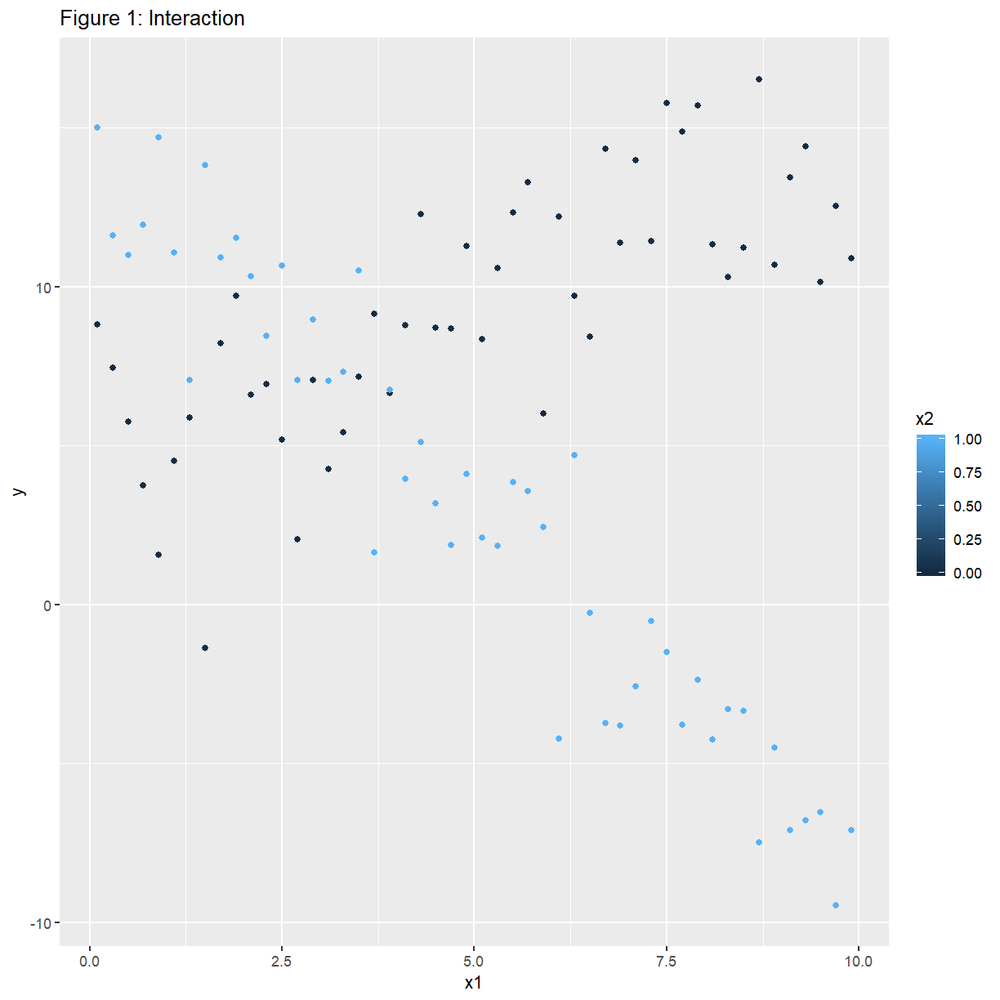
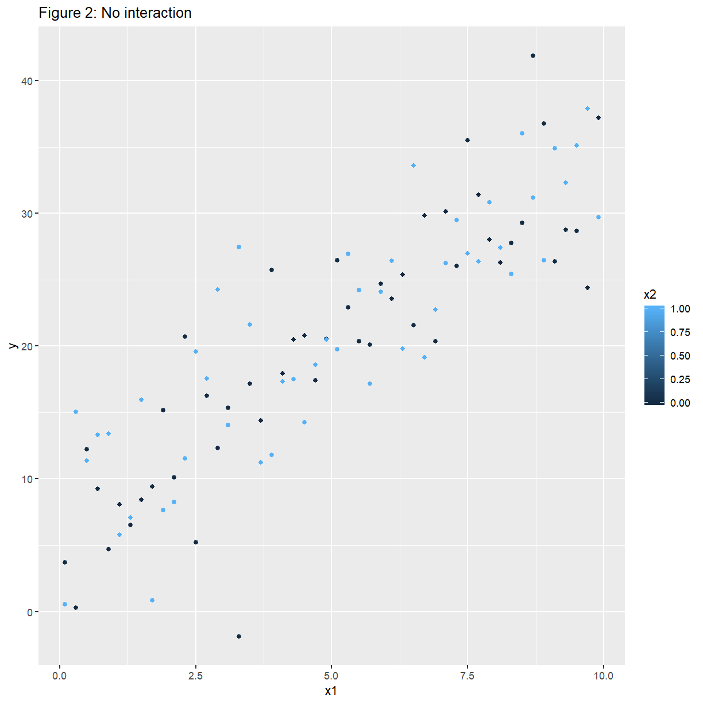
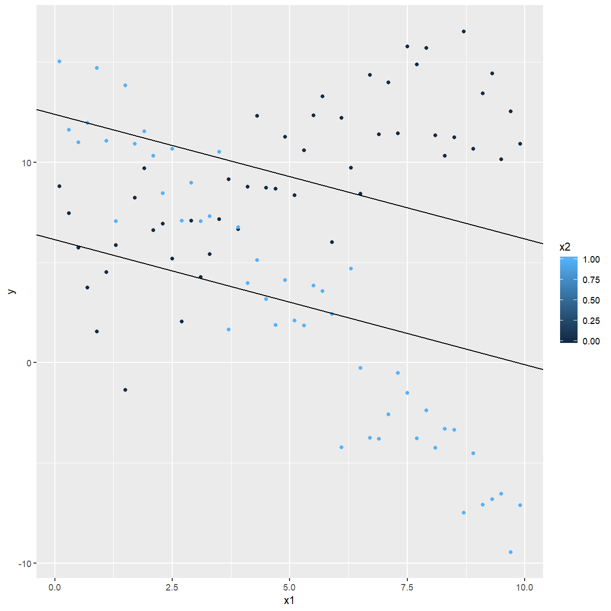
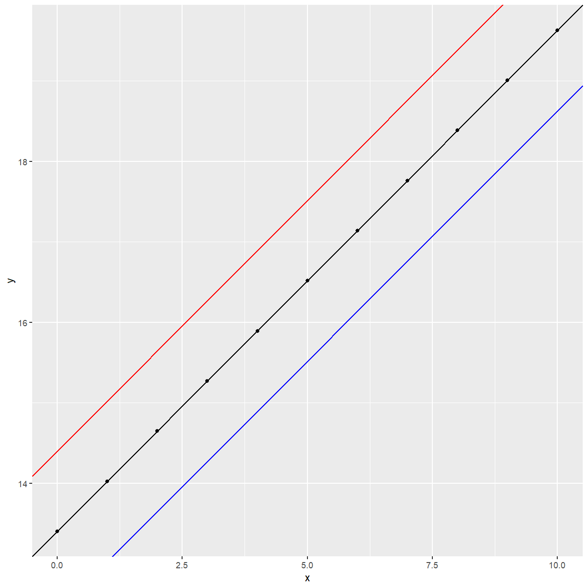
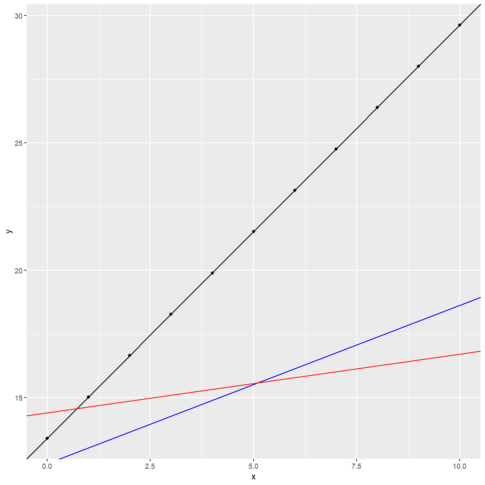

---
# Please do not edit this file directly; it is auto generated.
# Instead, please edit 05-regression.md in _episodes_rmd/
title: "Regression"
author: "Dr Tania Prvan"
teaching: 60
exercises: 30
questions:
- ""
objectives:
- ""
keypoints:
- ""
source: "Rmd"
mathjax: true
---

### 2.1 HYPOTHESIS TESTS

We wish to test whether the overall regression is significant; i.e., are all the predictors
taken together useful in the prediction of $Y$?

Should a particular predictor be in the regression model?

Should a set of predictors be added to the regression model? (This situation arises when a group
of predictors belong together.)

In general, we have a null model (reduced model), in which some or all of the predictors are
left out of the model (i.e. some or all of $\beta_i$'s are hypothesised to be zero) and a full
model which has all the predictors in the model (i.e. all $\beta_i$'s present). The general form
of the test statistic is:

$$F=\frac{\hat{\sigma}_0^2}{\hat{\sigma}^2}$$

where $\hat{\sigma}^2$ is the usual estimate of $\sigma^2$ under the full model and
$\hat{\sigma}_0^2$ is the estimate of $\sigma^2$ under the null model (reduced model). If the
null model holds $\hat{\sigma}_0^2$ equals $\sigma^2$ and if the null model does not hold then
it is greater than $\sigma^2$.	Having more parameters in the model will always reduce the
residual variation. Therefore $\sigma^2\le\hat{\sigma}_0^2$.If the null model holds we would
expect $F$ to be approximately equal to 1 and if the full model holds we would expect $F$ to be
greater than 1. If $F$ is large the full model has reduced the residual variation substantially,
the additional predictors are useful in the prediction of the $y$  whereas if $F$ is close to 1
then the additional predictors in the full model have not reduced the residual variation by much
so we would use the null model.

#### 2.1.1 Test for overall significance of the regression

If we had $p$ predictors the full model would be

$$y_i=\beta_0+\beta_1x_{i1}+\beta_2x_{i2}+\cdots+\beta_{ip}x_p+\varepsilon_i,   i=1,\cdots,n.$$

If we are interested in testing whether the regression is significant or not we are interested
in testing whether some of the predictors ($X_i$'s) are useful or not. 
The null model would be that none of the predictors are useful:

$$y_i=\beta_0+\varepsilon_i,   i=1,\cdots,n.$$

We test the hypothesis $H_0:\beta_1=\beta_2=\cdots=\beta_p=0$ against
$H_1:$ at least one $\beta_i\neq0$. In matrix notation
	
$$H_0:\left(\begin{matrix}\beta_1\\\beta_2\\\vdots\\\beta_p\\\end{matrix}\right)=\left(\begin{matrix}0\\0\\\vdots\\0\\\end{matrix}\right) \mbox{ versus } H_1:\left(\begin{matrix}\beta_1\\\beta_2\\\vdots\\\beta_p\\\end{matrix}\right)\neq\left(\begin{matrix}0\\0\\\vdots\\0\\\end{matrix}\right).$$

Here the regression mean square would be used to estimate $\sigma^2$ under the full model and
the residual mean square would be used to estimate $\sigma^2$ under the null model. 
	The test statistic is 

$$F=\frac{MSR}{MSE}=\frac{SSR/p}{SSE/(n-p-1)}$$

which under the null hypothesis has a $F_{p,n-p-1}$ distribution. 
We reject $H_0$ in favour of $H_1$ if $F$ lies in the upper tail of this distribution. 

Computations can be summarised in the ANOVA table:
$$ \begin{array}{l|llll}\hline
\mbox{Source} & df & SS & MS & F\\ \hline
\mbox{Regression} & p & SSR & MSR=\frac{SSR}{p} & F=\frac{MSR}{MSE}\\
\mbox{Residual} & n-p-1 & SSE & MSE=\frac{SSE}{n-p-1}=\hat{\sigma}^2 & \\ \hline
\mbox{Total} & n-1 & SST & & \\ \hline
\end{array} $$

where $SST$, $SSR$ and $SSE$ are defined as before. We have exactly the same decomposition as
before that 

SST = SSR + SSE

Now, $R^2=\frac{SSR}{SST}$ is the proportion of the variance explained by the regression.

We can show that

$$F=\frac{R^2/p}{(1-R^2)/(n-p-1)}.$$

A small value of $R^2$ will result in a small value of $F$ and we will not reject $H_0$ in
favour of $H_1$. A value of $R^2$ close to 1 will result in a large value of $F$ and we will
reject $H_0$ in favour of $H_1$.
 
We already have seen an example of testing whether the regression is significant.

#### 2.1.2 Selecting the "best" model

There is no unique criterion for choosing the "best" model. We want as simple a model as
possible that adequately explains what is going on ("principle of parsimony"). The more
parameters in the model, the closer the fitted values will be to the observed data and the
higher $R^2$ will be but the standard errors of the estimates ${\hat{\beta}}_i$ will increase
because we are estimating more parameters on the same amount of information. We trade off
between

1. Few $X$'s (small $p$): lower $R^2$ but more precise $\beta_i$'s and
1. Many $X$'s (large $p$): higher $R^2$ but less precise $\beta_i$'s.

We try to find that set of predictors
which give an acceptable model fit, or $R^2$. If a predictor does not add to the model's
explanation of the variation of $Y$  in a significant way, it is not added to the model, even
though it would have reduced $R^2$.

##### Comparing two models

The **reduced model** is the model with the smallest number of parameters. We want to test
$H_0:$ reduced model is appropriate against $H_1:$ full model is appropriate. To formally test
this we need to fit the reduced model and record from the output the Residual (Error) Sum of
Squares and its associated degrees of freedom, which we denote by $SSE_{RM}$ and $DF_{RM}$
respectively. The same information is required from fitting the full model, label the residual
sum of squares and its associated degrees of freedom by $SSE_{FM}$ and $DF_{FM}$.  The
appropriate test statistic is

$$T=\frac{\left(SSE_{RM}-SSE_{FM}\right)/(DF_{RM}-DF_{FM})}{SSE_{FM}/DF_{FM}}.$$

We reject $H_0$ in favour of $H_1$ at the $100\alpha\%$ significance level if
$T>F_{DF_{RM}-DF_{FM},DF_{FM};\alpha}$.	This is only valid if the model assumptions hold. We
will look at regression diagnostics in detail the next section.

##### Partial F-tests

Assume that we have $n$ observations. The full model has all the $p$ predictors in it. 
The reduced model has one predictor removed, say the i'th predictor. We use the same test
statistic as above and reject $H_0:\beta_i=0$ in favour of $H_1:\beta_i\neq0$ at the
$\alpha100\%$ significance level if $T>F_{1,n-p-1;\alpha}$. You can think of the partial F tests
as assessing variables as if they were the last being added to the model.

An equivalent way of testing $H_0:\beta_i=0$ versus $H_1:\beta_i\neq 0$ is using
$t=\frac{\hat{\beta}_i}{S.E.(\hat{\beta}}_i)}$
which has a $t_{n-p-1}$ distribution if $H_0$ is true.
The R function `lm` gives you the partial F-tests in this way. 
The disadvantage of partial F-tests is that they are not independent tests. 

##### EXAMPLE: Heat Flux revisited

~~~
summary(heatflux_fit)
~~~
{: .language-r}

~~~

Call:
lm(formula = HeatFlux ~ Insulation + East + South + North + Time, 
    data = heat_flux)

Residuals:
     Min       1Q   Median       3Q      Max 
-13.6848  -2.7688   0.6273   3.9166  17.3962 

Coefficients:
             Estimate Std. Error t value Pr(>|t|)    
(Intercept) 325.43612   96.12721   3.385  0.00255 ** 
Insulation    0.06753    0.02899   2.329  0.02900 *  
East          2.55198    1.24824   2.044  0.05252 .  
South         3.80019    1.46114   2.601  0.01598 *  
North       -22.94947    2.70360  -8.488 1.53e-08 ***
Time          2.41748    1.80829   1.337  0.19433    
---
Signif. codes:  0 '***' 0.001 '**' 0.01 '*' 0.05 '.' 0.1 ' ' 1

Residual standard error: 8.039 on 23 degrees of freedom
Multiple R-squared:  0.8988,	Adjusted R-squared:  0.8768 
F-statistic: 40.84 on 5 and 23 DF,  p-value: 1.077e-10
~~~
{: .output}

The Partial F-tests p-values are given in the Pr(>|t|) column. You only look at these if the
model assumptions hold. Suppose they do, then you would conclude at the 5% significance level
that the predictors `Insulation` and `South` are significant.

##### Sequential F tests

Assume that we have $Sn$ observations. Variables are added to the model in a particular order
and at each step the most recent predictor being entered into the model is tested for
significance. 

R function `lm` can provide the output. All you need do is divide the sequential sum of squares
by the residual mean sum of squares for the full model and compare with $F_{1,n-p-1}$. 
The advantage of the sequential $F$ tests are that they are independent tests. 
The disadvantage is that the tests may be highly dependent on the order in which the
predictors enter the model. 

~~~
fit5 <- lm(HeatFlux ~ Insulation + East + South + North + Time, data = heat_flux)
fit4 <- lm(HeatFlux ~ Insulation + East + South + North, data = heat_flux)
fit3 <- lm(HeatFlux ~ Insulation + East + South, data = heat_flux)
fit2 <- lm(HeatFlux ~ Insulation + East, data = heat_flux)
fit1 <- lm(HeatFlux ~ Insulation, data = heat_flux)
fit0 <- lm(HeatFlux ~ 1, data = heat_flux)

anova(fit0, fit1, fit2, fit3, fit4, fit5, test = "F")
~~~
{: .language-r}

~~~
Analysis of Variance Table

Model 1: HeatFlux ~ 1
Model 2: HeatFlux ~ Insulation
Model 3: HeatFlux ~ Insulation + East
Model 4: HeatFlux ~ Insulation + East + South
Model 5: HeatFlux ~ Insulation + East + South + North
Model 6: HeatFlux ~ Insulation + East + South + North + Time
  Res.Df     RSS Df Sum of Sq       F    Pr(>F)    
1     28 14681.9                                   
2     27  8898.1  1    5783.8 89.4964 2.155e-09 ***
3     26  8086.4  1     811.7 12.5602 0.0017316 ** 
4     25  6904.9  1    1181.5 18.2822 0.0002832 ***
5     24  1601.9  1    5303.0 82.0574 4.772e-09 ***
6     23  1486.4  1     115.5  1.7873 0.1943335    
---
Signif. codes:  0 '***' 0.001 '**' 0.01 '*' 0.05 '.' 0.1 ' ' 1
~~~
{: .output}

East, South and North are significant (at 1\% significance level or 0.5\% significance level)
according to the Sequential F Test.

**EXERCISE** Try different orderings of the predictors. There are 5 ways you can choose the
first predictor, 4 ways for the second predictor, 3 ways of choosing the third predictor,
2 ways of choosing the fourth predictor, and only one way to choose the fifth predictor giving
$5 \times 4 \times 3 \times 2 \times 1 = 120$ combinations.

##### Using R Square ($R^2$)

When a linear regression model is fitted using function `lm` in R you can extract $R^2$. 

~~~
summary(heatflux_fit)$r.squared
~~~
{: .language-r}

~~~
[1] 0.8987602
~~~
{: .output}
        
R Square gives the "proportion of variation in the response data that is explained by the
model".	An acceptable value for $R^2$ depends on the context of the model fitting. R Square
($R^2$) is a dangerous criterion for model comparisons, any additional model terms will
automatically increase it.

Note that Multiple R-squared given earlier is the same as R-squared in the `lm` function.

##### Using Adjusted R Square ($R_{ADJ}^2$) 

When a linear regression model is fitted using `lm` in R you can always obtain $R_{ADJ}^2$
(Adjusted R-Squared). This is $R_{ADJ}^2=1-\frac{n-1}{n-p}(1-R^2)$ which does not necessarily
increase if more terms are added to the model. The model with the largest $R_{ADJ}^2$ is usually
chosen.

**EXAMPLE** For the Heat Flux data using all the predictors the Adjusted R-squared is
0.8768. See earlier output.

##### Using $\hat{\sigma}^2$, the residual mean square (MSE)

We choose the model with the smallest $\hat{\sigma}^2$ or if the next smallest $\hat{\sigma}^2$
is close to the smallest $\hat{\sigma}^2$ but the model has less terms in it we would choose it.
	
##### Mallows $C_p$ (A Criterion Based Method)

Predicted values obtained from a regression equation based on a subset of variables are
generally biased. We use the mean square error of the predicted value to judge the performance
of an equation. The	measure standardized total mean squared error of prediction for the observed
data by

$$J_p=\frac{1}{\sigma^2}\sum{MSE(\hat{y}_i)}$$

where MSE($\hat{y}_i$) is the ith predicted value from an equation with $p$ terms (number of
parameters in equation) and $\sigma^2$ is the variance of the random errors.	This statistic
places special emphasis on observed data, and good subsets will result in small values. 

We can estimate the value of this statistic from the data by Mallows' $C$, calculated from:

$$C_p=\frac{SSE_p}{\hat{\sigma}^2}+(2p-n)$$

where $\hat{\sigma}^2$ is from the linear model with the full set of $q$ variables.

Mallows' $C_p$ has these properties:

1. it is easily calculated from usual regression summaries,
1. it measures the difference in fitting errors between the full and the subset
   models,
1. it has a random and a fixed component giving a trade off between better fit and more
   parameters, and
1. it can be used to compare subset models --- although it is not necessarily true that a
   smaller value means a better subset model, any model with $C_p \le p$ will be a good model.

We can use `leaps` to obtain the Mallow's $C_p$. Note that when $p$ equals the number of
predictors in the full model that Mallow's $C_p$ always equals $p$.

~~~
library(leaps)

x <- heat_flux[, -1]
y <- heat_flux$HeatFlux

leaps(x, y)
~~~
{: .language-r}

~~~
$which
      1     2     3     4     5
1 FALSE FALSE FALSE  TRUE FALSE
1  TRUE FALSE FALSE FALSE FALSE
1 FALSE FALSE FALSE FALSE  TRUE
1 FALSE FALSE  TRUE FALSE FALSE
1 FALSE  TRUE FALSE FALSE FALSE
2 FALSE FALSE  TRUE  TRUE FALSE
2 FALSE FALSE FALSE  TRUE  TRUE
2  TRUE FALSE FALSE  TRUE FALSE
2 FALSE  TRUE FALSE  TRUE FALSE
2  TRUE  TRUE FALSE FALSE FALSE
2  TRUE FALSE  TRUE FALSE FALSE
2  TRUE FALSE FALSE FALSE  TRUE
2 FALSE FALSE  TRUE FALSE  TRUE
2 FALSE  TRUE FALSE FALSE  TRUE
2 FALSE  TRUE  TRUE FALSE FALSE
3 FALSE  TRUE  TRUE  TRUE FALSE
3  TRUE FALSE  TRUE  TRUE FALSE
3 FALSE FALSE  TRUE  TRUE  TRUE
3  TRUE FALSE FALSE  TRUE  TRUE
3 FALSE  TRUE FALSE  TRUE  TRUE
3  TRUE  TRUE FALSE  TRUE FALSE
3  TRUE  TRUE  TRUE FALSE FALSE
3  TRUE FALSE  TRUE FALSE  TRUE
3 FALSE  TRUE  TRUE FALSE  TRUE
3  TRUE  TRUE FALSE FALSE  TRUE
4  TRUE  TRUE  TRUE  TRUE FALSE
4  TRUE FALSE  TRUE  TRUE  TRUE
4 FALSE  TRUE  TRUE  TRUE  TRUE
4  TRUE  TRUE FALSE  TRUE  TRUE
4  TRUE  TRUE  TRUE FALSE  TRUE
5  TRUE  TRUE  TRUE  TRUE  TRUE

$label
[1] "(Intercept)" "1"           "2"           "3"           "4"          
[6] "5"          

$size
 [1] 2 2 2 2 2 3 3 3 3 3 3 3 3 3 3 4 4 4 4 4 4 4 4 4 4 5 5 5 5 5 6

$Cp
 [1]  38.492277 112.687090 174.174842 199.329010 199.803490   9.097518
 [7]  17.846129  37.462451  40.490491 102.126871 107.320539 114.607262
[13] 120.046927 174.732260 196.395794   7.596312   9.717698   9.950942
[19]  10.149946  19.842738  38.941581  85.844637 100.383642 101.484104
[25] 102.842597   5.787266   8.179844   9.424426  10.764344  76.054147
[31]   6.000000
~~~
{: .output}

According to Mallow's $C_p$ none of the models are any good.

##### Multicollinearity

When predictors are related to each other, regression modelling can be very confusing. Estimated
effects can change in magnitude and even sign.	Two predictors are collinear if
$c_1x_1+c_2x_2=c_0$ for constants $c_1,c_2,c_0$. The definition of collinearity extends to
several predictors. More important, however, is approximate collinearity, when predictors are
closely but not exactly related and the equation holds approximately.	In some packages (e.g.
Minitab) a message is given if you perform a regression where there is too much collinearity. If
the collinearity is extreme, a variable will be dropped before the calculations are carried out.
If the collinearity is exact, this causes no loss of information, and if the collinearity is
approximate, only a small amount of information is lost.

Alternatively, we can ask for variance inflation factors (VIFs) associated with each predictor.
These come from the formula for the variance of the parameter estimates
$Var(\hat{\beta}_i)=\sigma^2\left(\frac{1}{1-R_i^2}\right)\left(\frac{1}{SX_iX_i}\right)$,
with $R_i^2$ the square of the multiple correlation between $X_i$ and the other $X’s$,
and $1/(1-R_i^2)$ being the amount by which the variance is increased, or inflated, due to
collinearity.
If none of the VIFs are greater than 10 then collinearity is not a problem.

**EXAMPLE** Revisiting Heat Flux example.

~~~
library(car)

heatflux_fit <- lm(HeatFlux ~ Insulation + East + South + North + Time, data = heat_flux)
vif(heatflux_fit)
~~~
{: .language-r}

~~~
Insulation       East      South      North       Time 
  2.319035   1.355448   3.175970   2.612066   5.370059 
~~~
{: .output}

All VIFs are less than 10 so there is no multicollinearity problem.

##### Multiple correlation coefficient

The multiple correlation coefficient $R_{Y|X_1,\cdots,X_p}$ is a measure of the association
between $Y$ and $X_1,\ldots,X_p$ jointly. Its square is what we have called $R^2$. We can
interpret $R_{Y|X_1,\cdots,X_p}$ as the correlation between $Y$ and the regression equation
involving $X_1,\ldots,X_p$. It is defined as
$R_{Y|X_1,\cdots,X_p}=\frac{\sum(y_i-\bar{y})(y_i-\hat{y})}{\sum(y_i-\bar{y})^2 \sum (y_i-\bar\hat{y})^2}$
where
$\hat{y}_i=\hat{\beta}_0+\hat{\beta}_1x_{i1}+\hat{\beta}_2x_{i2}+\cdots \hat{\beta}_px_{ip}$, $i=1,\ldots,n$,
is the fitted value or predicted value for $y_i$ and $\bar\hat{y}=\frac{1}{n}\sum \hat{y}_i$
is the mean of the fitted values. (It turns out that $\bar{\hat{y}}=\bar{y}$ always.)

Also, $R_{Y|X_1,\cdots,X_p}^2=\frac{SST-SSE}{SST}=\frac{SSR}{SST}$ and it is interpreted as the
proportion of total variation (SST) that is explained by the regression involving
$X_1,\ldots,X_p$ (SSR).

##### Variable selection

To combat collinearity or to find a parsimonious model we may wish to select only some of the
predictor variables available. Assume that we have $n$ cases with values observed on $k$
predictor variables $X_1,X_2,\cdots,X_k$ and a response $Y$. Let $p$ = the number of predictors
in a selected subset (including the intercept) and assume all necessary transformations have
been carried out. 

The full model can be written as $Y=X_1\beta_1+X_2\beta_2+\varepsilon$ (vector notation, with
X_1 an n by p matrix) and the subset model $Y=X_1\beta_1+\varepsilon$ is obtained by putting
$\beta_2=0$. The subset model is tested against the full model using a generalised F-test, as
usual.

$$ \begin{array}{l|llll}\hline
\mbox{Source} & df & SS & MS & F\\ \hline
\mbox{Reg with }(\beta_1,\beta_2) & k & SSR(\beta_1,\beta_2) & & \\ \hline
\mbox{Reg with }(\beta_1) & p-1 & SSR(\beta_1) & & \\

\mbox{Reg with } (\beta_2 | \beta_1) & k+1-p& SSR(\beta_1,\beta_2) - SSR(\beta_1) & MSR & F^{*}\\ \hline

\mbox{Residual} & n-k - 2 & SSR & MSE=\hat{\sigma}^2 & \\ \hline
\mbox{Total} & n-1 & SST & & \\ \hline
\end{array} $$

##### Selecting variables on substantive grounds

The most important method for selecting variables is based on a knowledge of the situation and
the variables being studied.

**EXAMPLE:**  The variables `HT` (height) and `WT` (weight) can be combined into
`BMI` (body mass index = weight per height squared). 

**EXAMPLE:** A number of test scores can be combined into an average.

**EXAMPLE:** Weisberg (1981) gives an example **Highway data**, from a Masters thesis modelling
the automobile accident rate in terms of 13 independent variables. Here there are
$2^{13} = 8192$ possible subset models, which can be reduced by considering two points:

1. Three variables, `FAI`, `PA` and `MA`, should be kept together since they are indicator
   variables for different types of highways, with a fourth type indicated if each of these
   variables equals zero and
1. The variable `LEN`, length of segment under study, is required by definition. This now gives
   a total of 512 possible subset models, still a large number but much fewer than originally.

##### Stepwise methods of variable selection

Often we have to use the data to find a reasonable subset of the predictors for use in a model.
A stepwise procedure is a systematic way of examining only a few subsets of each size and
choosing a path through all possible models.

###### Forward selection

We begin with a simple regression model with the best single predictor (largest $R^2$, $F$ or
$t$).We then add the predictor that increases $R^2$ the most, or would have the largest $F$ or
$t$ of any of the other variables. We continue thus, but stop when you reach a subset of
predetermined size, or when no other variable has an $F$ greater than $F$ to enter, or if any
variable would cause unacceptable collinearity.

###### Backward elimination

We begin with the full model. We then remove the variable with the smallest $F$ or $t$, the
variable that would reduce $R^2$ the least. We continue thus, but stop when you reach a subset
of predetermined size, or when all variables remaining in the model have $F$ greater than $F$ to
remove.

###### Stepwise

This is a combination of the previous two methods. We start with one variable, as in forward
selection, and at each step take one of four options: add a variable, remove a variable,
exchange two variables or stop. If there are at least two variables in the model, remove a
variable if it has $F$ less than $F$ to remove. If there are at least two variables in the
model, remove a variable if this would result in a larger $R^2$ than obtained previously with
that many variables. Exchange a variable in the model with one not in the model if this would
increase $R^2$. Add a variable if it has the largest $F$ greater than $F$ to enter and the
collinearity tolerance is OK.

###### Remarks

* Stepwise methods entail less computing than Best Subsets Regression. 
* Order in which variables enter or leave the equation should not be interpreted as reflecting
  the relative importance of the variables.
* If data is noncollinear, all three methods should give nearly the same selection of variables.
* CHP recommend Backward Elimination over Forward Selection because the full variable set is
  calculated and available for inspection even though it may not be used in the final equation.
* Backward Elimination copes better with multicollinearity.
* Residual plots for various “best” models fitted to data should always be examined and if found
  to be unsatisfactory the model should not be used.

**EXAMPLE:** Squid data (This data set is from Classical and Modern Regression with Applications
by R.H. Myers published in 1990.) An experiment was conducted to study the size of squid eaten
by sharks and tuna.

The regressors are characteristics of the beak or mouth of the squid. They are X1 = Beak length
in inches, X2 = Wing length in inches, X3 =  Beak to notch length, X4 = Notch to wing length,
and X5 = Width in inches. The response (Y) is the weight of the squid in pounds. These data are
given below.

$$ \begin{array}{|c|ccccc|c|ccccc|}\hline
Y & X_1 & X_2 & X_3 & X_4 & X_5 &  Y & X_1 & X_2 & X_3 & X_4 & X_5\\ \hline
1.95 & 1.31 & 1.07& 0.44 & 0.75 & 0.35 & 1.90 & 1.33 & 1.10 & 0.48 & 0.77 & 0.38\\ 
2.90 &	1.55 &	1.49 &	0.53 &	0.90 &	0.47 &	8.56 &	1.86 &	1.47 &	0.60 &	1.01 &	0.65\\
0.72 & 0.99 &	0.84 &	0.34 &	0.57 &	0.32 &	4.49 &	1.58 &	1.34 &	0.52 &	0.95 &	0.50\\
0.81 & 0.99 &	0.83 &	0.34 &	0.54 &	0.27 &	8.49 &	1.97 &	1.59 &	0.67 &	1.20 &	0.59\\
1.09 & 	1.05 &	0.90 &	0.36 &	0.64 &	0.30 &	6.17 &	1.80 &	1.56 &	0.66 &	1.02 &	0.59 \\
1.22 &	1.09 &	0.93 &	0.42 &	0.61 &	0.31 &	7.54 &	1.75 &	1.58 &	0.63 &	1.09 &	0.59\\
1.02 & 1.08 &	0.90 &	0.40 &	0.51 &	0.31 &	6.36 &	1.72 &	1.43 &	0.64 &	1.02 &	0.63\\
1.93 &	1.27 &	1.08 &	0.44 &	0.77 &	0.34 &	7.63 &	1.68 &	1.57 &	0.72 &	0.96 &	0.68\\
0.64 & 0.99 &	0.85 &	0.36 &	0.56 &	0.29 &	7.78 &	1.75 &	1.59 &	0.68 &	1.08 &	0.62\\
2.08 & 1.34 &	1.13 &	0.45 &	0.77 &	0.37 &	10.15 &	2.19 &	1.86 &	0.75 &	1.24 &	0.72\\
1.98 & 1.30 &	1.10 &	0.45 &	0.76 &	0.38 &	6.88 &	1.73 &	1.67 &	0.64 &	1.14 &	0.55\\ \hline
\end{array}$$

We first fit the model
$Y=\beta_0+\beta_1X_1+\beta_2X_2+\beta_3X_3+\beta_4X_4+\beta_5X_5+\varepsilon$
to the above data.

Before doing this we should first obtain a matrix scatter plot of the data.

~~~
library(tidyverse)
library(ggpubr)

squid <- read_csv(file.path("..", "Data", "Squid.csv"))
squid
~~~
{: .language-r}

~~~
# A tibble: 22 x 6
       Y    X1    X2    X3    X4    X5
   <dbl> <dbl> <dbl> <dbl> <dbl> <dbl>
 1  1.95  1.31  1.07  0.44 0.75  0.35 
 2  2.9   1.55  1.49  0.53 0.9   0.47 
 3  0.72  0.99  0.84  0.34 0.570 0.32 
 4  0.81  0.99  0.83  0.34 0.54  0.27 
 5  1.09  1.05  0.9   0.36 0.64  0.3  
 6  1.22  1.09  0.93  0.42 0.61  0.31 
 7  1.02  1.08  0.9   0.4  0.51  0.31 
 8  1.93  1.27  1.08  0.44 0.77  0.34 
 9  0.64  0.99  0.85  0.36 0.56  0.290
10  2.08  1.34  1.13  0.45 0.77  0.37 
# ... with 12 more rows
~~~
{: .output}

~~~
pairs(squid)
~~~
{: .language-r}

The relationship between $Y$ and each predictor separately is approximately linear with positive
slope. More worrying is the obvious correlations between most of the predictors, there may be
multicollinearity.

Seeing what happens when we fit the multiple linear regression.

~~~
squid_fit <- lm(Y ~ X1 + X2 + X3 + X4 + X5, data = squid)

par(mfrow = c(2, 2))
plot(squid_fit)
~~~
{: .language-r}

The model is not adequate, the Residual versus Fitted values plot does not look like a random
scatter about zero. We cannot proceed to make valid inference.

For the moment, just to illustrate what to do if the model was adequate and the normality
assumption held, look at the model out put.

~~~
summary(squid_fit)
~~~
{: .language-r}

~~~

Call:
lm(formula = Y ~ X1 + X2 + X3 + X4 + X5, data = squid)

Residuals:
    Min      1Q  Median      3Q     Max 
-1.2610 -0.5373  0.1355  0.5120  0.8611 

Coefficients:
            Estimate Std. Error t value Pr(>|t|)    
(Intercept)  -6.5122     0.9336  -6.976 3.13e-06 ***
X1            1.9994     2.5733   0.777  0.44851    
X2           -3.6751     2.7737  -1.325  0.20378    
X3            2.5245     6.3475   0.398  0.69610    
X4            5.1581     3.6603   1.409  0.17791    
X5           14.4012     4.8560   2.966  0.00911 ** 
---
Signif. codes:  0 '***' 0.001 '**' 0.01 '*' 0.05 '.' 0.1 ' ' 1

Residual standard error: 0.7035 on 16 degrees of freedom
Multiple R-squared:  0.9633,	Adjusted R-squared:  0.9519 
F-statistic: 84.07 on 5 and 16 DF,  p-value: 6.575e-11
~~~
{: .output}

Partial F tests suggest that the “best” model contains only one predictor variable and that is
X5. (Since the model assumptions are violated the above inference is dangerous.)

We could also look at the “best” model suggested by sequential F tests. The order in which the
parameters are listed can affect the conclusions reached significantly. A full-scale
model-building process cannot be based on sequential F tests unless there is an appropriate
selection of order of variables based on subject matter expertise.

~~~
fit5 <- lm(Y ~ X1 + X2 + X3 + X4 + X5, data = squid)
fit4 <- lm(Y ~ X1 + X2 + X3 + X4, data = squid)
fit3 <- lm(Y ~ X1 + X2 + X3, data = squid)
fit2 <- lm(Y ~ X1 + X2, data = squid)
fit1 <- lm(Y ~ X1, data = squid)
fit0 <- lm(Y ~ 1, data = squid)

anova(fit0, fit1, fit2, fit3, fit4, fit5, test = "F")
~~~
{: .language-r}

~~~
Analysis of Variance Table

Model 1: Y ~ 1
Model 2: Y ~ X1
Model 3: Y ~ X1 + X2
Model 4: Y ~ X1 + X2 + X3
Model 5: Y ~ X1 + X2 + X3 + X4
Model 6: Y ~ X1 + X2 + X3 + X4 + X5
  Res.Df     RSS Df Sum of Sq        F    Pr(>F)    
1     21 215.925                                    
2     20  16.779  1   199.145 402.4397 9.131e-13 ***
3     19  16.653  1     0.127   0.2560  0.619804    
4     18  12.533  1     4.120   8.3249  0.010765 *  
5     17  12.270  1     0.263   0.5325  0.476114    
6     16   7.918  1     4.352   8.7951  0.009109 ** 
---
Signif. codes:  0 '***' 0.001 '**' 0.01 '*' 0.05 '.' 0.1 ' ' 1
~~~
{: .output}

The model suggested by the sequential F tests is
$Y=\beta_0+\beta_1X_1+\beta_3X_3+\beta_5X_5+\varepsilon$.

~~~
fit135 <- lm(Y ~ X1 + X3 + X5, data = squid)

summary(fit135)
~~~
{: .language-r}

~~~

Call:
lm(formula = Y ~ X1 + X3 + X5, data = squid)

Residuals:
    Min      1Q  Median      3Q     Max 
-1.6386 -0.5084  0.1060  0.5471  0.9666 

Coefficients:
            Estimate Std. Error t value Pr(>|t|)    
(Intercept) -6.83999    0.87718  -7.798 3.52e-07 ***
X1           3.26593    1.60373   2.036   0.0567 .  
X3           0.07094    5.48254   0.013   0.9898    
X5          13.35925    4.72866   2.825   0.0112 *  
---
Signif. codes:  0 '***' 0.001 '**' 0.01 '*' 0.05 '.' 0.1 ' ' 1

Residual standard error: 0.7142 on 18 degrees of freedom
Multiple R-squared:  0.9575,	Adjusted R-squared:  0.9504 
F-statistic: 135.1 on 3 and 18 DF,  p-value: 1.572e-12
~~~
{: .output}

The appropriate test statistic for testing
$H_0: Y=\beta_0+\beta_1X_1+\beta_3X_3+\beta_5X_5+\varepsilon$  against
$H_1: Y=\beta_0+\beta_1X_1+\beta_2X_2+\beta_3X_3+\beta_4X_4+\beta_5X_5+\varepsilon$  is

$$T=\frac{\left(SSE_{RM}-SSE_{FM}\right)/(DF_{RM}-DF_{FM})}{SSE_{FM}/DF_{FM}}$$

We reject $H_0$ in favour of $H_1$ at the 100$\alpha\%$ significance level if
$T>F_{DF_{RM}-DF_{FM},DF_{FM};\alpha}$.

~~~
anova(fit5)
~~~
{: .language-r}

~~~
Analysis of Variance Table

Response: Y
          Df  Sum Sq Mean Sq  F value    Pr(>F)    
X1         1 199.145 199.145 402.4397 9.131e-13 ***
X2         1   0.127   0.127   0.2560  0.619804    
X3         1   4.120   4.120   8.3249  0.010765 *  
X4         1   0.263   0.263   0.5325  0.476114    
X5         1   4.352   4.352   8.7951  0.009109 ** 
Residuals 16   7.918   0.495                       
---
Signif. codes:  0 '***' 0.001 '**' 0.01 '*' 0.05 '.' 0.1 ' ' 1
~~~
{: .output}

~~~
anova(fit135)
~~~
{: .language-r}

~~~
Analysis of Variance Table

Response: Y
          Df  Sum Sq Mean Sq  F value    Pr(>F)    
X1         1 199.145 199.145 390.3744 1.188e-13 ***
X3         1   3.525   3.525   6.9103   0.01704 *  
X5         1   4.072   4.072   7.9816   0.01121 *  
Residuals 18   9.183   0.510                       
---
Signif. codes:  0 '***' 0.001 '**' 0.01 '*' 0.05 '.' 0.1 ' ' 1
~~~
{: .output}

Now, from the output above $SSE_{FM}=7.918$, $DF_{FM}=16$, $SSE_{REM}=9.183$,
and $DF_{RM}=18$ so our test statistic

$$T=\frac{\left(9.183-7.918\right)/(18-16)}{7.918/16}=1.28.$$

Need to compare this with $F_{2,18;0.05}$. 

~~~
qf(0.95, df1 = 2, df2 = 18)
~~~
{: .language-r}

~~~
[1] 3.554557
~~~
{: .output}

Since $T=1.28 \ngeq 3.5546$  we cannot reject $H_0$ in favour of $H_1$ at the $5\%$
significance level. The reduced model here is plausible. 

If the model assumptions were not being met the above inference is dangerous.

###### Forward stepwise regression in R

Illustrated on the squid data set.

~~~
model <- lm(Y ~ ., data = squid)
model$call$data <- squid # Should not be needed when running by hand

ols_step_forward_p(model)
~~~
{: .language-r}

~~~
Error in ols_step_forward_p(model): could not find function "ols_step_forward_p"
~~~
{: .error}
Final model has $X_5$, $X_4$ and $X_2$.

###### Forward stepwise elimination in R

~~~
modelb <- lm(Y ~ ., data = squid)
modelb$call$data <- squid # Should not be needed when running by hand

ols_step_backward_p(modelb)
~~~
{: .language-r}

~~~
Error in ols_step_backward_p(modelb): could not find function "ols_step_backward_p"
~~~
{: .error}

Final model has $X_2$, $X_4$ and $X_5$.

###### Stepwise regression in R

~~~
models <- lm(Y ~ ., data = squid)
models$call$data <- squid # Should not be needed when running by hand

ols_step_both_p(models)
~~~
{: .language-r}

~~~
Error in ols_step_both_p(models): could not find function "ols_step_both_p"
~~~
{: .error}

Final model has $X_5$ and $X_4$.

###### Best Subsets Regression in R

~~~
modelbs <- lm(Y ~ ., data = squid)
modelbs$call$data <- squid # Should not be needed when running by hand

ols_step_best_subset(modelbs)
~~~
{: .language-r}

~~~
Error in ols_step_best_subset(modelbs): could not find function "ols_step_best_subset"
~~~
{: .error}

Using Mallow's $C_p$ would go for Model 3. Full model always has Mallow's $C_p = p$.

Using Adjusted $R^2$ would go for Model 3. 

Other packages will give you the estimate of $\hat{\sigma}^2$ or $\hat{\sigma}$ for each model
and you would go for the model with the smallest or close to smallest $\hat{\sigma}^2$ with the
least number of parameters in it.

### 2.2 PARTIAL CORRELATION

Partial correlation is the correlation between two variables while controlling for the effects
of one or more other variables.The partial correlation between $Y$ and $X$, after controlling
for $Z_1,\cdots,Z_p$ is denoted by $r_{YX|Z_1,cdots,Z_p}$. Its square is defined as follows
$r_{YX|Z_1,\cdots,Z_p}^2=\frac{SSE_{Z_1,\cdots,Z_p}-SSE_{X,Z_1,\cdots,Z_p}}{SSE_{Z_1,\cdots,Z_p}}$.
This is the reduction in sum of squares due to adding $X$ into the model, given $Z_1,\cdots,Z_p$
already in the model divided by the residual sum of squares for the model only having
$Z_1,\cdots,Z_p$. The quantity $r_{YX|Z_1,\cdots,Z_p}$ is called the $p^{th}$ order partial
correlation coefficient. The R package `ppcor` can be used to calculate partial correlations.
See <https://cran.r-project.org/web/packages/ppcor/ppcor.pdf>. If we compare the controlled
correlation ($r_{YX|Z_1,\cdots,Z_p}$) with the original correlation ($r_{YX}$) and if there is
no difference, the inference is that the control variables have no effect. 

###### Test of the partial correlation coefficient

The partial correlation coefficient is an estimate $r_{YX|Z_1,\cdots,Z_p}^2$ of the population
quantity $\rho_{YX|Z_1,\ldots,Z_p}^2$. We test $H_0:\rho_{YX|Z_1,\ldots,Z_p}^2=0$ versus
$H_1:\rho_{YX|Z_1,\ldots,Z_p}^2\neq0$ via the partial F-test with test statistic
$T=\frac{\left(SSE_{RM}-SSE_{FM}\right)/(DF_{RM}-DF_{FM})}{SSE_{FM}/DF_{FM}}$
where the reduced model regresses $Y$ on $Z_1,\cdots,Z_p$ and the full model regresses $Y$ on
$X,Z_1,\cdots,Z_p$.

**EXAMPLE: MCG** (For details see <http://www.statsci.org/data/oz/afl.html>)

Want to investigate the effect on football game attendance of various covariates.

$$
\begin{array}{l|l} \hline
\mbox{Variable} & \mbox{Description} \\ \hline
\mbox{MCG} & 	\mbox{Attendance at the MCG in 1000's.}\\
\mbox{Members} & \mbox{The sum of the memberships of the two clubs whose teams were playing the
match in question in 1000's.} \\
\mbox{Top50} & \mbox{The number of players in the top 50 in the AFL who happened to be playing
in the match in question.} \\ \hline
\end{array}
$$

After taking the effect of Members into account, what is the effect of Top50 on MCG attendance?
Here $Y=$MCG, $X=$Top50 and $Z=$Members.

~~~
library(tidyverse)

mcg1 <- read_csv(file.path("..", "Data", "MCG1.csv"))
mcg1
~~~
{: .language-r}

~~~
# A tibble: 41 x 8
     MCG Other  Temp Members Top50 Date       Home  Away 
   <dbl> <dbl> <dbl>   <dbl> <dbl> <chr>      <chr> <chr>
 1  8.65 72.9     24    12.6     5 27/03/1993 NM    Bris 
 2 49.9  60.8     21    26.0     7 3/04/1993  Ess   Carl 
 3 24.4  59.8     24    16.9     5 17/04/1993 NM    Melb 
 4 46.6   9.27    22    27.0     8 1/05/1993  Ess   Gee  
 5 29.3  74.8     17    22.9     7 8/05/1993  Rich  StK  
 6 34.4  61.9     16    51.6     8 22/05/1993 Ess   Adel 
 7 17.8  92.1     19    13.0     4 29/05/1993 Rich  Syd  
 8 37.1  23.4     13    29.9     9 12/06/1993 Carl  Gee  
 9 44.1  61.2     14    21.6     6 19/06/1993 Melb  Ess  
10 19.1  54.9     13    21.5     7 26/06/1993 Ess   Rich 
# ... with 31 more rows
~~~
{: .output}

Fitting the model without the controlling variable.

~~~
mcg_fit1 <- lm(MCG ~ Members, data = mcg1)

summary(mcg_fit1)
~~~
{: .language-r}

~~~

Call:
lm(formula = MCG ~ Members, data = mcg1)

Residuals:
    Min      1Q  Median      3Q     Max 
-37.602  -8.161  -0.114   8.453  31.575 

Coefficients:
            Estimate Std. Error t value Pr(>|t|)    
(Intercept)   9.6216     8.0103   1.201 0.236935    
Members       1.2073     0.2873   4.202 0.000149 ***
---
Signif. codes:  0 '***' 0.001 '**' 0.01 '*' 0.05 '.' 0.1 ' ' 1

Residual standard error: 15.57 on 39 degrees of freedom
Multiple R-squared:  0.3117,	Adjusted R-squared:  0.294 
F-statistic: 17.66 on 1 and 39 DF,  p-value: 0.0001488
~~~
{: .output}

~~~
anova(mcg_fit1)
~~~
{: .language-r}

~~~
Analysis of Variance Table

Response: MCG
          Df Sum Sq Mean Sq F value    Pr(>F)    
Members    1 4279.8  4279.8   17.66 0.0001488 ***
Residuals 39 9451.5   242.3                      
---
Signif. codes:  0 '***' 0.001 '**' 0.01 '*' 0.05 '.' 0.1 ' ' 1
~~~
{: .output}

Fitting the model with the controlling variable.

~~~
mcg_fit2 <- lm(MCG ~ Members + Top50, data = mcg1)

summary(mcg_fit2)
~~~
{: .language-r}

~~~

Call:
lm(formula = MCG ~ Members + Top50, data = mcg1)

Residuals:
    Min      1Q  Median      3Q     Max 
-38.124  -9.259   0.387   8.682  30.940 

Coefficients:
            Estimate Std. Error t value Pr(>|t|)   
(Intercept)   1.5101    11.1320   0.136  0.89281   
Members       1.0728     0.3143   3.413  0.00154 **
Top50         1.9474     1.8584   1.048  0.30130   
---
Signif. codes:  0 '***' 0.001 '**' 0.01 '*' 0.05 '.' 0.1 ' ' 1

Residual standard error: 15.55 on 38 degrees of freedom
Multiple R-squared:  0.331,	Adjusted R-squared:  0.2958 
F-statistic: 9.401 on 2 and 38 DF,  p-value: 0.0004818
~~~
{: .output}

~~~
anova(mcg_fit2)
~~~
{: .language-r}

~~~
Analysis of Variance Table

Response: MCG
          Df Sum Sq Mean Sq F value    Pr(>F)    
Members    1 4279.8  4279.8 17.7044 0.0001518 ***
Top50      1  265.5   265.5  1.0981 0.3012961    
Residuals 38 9186.0   241.7                      
---
Signif. codes:  0 '***' 0.001 '**' 0.01 '*' 0.05 '.' 0.1 ' ' 1
~~~
{: .output}

Calculating the partial correlation:

$$T=\frac{\left(SSE_{RM}-SSE_{FM}\right)/(DF_{RM}-DF_{FM})}{SSE_{FM}/DF_{FM}}$$

$$=\frac{\left(9451.5-9186.0\right)/(39-38)}{9186.0/38}$$

$$=0.0280907$$

$$r_{YX|Z}=\sqrt{0.0280907}=0.167603$$

~~~
cor(mcg1$MCG, mcg1$Top50)
~~~
{: .language-r}

~~~
[1] 0.3548781
~~~
{: .output}

Now correlation between MCG and Top50 is 0.355.
After controlling for Members, the correlation between MCG and Top50 has shrunk to 0.17.

### 3.1 CONFOUNDING

An extraneous variable is an independent variable that is not of direct interest to the study,
but does have an influence on the response.

**EXAMPLE:** We observe the following relationship between characteristics $y$ and $x$ in a
sample of male members of a species:

~~~
males <- read_csv(file.path("..", "Data", "Males.csv"))

plot(males)
~~~
{: .language-r}

and the following for the females:

~~~
females <- read_csv(file.path("..", "Data", "Females.csv"))

plot(females)
~~~
{: .language-r}

Plots look very similar but the ranges on the x-axes and y- axes are different. 

Simple linear regression for the genders separately give:

**Males**

~~~
males_fit <- lm(y ~ x, data = males)

summary(males_fit)
~~~
{: .language-r}

~~~

Call:
lm(formula = y ~ x, data = males)

Residuals:
     Min       1Q   Median       3Q      Max 
-1.33527 -0.36645  0.03395  0.36717  1.03367 

Coefficients:
            Estimate Std. Error t value Pr(>|t|)    
(Intercept)   2.5815     0.3820   6.758 1.57e-08 ***
x            -2.7407     0.2499 -10.967 8.60e-15 ***
---
Signif. codes:  0 '***' 0.001 '**' 0.01 '*' 0.05 '.' 0.1 ' ' 1

Residual standard error: 0.5254 on 49 degrees of freedom
Multiple R-squared:  0.7105,	Adjusted R-squared:  0.7046 
F-statistic: 120.3 on 1 and 49 DF,  p-value: 8.599e-15
~~~
{: .output}

~~~
anova(males_fit)
~~~
{: .language-r}

~~~
Analysis of Variance Table

Response: y
          Df Sum Sq Mean Sq F value    Pr(>F)    
x          1 33.199  33.199  120.28 8.599e-15 ***
Residuals 49 13.525   0.276                      
---
Signif. codes:  0 '***' 0.001 '**' 0.01 '*' 0.05 '.' 0.1 ' ' 1
~~~
{: .output}

~~~
plot(males)
abline(a = 2.5815, b = -2.7407)
~~~
{: .language-r}

**Females**

~~~
females_fit <- lm(y1 ~ ., data = females)

summary(females_fit)
~~~
{: .language-r}

~~~

Call:
lm(formula = y1 ~ ., data = females)

Residuals:
     Min       1Q   Median       3Q      Max 
-1.90342 -0.61669  0.05136  0.53750  1.61836 

Coefficients:
            Estimate Std. Error t value Pr(>|t|)    
(Intercept)  15.3054     1.3308  11.501 1.59e-15 ***
x1           -3.0930     0.3789  -8.163 1.08e-10 ***
---
Signif. codes:  0 '***' 0.001 '**' 0.01 '*' 0.05 '.' 0.1 ' ' 1

Residual standard error: 0.7966 on 49 degrees of freedom
Multiple R-squared:  0.5763,	Adjusted R-squared:  0.5676 
F-statistic: 66.64 on 1 and 49 DF,  p-value: 1.077e-10
~~~
{: .output}

~~~
anova(females_fit)
~~~
{: .language-r}

~~~
Analysis of Variance Table

Response: y1
          Df Sum Sq Mean Sq F value    Pr(>F)    
x1         1 42.286  42.286  66.637 1.077e-10 ***
Residuals 49 31.094   0.635                      
---
Signif. codes:  0 '***' 0.001 '**' 0.01 '*' 0.05 '.' 0.1 ' ' 1
~~~
{: .output}

~~~
plot(females)
abline(a = 15.3054, b = -3.0930)
~~~
{: .language-r}

Intercepts ($\hat{\beta}_0$’s) are quite different for male and female regression equations but
slopes  ($\hat{\beta}_1’s$) are similar. 

Reasonable to conclude that there is a negative linear relationship between Y and X, with a
slope of -3.
(Test $H_0:\beta_1=-3$ against $H_1:\beta_1\neq-3$  for Males and Females separately to see
this.)

**EXERCISE:** Do this for yourself. 

Now we regress $Y$ on $X$ with the males and females together:

~~~
mf <- read_csv(file.path("..", "Data", "MF.csv"))
mf
~~~
{: .language-r}

~~~
# A tibble: 102 x 3
       x       y   Sex
   <dbl>   <dbl> <dbl>
 1  1     0.0573     1
 2  1.02  0.151      1
 3  1.04 -0.235      1
 4  1.06 -0.265      1
 5  1.08 -0.0827     1
 6  1.1  -0.227      1
 7  1.12 -0.544      1
 8  1.14 -0.208      1
 9  1.16 -0.530      1
10  1.18 -0.803      1
# ... with 92 more rows
~~~
{: .output}

~~~
mf_fit <- lm(y ~ x, data = mf)
summary(mf_fit)
~~~
{: .language-r}

~~~

Call:
lm(formula = y ~ x, data = mf)

Residuals:
    Min      1Q  Median      3Q     Max 
-4.1277 -1.4482 -0.1652  1.4083  4.0033 

Coefficients:
            Estimate Std. Error t value Pr(>|t|)    
(Intercept)  -4.8558     0.4675  -10.39   <2e-16 ***
x             2.5324     0.1726   14.67   <2e-16 ***
---
Signif. codes:  0 '***' 0.001 '**' 0.01 '*' 0.05 '.' 0.1 ' ' 1

Residual standard error: 1.817 on 100 degrees of freedom
Multiple R-squared:  0.6828,	Adjusted R-squared:  0.6797 
F-statistic: 215.3 on 1 and 100 DF,  p-value: < 2.2e-16
~~~
{: .output}

Overall regression has a slope of $\hat{\beta}_1=2.5324$! This is what has happened:

~~~
plot(mf$x, mf$y)
abline(a = -4.8558, b = 2.5324)
~~~
{: .language-r}

Plot of $y$ vs $x$, with genders indicated by different symbols:

~~~
ggplot(mf, aes(x = x, y = y, colour = Sex)) + 
    geom_point() +
    geom_abline(intercept = -4.8558, slope = 2.5324)
~~~
{: .language-r}

Gender is a **confounder** in the regression. A confounder is a variable in a study that may not
be of direct interest, but has an association with both response and predictor(s). Confounders
must be taken into account or controlled for. If not, incorrect results such as that shown above
may be obtained.

Kleinbaum et al [1] state:
*In general, confounding exists if meaningfully different interpretations of the relationship of
interest result when an extraneous variable is ignored or included in the data analysis.*

[1] Kleinbaum, Kupper, Muller and Nizam (1998) _Applied Regression Analysis and Other
Multivariable Methods_, Third Edition, Duxbury Press.

**Controlling for a confounder**

~~~
mf_fit_all <- lm(y ~ ., data = mf)

summary(mf_fit_all)
~~~
{: .language-r}

~~~

Call:
lm(formula = y ~ ., data = mf)

Residuals:
    Min      1Q  Median      3Q     Max 
-1.8365 -0.4415 -0.0187  0.4624  1.6783 

Coefficients:
            Estimate Std. Error t value Pr(>|t|)    
(Intercept)  -8.9972     0.2393  -37.59   <2e-16 ***
x            -2.9168     0.2265  -12.88   <2e-16 ***
Sex          11.8430     0.4722   25.08   <2e-16 ***
---
Signif. codes:  0 '***' 0.001 '**' 0.01 '*' 0.05 '.' 0.1 ' ' 1

Residual standard error: 0.6734 on 99 degrees of freedom
Multiple R-squared:  0.9569,	Adjusted R-squared:  0.956 
F-statistic:  1098 on 2 and 99 DF,  p-value: < 2.2e-16
~~~
{: .output}

~~~
anova(mf_fit_all)
~~~
{: .language-r}

~~~
Analysis of Variance Table

Response: y
          Df Sum Sq Mean Sq F value    Pr(>F)    
x          1 710.81  710.81 1567.49 < 2.2e-16 ***
Sex        1 285.24  285.24  629.03 < 2.2e-16 ***
Residuals 99  44.89    0.45                      
---
Signif. codes:  0 '***' 0.001 '**' 0.01 '*' 0.05 '.' 0.1 ' ' 1
~~~
{: .output}

FIXME *To put a plot with the fitted model here*

**How do we identify when confounding is occurring?**

The coefficient of a predictor is very different when the confounder is added to the model. 

**EXAMPLE:** When the model is
$Y_i=\beta_0+\beta_1X_i+\varepsilon$
for above example we get $\hat{\beta}_1=2.5324$.
When gender is added to the model:

$$Y_i=\beta_0+\beta_1X_i+\beta_2gender_i+\varepsilon$$

we get $\hat{\beta}_1=-2.9168$. This is ample proof of confounding.
No formal statistical test for the equality of the $\beta_1$’s obtained under the two models
exists; we need to use judgement, in conjunction with graphical evidence such as above.
Confounding happens when both response and predictor are affected by the same variable. Evidence
of the cause of confounding is provided by plots of both $X$ and $Y$ against the confounder.

~~~
par(mfrow = c(1, 2))
boxplot(x ~ Sex, data = mf)
boxplot(y ~ Sex, data = mf)
~~~
{: .language-r}

**Continuous confounders**

**EXAMPLE:** Mass and Physical Measurements for Male Subjects
Michael Larner measured the weight and various physical measurements for 22 male subjects aged
16 - 30. Subjects were randomly chosen volunteers, all in reasonable good health. Subjects were
requested to slightly tense each muscle being measured to ensure measurement consistency. All
measurements except mass are in cm. 

$$\begin{array}{ll} \hline
\mbox{Variable} &	\mbox{Description}\\ \hline
\mbox{Mass} & 	\mbox{Weight in kg}\\
\mbox{Fore} & 	\mbox{Maximum circumference of forearm}\\
\mbox{Bicep} & 	\mbox{Maximum circumference of bicep}\\
\mbox{Chest} & 	\mbox{Distance around chest directly under the armpits}\\
\mbox{Neck} & \mbox{Distance around neck, approximately halfway up}\\
\mbox{Waist} & 	\mbox{Distance around waist, approximately trouser line}\\
\mbox{Thigh} & 	\mbox{Circumference of thigh, measured halfway between the knee and the top of the leg}\\
\mbox{Calf} & 	\mbox{Maximum circumference of calf}\\
\mbox{Height} & \mbox{Height from top to toe}\\
\mbox{Shoulders} & 	\mbox{Distance around shoulders, measured around the peak of the shoulder blades}\\ \hline
\end{array}$$

Larner, M. (1996). _Mass and its Relationship to Physical Measurements_. MS305 Data Project,
Department of Mathematics, University of Queensland.

Say the purpose of the study was to explain men’s weight ($Y$) as a function of their height
($X_1$):

~~~
mass <- read_csv(file.path("..", "Data", "mass.csv"))
names(mass) <- c("Mass", "Fore", "Bicep", "Chest", "Neck", "Shoulder", "Waist", "Height",
    "Calf", "Thigh", "Head")
mass
~~~
{: .language-r}

~~~
# A tibble: 22 x 11
    Mass  Fore Bicep Chest  Neck Shoulder Waist Height  Calf Thigh  Head
   <dbl> <dbl> <dbl> <dbl> <dbl>    <dbl> <dbl>  <dbl> <dbl> <dbl> <dbl>
 1  77    28.5  33.5   100  38.5      114  85     178   37.5  53    58  
 2  85.5  29.5  36.5   107  39        119  90.5   187   40    52    59  
 3  63    25    31      94  36.5      102  80.5   175   33    49    57  
 4  80.5  28.5  34     104  39        114  91.5   183   38    50    60  
 5  79.5  28.5  36.5   107  39        114  92     174   40    53    59  
 6  94    30.5  38     112  39        121 101     180   39.5  57.5  59  
 7  66    26.5  29      93  35        105  76     178.  38.5  50    58.5
 8  69    27    31      95  37        108  84     182.  36    49    60  
 9  65    26.5  29      93  35        112  74     178.  34    47    55.5
10  58    26.5  31      96  35        103  76     168.  35    46    58  
# ... with 12 more rows
~~~
{: .output}

~~~
mass_fit1 <- lm(Mass ~ Height, data = mass)

summary(mass_fit1)
~~~
{: .language-r}

~~~

Call:
lm(formula = Mass ~ Height, data = mass)

Residuals:
     Min       1Q   Median       3Q      Max 
-14.2156  -7.7434   0.1785   4.0739  18.7436 

Coefficients:
            Estimate Std. Error t value Pr(>|t|)  
(Intercept) -81.3253    61.4763  -1.323    0.201  
Height        0.8699     0.3443   2.527    0.020 *
---
Signif. codes:  0 '***' 0.001 '**' 0.01 '*' 0.05 '.' 0.1 ' ' 1

Residual standard error: 9.781 on 20 degrees of freedom
Multiple R-squared:  0.242,	Adjusted R-squared:  0.2041 
F-statistic: 6.385 on 1 and 20 DF,  p-value: 0.02004
~~~
{: .output}

~~~
anova(mass_fit1)
~~~
{: .language-r}

~~~
Analysis of Variance Table

Response: Mass
          Df  Sum Sq Mean Sq F value  Pr(>F)  
Height     1  610.86  610.86  6.3854 0.02004 *
Residuals 20 1913.29   95.66                  
---
Signif. codes:  0 '***' 0.001 '**' 0.01 '*' 0.05 '.' 0.1 ' ' 1
~~~
{: .output}

An extraneous variable in the study is $X_2=$ Waist. Let’s add it into the regression:

~~~
mass_fit2 <- lm(Mass ~ Height + Waist, data = mass)

summary(mass_fit2)
~~~
{: .language-r}

~~~

Call:
lm(formula = Mass ~ Height + Waist, data = mass)

Residuals:
    Min      1Q  Median      3Q     Max 
-8.9319 -3.2881  0.6235  3.5401  5.2012 

Coefficients:
            Estimate Std. Error t value Pr(>|t|)    
(Intercept) -89.3517    26.0808  -3.426  0.00283 ** 
Height        0.3439     0.1559   2.206  0.03990 *  
Waist         1.1909     0.1240   9.604    1e-08 ***
---
Signif. codes:  0 '***' 0.001 '**' 0.01 '*' 0.05 '.' 0.1 ' ' 1

Residual standard error: 4.147 on 19 degrees of freedom
Multiple R-squared:  0.8705,	Adjusted R-squared:  0.8569 
F-statistic: 63.88 on 2 and 19 DF,  p-value: 3.678e-09
~~~
{: .output}

~~~
anova(mass_fit2)
~~~
{: .language-r}

~~~
Analysis of Variance Table

Response: Mass
          Df  Sum Sq Mean Sq F value    Pr(>F)    
Height     1  610.86  610.86  35.514 9.788e-06 ***
Waist      1 1586.49 1586.49  92.237 1.005e-08 ***
Residuals 19  326.80   17.20                      
---
Signif. codes:  0 '***' 0.001 '**' 0.01 '*' 0.05 '.' 0.1 ' ' 1
~~~
{: .output}

We have

$$
\begin{array}{lll}\hline
\mbox{Model} &	\hat{\beta}_1	& \mbox{p-value}\\ \hline
y_i=\beta_0+\beta_1x_{1i}+\varepsilon_i & & \\
y_i=\beta_0+\beta_1x_{1i}+\beta_2x_{2i}+\varepsilon_i & & \\ \hline
\end{array}
$$

The estimate of $\beta_1$ differs substantially depending on whether Waist is included in the
model or not. Confounding is occurring because of important association between the extraneous
variable (Waist) and the response variable Mass.

It is often necessary to include in a model variables not of direct interest to the research
question (i.e. extraneous variables), simply because omitting them from the analysis would lead
to incorrect conclusions concerning the relationship between the variables of interest.

**How do we know what extraneous variables, or potential confounders, to measure in a study?**

We have to rely on previous knowledge, such as that gained from previous studies, to identify
which variables, besides those of direct interest, we should be measuring.

### 3.2 Interaction

Interaction occurs when the relationship between $Y$ and $X_1$ is different at different levels
of a third variable $X_2$.

**EXAMPLE:** Simulated data set. There is a continuous predictor $x_1$, and a categorical
predictor $x_2$ which assumes the values 0 and 1. The variable $y$ increases linearly with
$x_1$ when $x_2=0$, and decreases linearly with $x_1$ when $x_2=1$.

~~~
confounding <- read_csv(file.path("..", "Data", "confounding.csv"))
names(confounding) <- c("y", "x1", "x2")

ggplot(confounding, aes(x = x1, y = y, colour = x2)) +
    ggtitle("Figure 1: Interaction") +
    geom_point()
~~~
{: .language-r}

An example of no interaction is:

~~~
noconfounding <- read_csv(file.path("..", "Data", "noconfounding.csv"))
names(noconfounding) <- c("y", "x1", "x2")

ggplot(noconfounding, aes(x = x1, y = y, colour = x2)) +
    ggtitle("Figure 2: No interaction") +
    geom_point()
~~~
{: .language-r}

Here $y$ increases linearly with $x_1$, at the same rate (slope), irrespective of the value of
$x_2$.

A regression of $Y$ on $X_1$ and $X_2$ for the data in Figure 1 gives:

~~~
conf_fit <- lm(y ~ x1 + x2, data = confounding)

summary(conf_fit)
~~~
{: .language-r}

~~~

Call:
lm(formula = y ~ x1 + x2, data = confounding)

Residuals:
     Min       1Q   Median       3Q      Max 
-12.8407  -4.2836   0.0165   4.0220   9.5455 

Coefficients:
            Estimate Std. Error t value Pr(>|t|)    
(Intercept)  12.4042     1.1830  10.485  < 2e-16 ***
x1           -0.6230     0.1833  -3.399 0.000982 ***
x2           -6.2591     1.0580  -5.916 4.96e-08 ***
---
Signif. codes:  0 '***' 0.001 '**' 0.01 '*' 0.05 '.' 0.1 ' ' 1

Residual standard error: 5.29 on 97 degrees of freedom
Multiple R-squared:  0.3243,	Adjusted R-squared:  0.3104 
F-statistic: 23.28 on 2 and 97 DF,  p-value: 5.539e-09
~~~
{: .output}

~~~
anova(conf_fit)
~~~
{: .language-r}

~~~
Analysis of Variance Table

Response: y
          Df  Sum Sq Mean Sq F value    Pr(>F)    
x1         1  323.32  323.32  11.554 0.0009825 ***
x2         1  979.39  979.39  34.999 4.956e-08 ***
Residuals 97 2714.43   27.98                      
---
Signif. codes:  0 '***' 0.001 '**' 0.01 '*' 0.05 '.' 0.1 ' ' 1
~~~
{: .output}

We are fitting a common slope, and allowing different intercepts for $x_2=0$ and $x_2=1$.
We can write the model as

$$x_2=0: \hat{y}_i=12.4-0.623x_{1i}$$

$$x_2=1:  \hat{y}_i=12.4-0.623x_{1i}-6.26\\
                    =6.14-0.623x_{1i}$$

~~~
ggplot(confounding, aes(x = x1, y = y, colour = x2)) +
    geom_point() +
    geom_abline(intercept = 12.4, slope = -0.623) +
    geom_abline(intercept = 6.14, slope = -0.623)
~~~
{: .language-r}

In order to capture the true relationship, we include an interaction term, which is
$x_1\times x_2:$

~~~
conf_fit_int <- lm(y ~ x1 * x2, data = confounding)

summary(conf_fit_int)
~~~
{: .language-r}

~~~

Call:
lm(formula = y ~ x1 * x2, data = confounding)

Residuals:
    Min      1Q  Median      3Q     Max 
-7.1629 -1.3032  0.0645  1.4364  4.5780 

Coefficients:
            Estimate Std. Error t value Pr(>|t|)    
(Intercept)   4.2929     0.6598   6.507 3.48e-09 ***
x1            0.9992     0.1143   8.743 7.42e-14 ***
x2            9.9634     0.9331  10.678  < 2e-16 ***
x1:x2        -3.2445     0.1616 -20.074  < 2e-16 ***
---
Signif. codes:  0 '***' 0.001 '**' 0.01 '*' 0.05 '.' 0.1 ' ' 1

Residual standard error: 2.332 on 96 degrees of freedom
Multiple R-squared:   0.87,	Adjusted R-squared:  0.8659 
F-statistic: 214.2 on 3 and 96 DF,  p-value: < 2.2e-16
~~~
{: .output}

~~~
anova(conf_fit_int)
~~~
{: .language-r}

~~~
Analysis of Variance Table

Response: y
          Df  Sum Sq Mean Sq F value    Pr(>F)    
x1         1  323.32  323.32  59.435 1.165e-11 ***
x2         1  979.39  979.39 180.039 < 2.2e-16 ***
x1:x2      1 2192.20 2192.20 402.985 < 2.2e-16 ***
Residuals 96  522.23    5.44                      
---
Signif. codes:  0 '***' 0.001 '**' 0.01 '*' 0.05 '.' 0.1 ' ' 1
~~~
{: .output}

We now have the following model:

$$x_2=0: \hat{y}_i=4.29+0.999x_{1i}$$

$$x_2=1:  \hat{y}_i=4.29+0.999x_{1i}+9.96-3.24x_{1i}\\      =14.25-2.241x_{1i}$$

The fitted lines are shown with the data below:

~~~
ggplot(confounding, aes(x = x1, y = y, colour = x2)) +
    geom_point() +
    geom_abline(intercept =  4.29, slope =  0.999) +
    geom_abline(intercept = 14.25, slope = -2.241)
~~~
{: .language-r}

Fitting a model with an interaction term to the data in Figure 2 gives:

~~~
noconf_fit_int <- lm(y ~ x1 * x2, data = noconfounding)

summary(noconf_fit_int)
~~~
{: .language-r}

~~~

Call:
lm(formula = y ~ x1 * x2, data = noconfounding)

Residuals:
     Min       1Q   Median       3Q      Max 
-16.8783  -3.0603  -0.4352   3.0126  11.3395 

Coefficients:
            Estimate Std. Error t value Pr(>|t|)    
(Intercept)   5.1814     1.3786   3.758 0.000294 ***
x1            2.9798     0.2388  12.479  < 2e-16 ***
x2            2.0335     1.9496   1.043 0.299551    
x1:x2        -0.2760     0.3377  -0.817 0.415830    
---
Signif. codes:  0 '***' 0.001 '**' 0.01 '*' 0.05 '.' 0.1 ' ' 1

Residual standard error: 4.873 on 96 degrees of freedom
Multiple R-squared:  0.7476,	Adjusted R-squared:  0.7397 
F-statistic: 94.79 on 3 and 96 DF,  p-value: < 2.2e-16
~~~
{: .output}

~~~
anova(noconf_fit_int)
~~~
{: .language-r}

~~~
Analysis of Variance Table

Response: y
          Df Sum Sq Mean Sq  F value Pr(>F)    
x1         1 6727.3  6727.3 283.2649 <2e-16 ***
x2         1   10.7    10.7   0.4498 0.5041    
x1:x2      1   15.9    15.9   0.6678 0.4158    
Residuals 96 2279.9    23.7                    
---
Signif. codes:  0 '***' 0.001 '**' 0.01 '*' 0.05 '.' 0.1 ' ' 1
~~~
{: .output}

The interaction term $x_1x_2$ is not significant. Fitting a model without the interaction term
gives:

~~~
noconf_fit <- lm(y ~ x1 + x2, data = noconfounding)

summary(noconf_fit)
~~~
{: .language-r}

~~~

Call:
lm(formula = y ~ x1 + x2, data = noconfounding)

Residuals:
     Min       1Q   Median       3Q      Max 
-17.1129  -3.0653  -0.6238   3.2418  11.5741 

Coefficients:
            Estimate Std. Error t value Pr(>|t|)    
(Intercept)   5.8713     1.0880   5.397 4.81e-07 ***
x1            2.8418     0.1686  16.859  < 2e-16 ***
x2            0.6537     0.9730   0.672    0.503    
---
Signif. codes:  0 '***' 0.001 '**' 0.01 '*' 0.05 '.' 0.1 ' ' 1

Residual standard error: 4.865 on 97 degrees of freedom
Multiple R-squared:  0.7459,	Adjusted R-squared:  0.7406 
F-statistic: 142.3 on 2 and 97 DF,  p-value: < 2.2e-16
~~~
{: .output}

~~~
anova(noconf_fit)
~~~
{: .language-r}

~~~
Analysis of Variance Table

Response: y
          Df Sum Sq Mean Sq  F value Pr(>F)    
x1         1 6727.3  6727.3 284.2383 <2e-16 ***
x2         1   10.7    10.7   0.4513 0.5033    
Residuals 97 2295.8    23.7                    
---
Signif. codes:  0 '***' 0.001 '**' 0.01 '*' 0.05 '.' 0.1 ' ' 1
~~~
{: .output}

**Some comments in fitting a model with interaction**

In general, an $m$’th order interaction involves $m+1$ predictors.

**EXAMPLE:** If we have the second-order  $X_1X_2X_3$ interaction, we would also include the
first-order interactions $X_1X_2$, $X_1X_3$ and $X_2X_3$ as well as the main effects
$X_1$, $X_2$ and $X_3$.

- When fitting a higher-order interaction term, we always include the corresponding lower-order
  terms in the model. 

- A model with interaction terms is more difficult to interpret than one with just main effects.

- The higher the order of the interactions, the harder the interpretation becomes.

- We will always prefer a model with fewer interaction terms if the models have similar
  $R_{Adj}^2$.

**Some other diagnostics**

~~~
par(mfrow = c(2, 2))
plot(noconf_fit)
~~~
{: .language-r}

The Residuals vs Leverage ($h_{ii}$) plot can be used to see if you have any points with high
leverage. To actually identify the points use `hatvalues(fit)` where `fit` is whatever name you
gave to the model fitted to the data.

*Leverage is a measure of how far away the independent variable values of an observation are
from those of the other observations* \\
<https://en.wikipedia.org/wiki/Leverage_(statistics)>

One rule of thumb for identifying such points is when

$$h_{ii}>2\frac{(p+1)}{n}.$$

We have $n=100$ and $p=2$ so high leverage points will have $h_{ii}>2\frac{(2+1)}{100}=0.06.$
There are no high leverage points under the model fitted.

**Influential points** are captured by **Cook's distance** ($D_i$). An influential observation
is an observation if it was removed the regression parameter estimates could be quite different.
Such points are said to have high influence.

According to Cook and Weisberg we flag a case as influential if $D_i\geq F_{p+1,n-p-1;0.50}$.
For this example all Cook's distances are close to zero so appears that there are no influential
points.

The following can be used to obtain Cook's Distances.

~~~
library(car)

cooks.distance(mass_fit2)
~~~
{: .language-r}

~~~
           1            2            3            4            5 
1.491363e-02 2.714110e-02 2.203842e-02 8.236742e-03 1.047932e-03 
           6            7            8            9           10 
1.119823e-02 4.391635e-02 3.386806e-02 1.075475e-01 7.001717e-03 
          11           12           13           14           15 
9.366549e-02 4.016974e-03 1.165020e-02 1.624058e-01 1.044987e-01 
          16           17           18           19           20 
1.840585e-05 1.209214e-01 1.045333e-01 6.708925e-02 5.233727e-02 
          21           22 
2.204762e-02 1.522339e-02 
~~~
{: .output}
To get $D_i\geq F_{p+1,n-p-1;0.50}$ use `qf(.5, df1 = p+1, df2 = n-p-1)` in R where you
substitute the number values of `df1` and `df2`.

**4. Categorical Predictors**

To fit models with categorical predictors with more than two values (levels) we need to use the
`lm` command in R. 

**Example: BMD Data set**

We have a sample of n=122 post-menopausal women, who took part in a clinical trial of hormone
replacement therapy (HRT). The following variables were measured at the start of the trial:

BMD: Bone mineral density at the spine (g/cm²)

BMI: Body Mass Index (kg/m²)

AGE: Years

CALCIUM: Daily calcium intake (mg)

WTKG: Weight (kg) 

HTCM: Height (cm)

MENOPYRS: Number of years since menopause

SMKCODE: Smoking status (1=none, 2= 1-10 cigarettes/day, 3= >10 cigarettes/day)

PARITY: Number of children

ALCOHOL: Alcohol intake (1= none, 2= ≤1 drink/day, 3= 2-3 drinks/day, 4= ≥4 drinks/day)

TRTPRV: Previous HRT (0=no, 1=yes)

AGEMENOP: Age at menopause

BMI_CAT: BMI category (1=underweight, 2=normal, 3=overweight, 4=obese, 5=very obese)

OSTEOFAM: Family history of osteoporosis (0=no, 1=yes)

The study was undertaken to assess the effect of HRT on bone mineral density; at the start of
the trial, it is of interest to explain the relationship of BMD with the covariates.

The predictor `TRTPRV` takes on the value 0 if the subject had not previously taken hormone
replacement therapy (HRT), and 1 if she had. 
 
The regression of `BMD` against `BMI` and `TRTPRV` gives:

~~~
bmd <- read_csv(file.path("..", "data", "BMD.csv"))
names(bmd) <- c("BMD", "BMI", "AGE", "CALCIUM", "WTKG", "HTCM", "MENOPYRS", "SMKCODE", "PARITY",
    "ALCOHOL", "TRTPRV", "AGEMENOP", "BMI_CAT", "OSTEOFAM")
~~~
{: .language-r}

~~~
bmd_fit <- lm(BMD ~ BMI + TRTPRV, data = bmd)

summary(bmd_fit)
~~~
{: .language-r}

~~~

Call:
lm(formula = BMD ~ BMI + TRTPRV, data = bmd)

Residuals:
     Min       1Q   Median       3Q      Max 
-0.32088 -0.08494  0.00583  0.09239  0.38783 

Coefficients:
            Estimate Std. Error t value Pr(>|t|)    
(Intercept) 0.945730   0.076010  12.442   <2e-16 ***
BMI         0.005948   0.002867   2.075   0.0402 *  
TRTPRV      0.032468   0.028704   1.131   0.2603    
---
Signif. codes:  0 '***' 0.001 '**' 0.01 '*' 0.05 '.' 0.1 ' ' 1

Residual standard error: 0.1446 on 119 degrees of freedom
Multiple R-squared:  0.04411,	Adjusted R-squared:  0.02805 
F-statistic: 2.746 on 2 and 119 DF,  p-value: 0.06826
~~~
{: .output}

`TRTPRV` is not significant (p=0.260), but let's consider what the regression is telling us. 

If `TRTPRV = 0`:

$$BMD_i=0.945730+0.005948 ΒΜΙ_i$$

If `TRTPRV = 1`:

$$BMD_i = 0.945730+0.005948ΒΜΙ_i+0.032468×1\\
 = 0.9782+0.005948ΒΜΙ_i$$
In other words, having `TRTPRV = 1` results in an increase in the predicted value of `BMD` of
0.03247 g/cm².
Note that the values of 0 and 1 assigned to `TRTPRV` are arbitrary, and any other coding would
produce the same fitted values. 

`TRTPRV` is a categorical predictor, or factor, with two levels. What happens when there are
more then two levels? Consider the predictor `SMKCODE`:

$$\begin{array}{ll}
\mbox{Level} &	\mbox{Description}\\ \hline
1	& \mbox{Non-smoker}\\
2	& \mbox{Moderate smoker: 1-10 cigarettes/day}\\
3	& \mbox{Heavy smoker: >10 cigarettes/day} \\ \hline
\end{array} $$

If we regress `BMD` on `SMKCODE` we get:

~~~
bmd_smoke_fit <- lm(BMD ~ SMKCODE, data = bmd)

summary(bmd_smoke_fit)
~~~
{: .language-r}

~~~

Call:
lm(formula = BMD ~ SMKCODE, data = bmd)

Residuals:
     Min       1Q   Median       3Q      Max 
-0.32688 -0.09233  0.00366  0.10306  0.41163 

Coefficients:
            Estimate Std. Error t value Pr(>|t|)    
(Intercept)  1.18137    0.02970  39.782  < 2e-16 ***
SMKCODE     -0.05710    0.02117  -2.697  0.00801 ** 
---
Signif. codes:  0 '***' 0.001 '**' 0.01 '*' 0.05 '.' 0.1 ' ' 1

Residual standard error: 0.143 on 120 degrees of freedom
Multiple R-squared:  0.05714,	Adjusted R-squared:  0.04929 
F-statistic: 7.273 on 1 and 120 DF,  p-value: 0.008007
~~~
{: .output}

SMKCODE=1: $BMD_i= 1.18-0.0571\times 1 =1.1229$

SMKCODE=2: $BMD_i=1.18-0.0571\times 2 = 1.0658$

SMKCODE=3: $BMD_i = 1.18-0.0571 \times 3=1.0087$

This means that there is a predicted decrease in `BMD` of 0.0571 g/cm² when `SMKCODE` changes
from 1 to 2, and from 2 to 3. This doesn't make much sense: why should there be an equal
difference in mean `BMD` between non-smokers and moderate smokers, as between moderate and heavy
smokers?

If we had used different a coding for `SMKCODE`, we would have obtained a totally different
answer. This makes no sense at all. What we need is a model which recognises that the levels of
a categorical variable are not to be taken literally as numerical values, but rather as
indicators of different states that the variable can be in. For this we need the concept of an
indicator variable.

**Indicator variables**

Going back to the `BMD` smoking variable, we define three indicator variables $S_1$, $S_2$ and
$S_3$:

$$S_{i1}=\left\{ \begin{array}{ll}
 1 & \mbox{, if i'th person is a nonsmoker;}\\
 0 & \mbox{, otherwise.} \end{array} \right. $$
 $$S_{i2}=\left\{ \begin{array}{ll}
 1 & \mbox{, if i'th person is a moderate smoker;}\\
 0 & \mbox{, otherwise.} \end{array} \right. $$

$$S_{i3}=\left\{ \begin{array}{ll}
 1 & \mbox{, if i'th person is a heavy smoker;}\\
 0 & \mbox{, otherwise.} \end{array} \right. $$
 
The values of $S_1$, $S_2$ and $S_3$ will then be as follows:

$$\begin{array}{cccc}\hline
\mbox{SMKCODE} & S_1 & S_2 & S_3 \\ \hline	 
1	& 1 &	0	& 0\\
2	& 0	& 1	& 0\\
3	& 0	& 0	& 1\\ \hline
\end{array}$$

We can then include $S_1$, $S_2$ and $S_3$ in the model. The problem with this approach is
collinearity. We will always have for i-th subject: $S_{i1}+S_{i2}+S_{i3}=1$,     
which means there is a perfect collinearity between the indicator variables. Another way to
think of this is that we are giving the model redundant information: for example, for the i-th
subject, if we have $S_{i1}=0$ and $S_{i2}=0$ then we know that we must have $S_{i3}=1$.
We only need to provide two bits of information about `SMKCODE` in order to convey all of the
information. We leave out one of the indicator variables, and the level of the categorical
variable corresponding to the indicator variable which we leave out, is called the
**referent category**.

~~~
bmd_smoke_fact_fit <- lm(BMD ~ factor(SMKCODE), data = bmd)

summary(bmd_smoke_fact_fit)
~~~
{: .language-r}

~~~

Call:
lm(formula = BMD ~ factor(SMKCODE), data = bmd)

Residuals:
     Min       1Q   Median       3Q      Max 
-0.33018 -0.08980  0.00036  0.09505  0.40832 

Coefficients:
                 Estimate Std. Error t value Pr(>|t|)    
(Intercept)       1.12758    0.01412  79.835  < 2e-16 ***
factor(SMKCODE)2 -0.12711    0.04706  -2.701  0.00792 ** 
factor(SMKCODE)3 -0.08718    0.04507  -1.934  0.05544 .  
---
Signif. codes:  0 '***' 0.001 '**' 0.01 '*' 0.05 '.' 0.1 ' ' 1

Residual standard error: 0.1419 on 119 degrees of freedom
Multiple R-squared:  0.07856,	Adjusted R-squared:  0.06307 
F-statistic: 5.073 on 2 and 119 DF,  p-value: 0.007689
~~~
{: .output}

The referrent category is $S_1$, non-smoker.

**Another way of looking at the problem**

We have performed an analysis to determine whether Smoking (a categorical variable or factor)
is a significant predictor of BMD. An appropriate visual display is the box plot:

~~~
boxplot(BMD ~ SMKCODE, data = bmd)
~~~
{: .language-r}

in which we can see the lower BMDs of smokers. This suggests another method of analysis:
one-way analysis of variance. The model is

$$Y_{ij}=\mu+\alpha_j+\varepsilon_{ij},   i=1,\ldots,n_j;    j=1,2,3$$

where $Y_{ij} =$ BMD of _i_-th subject in smoking group _j_

$\mu =$	Overall mean BMD

$\alpha_j=$	Effect of smoking group _j_

$n_j=$ Number of subjects in smoking group _j_

$$\sum_{j=1}^{3}{\alpha_j=0},  \varepsilon_{ij}\sim N(0,\sigma^2)$$

~~~
anova(bmd_smoke_fact_fit)
~~~
{: .language-r}

~~~
Analysis of Variance Table

Response: BMD
                 Df  Sum Sq  Mean Sq F value   Pr(>F)   
factor(SMKCODE)   2 0.20441 0.102204  5.0727 0.007689 **
Residuals       119 2.39759 0.020148                    
---
Signif. codes:  0 '***' 0.001 '**' 0.01 '*' 0.05 '.' 0.1 ' ' 1
~~~
{: .output}

### 5.1 ANALYSIS OF COVARIANCE

A regression based on a single, categorical predictor is equivalent to a one-way ANOVA.
A regression based on more categorical variables as predictors (say _m_ of them) would have been
equivalent to an _m_-way ANOVA. Once we include categorical predictors in the regression
framework, by using indicator variables, there is nothing stopping us from also including one or
more covariates (or continuous predictors) in the model. 
Say we have one covariate ($X$) and one categorical predictor ($S$), which has $k$ levels.
Assuming that the last ($k$-th) level of $S$ is the referent category, a possible model is

$$y_i=\beta_0+\beta_1x_i+\gamma_1S_{i1}+\ldots+\gamma_{k-1}S_{i,k-1}+\varepsilon_i,~~~(1)$$

$\varepsilon_i \sim N(0,\sigma^2)$ independently $i=1,\ldots,n$

What (1) is assuming is that the slope of the relationship between $y$ and $x$ is $\beta_1$,
irrespective of the value of $S$. This may be depicted, for $k=3$, as:

~~~
x <- c(0, 1, 2, 3, 4, 5, 6, 7, 8, 9, 10)
y <- 13.4 + 0.623 * x
example1 <- data.frame(x, y)

ggplot(data = example1, aes(x = x, y = y)) +
    geom_point() +
    geom_abline(intercept = 12.4, slope = 0.623, col = "blue") +
    geom_abline(intercept = 13.4, slope = 0.623) +
    geom_abline(intercept = 14.4, slope = 0.623, col = "red")
~~~
{: .language-r}

We say here that there is no interaction between X and S.

Another possible scenario is:

~~~
x <- c(0, 1, 2, 3, 4, 5, 6, 7, 8, 9, 10)
y <- 13.4 + 1.623 * x
example2 <- data.frame(x, y)

ggplot(data = example2, aes(x = x, y = y)) +
    geom_point() +
    geom_abline(intercept = 12.4, slope = 0.623, col = "blue") +
    geom_abline(intercept = 13.4, slope = 1.623) + 
    geom_abline(intercept = 14.4, slope = 0.23, col = "red")
~~~
{: .language-r}

The slope of the relationship between $y$ and $x$ depends on the value of $S$. 

This is formulated as follows:

$$\begin{array}{cccc}
y_i	& =	& \beta_0	+ \beta_1 x_i	& \mbox{(covariate main effect)}\\
& &	+ \gamma_1S_{i1}+\ldots+\gamma_{k-1}S_{i,k-1} &	\mbox{(factor main effects)}\\
&	&	+ \delta_1(x_i \times S_{i1})+\cdots +\delta_{k-1}(x_i \times S_{i,k-1})&	\mbox{(interaction terms)}\\
& &		+ \epsilon_i & \\
\end{array}$$

Rewrite as

$$\begin{array}{ccc} 
y_i	& =	& \beta_0	\\
& & + \delta_1 S_{i1} x_{i1}+\ldots+\delta_{k-1}S_{i,k-1}x_i+\beta_1x_i\\
& &	+ \gamma_1S_{i1}+\ldots+\gamma_{k-1}S_{i,k-1}\\
& &		+ \epsilon_i\\
\end{array}$$

We have differential slopes for different levels of $S$. For the referent category $k$,
the slope is $\beta_1$.

No interaction hypothesis:

$$H_0:\left(\begin{matrix}\delta_1\\\vdots\\\delta_{k-1}\\\end{matrix}\right)=\left(\begin{matrix}0\\\vdots\\0\\\end{matrix}\right) \mbox{ versus } H_1:\left(\begin{matrix}\delta_1\\\vdots\\\delta_{k-1}\\\end{matrix}\right)\neq\left(\begin{matrix}0\\\vdots\\0\\\end{matrix}\right)$$

No effect of S hypothesis assuming no interaction:

$$H_0:\left(\begin{matrix}\gamma_1\\\vdots\\\gamma_{k-1}\\\end{matrix}\right)=\left(\begin{matrix}0\\\vdots\\0\\\end{matrix}\right) \mbox{ versus } H_1:\left(\begin{matrix}\gamma_1\\\vdots\\\gamma_{k-1}\\\end{matrix}\right)\neq\left(\begin{matrix}0\\\vdots\\0\\\end{matrix}\right)$$

**BMD example**

Body mass index (BMI) is an important predictor of bone mineral density (BMD). It is a simple
matter to include BMI in the model. The following is the model with no interaction, i.e. the
same slope between BMD and BMI, irrespective of the subject's smoking status:

$$BMD_i=\beta_0+\beta_1\cdot BMI_i+\gamma_2S_{i2}+\gamma_3S_{i3}+\varepsilon_i$$

where

$BMI_i$ = body mass index of i-th subject
and other definitions are as for model (1). The results are

~~~
bmd_bmi_smoke_fit <- lm(BMD ~ BMI + factor(SMKCODE), data = bmd)

summary(bmd_bmi_smoke_fit)
~~~
{: .language-r}

~~~

Call:
lm(formula = BMD ~ BMI + factor(SMKCODE), data = bmd)

Residuals:
     Min       1Q   Median       3Q      Max 
-0.31668 -0.08025  0.00546  0.09665  0.39288 

Coefficients:
                  Estimate Std. Error t value Pr(>|t|)    
(Intercept)       0.986226   0.074111  13.307   <2e-16 ***
BMI               0.005428   0.002795   1.942   0.0545 .  
factor(SMKCODE)2 -0.126571   0.046518  -2.721   0.0075 ** 
factor(SMKCODE)3 -0.078738   0.044763  -1.759   0.0812 .  
---
Signif. codes:  0 '***' 0.001 '**' 0.01 '*' 0.05 '.' 0.1 ' ' 1

Residual standard error: 0.1403 on 118 degrees of freedom
Multiple R-squared:  0.1071,	Adjusted R-squared:  0.0844 
F-statistic: 4.718 on 3 and 118 DF,  p-value: 0.003806
~~~
{: .output}

~~~
anova(bmd_bmi_smoke_fit)
~~~
{: .language-r}

~~~
Analysis of Variance Table

Response: BMD
                 Df  Sum Sq  Mean Sq F value   Pr(>F)   
BMI               1 0.08804 0.088044  4.4717 0.036566 * 
factor(SMKCODE)   2 0.19062 0.095311  4.8408 0.009538 **
Residuals       118 2.32333 0.019689                    
---
Signif. codes:  0 '***' 0.001 '**' 0.01 '*' 0.05 '.' 0.1 ' ' 1
~~~
{: .output}

The fitted model is

$$BMD_i=0.986+0.00543 \cdot BMI_i-0.12657\cdot S2-0.07874\cdot S3$$

**Interpretation of parameters:**

The predicted effect on BMD of an increase of 1 kg/m² of BMI, is a increase of 0.005 g/cm².

The predicted effect on BMD of a person being a moderate smoker, compared with a non-smoker,
is a decrease of 0.127 g/cm².

The predicted effect on BMD of a person being a heavy smoker, compared with a non-smoker,
is a decrease of 0.079 g/cm².

The model with interaction is

$$BMD_i=\beta_0+\beta_1\cdot BMI_i+\gamma_2S_{i2}+\gamma_3S_{i3}+\delta_2(BMI_i\cdot S_{i2})+\\
\delta_3(BMI_i\cdot S_{i3})+\varepsilon_i$$

~~~
bmd_bmi_smoke_fit_int <- lm(BMD ~ BMI * factor(SMKCODE), data = bmd)

summary(bmd_bmi_smoke_fit_int)
~~~
{: .language-r}

~~~

Call:
lm(formula = BMD ~ BMI * factor(SMKCODE), data = bmd)

Residuals:
     Min       1Q   Median       3Q      Max 
-0.31624 -0.08058  0.00551  0.09204  0.39303 

Coefficients:
                      Estimate Std. Error t value Pr(>|t|)    
(Intercept)           0.981566   0.079424  12.359   <2e-16 ***
BMI                   0.005607   0.003002   1.868   0.0643 .  
factor(SMKCODE)2     -0.251757   0.265309  -0.949   0.3446    
factor(SMKCODE)3      0.259077   0.343809   0.754   0.4526    
BMI:factor(SMKCODE)2  0.004827   0.010065   0.480   0.6324    
BMI:factor(SMKCODE)3 -0.013786   0.013880  -0.993   0.3227    
---
Signif. codes:  0 '***' 0.001 '**' 0.01 '*' 0.05 '.' 0.1 ' ' 1

Residual standard error: 0.1407 on 116 degrees of freedom
Multiple R-squared:  0.1169,	Adjusted R-squared:  0.0788 
F-statistic:  3.07 on 5 and 116 DF,  p-value: 0.01222
~~~
{: .output}

~~~
anova(bmd_bmi_smoke_fit_int)
~~~
{: .language-r}

~~~
Analysis of Variance Table

Response: BMD
                     Df  Sum Sq  Mean Sq F value   Pr(>F)   
BMI                   1 0.08804 0.088044  4.4445 0.037166 * 
factor(SMKCODE)       2 0.19062 0.095311  4.8114 0.009831 **
BMI:factor(SMKCODE)   2 0.02542 0.012710  0.6416 0.528309   
Residuals           116 2.29791 0.019810                    
---
Signif. codes:  0 '***' 0.001 '**' 0.01 '*' 0.05 '.' 0.1 ' ' 1
~~~
{: .output}

Model fitted:

$$B\hat{M}D_i	=	0.98157 +0.005607BMI_1
		-0.2518S_{i2}+0.2591S_{i3}\\
		+0.00483(BMI_i\times S_{i2})-0.01379(BMI_i\times S_{i3})
$$

Alternatively:

SMKCODE=1: $B\hat{M}D_i=0.98157+0.005607\cdot BMI_i$

SMKCODE=2: $B\hat{M}D_i=0.98157+0.005607\cdot BMI_i-0.2518+0.00483\cdot BMI_i$

$=0.72977+0.010437\cdot BMI_i$

SMKCODE=3: $B\hat{M}D_i=0.98157+0.005607\cdot BMI_i+0.2591-0.01379\cdot BMI_i$

$=1.2407-0.008183\cdot BMI_i$

**Interpretation of parameters:**

Interaction makes interpretation more complicated.

The predicted effect on BMD of an increase of 1 kg/m² of BMI, is:

-  for a non-smoker: an increase of 0.005607 g/cm²;

-  for a moderate smoker: an increase of 0.010437 g/cm²;

-  for a heavy smoker: a decrease of 0.008183 g/cm².

The predicted effect on BMD of a person being a moderate smoker compared with a non-smoker:
$-0.25180+0.00483\cdot BMI_i$

The predicted effect on BMD of a person being a heavy smoker compared with a non-smoker:
$0.2591-0.01379\cdot BMI_i$

**Test for interaction**

Always test for interaction before main effects. If interaction is present then we need to
retain the main effects in the model. We want to test

$$H_0:\left(\begin{matrix}\delta_1\\\delta_{2}\\\end{matrix}\right)=\left(\begin{matrix}0\\0\\\end{matrix}\right) \mbox{ versus } H_1:\left(\begin{matrix}\delta_1\\\delta_{2}\\\end{matrix}\right)\neq\left(\begin{matrix}0\\0\\\end{matrix}\right)$$

We can do this by looking at the ANOVA of the model we fitted with interaction.

~~~
anova(bmd_bmi_smoke_fit_int)
~~~
{: .language-r}

~~~
Analysis of Variance Table

Response: BMD
                     Df  Sum Sq  Mean Sq F value   Pr(>F)   
BMI                   1 0.08804 0.088044  4.4445 0.037166 * 
factor(SMKCODE)       2 0.19062 0.095311  4.8114 0.009831 **
BMI:factor(SMKCODE)   2 0.02542 0.012710  0.6416 0.528309   
Residuals           116 2.29791 0.019810                    
---
Signif. codes:  0 '***' 0.001 '**' 0.01 '*' 0.05 '.' 0.1 ' ' 1
~~~
{: .output}

The p-value associated with the interaction term is $0.0095$ which is significant. Only can say
if this model assumptions hold:

~~~
par(mfrow = c(2, 2))
plot(bmd_bmi_smoke_fit_int)
~~~
{: .language-r}

Might be prepared to say the model assumptions hold. Residuals versus Fitted values plot does
look like a random scatter about zero and the Normal Q-Q plot looks linear.

We conclude that there is no evidence to confirm a BMI-smoking interaction effect on bone
mineral density.

**Test for categorical predictor (no interaction present)**

In the presence of interaction, we need the main effects to be present in the model and so do
not need to check for their significance. 

In the absence of interaction, we test for the overall significance of the categorical
predictor, again via a multiple partial F-test. (R gives you this when you obtain the ANOVA of
the model fitted without an interaction term whit was fit above.)

The full model is

$$\begin{array}{cccc} 
y_i	& =	& \beta_0	+ \beta_1 x_i	& \mbox{(covariate main effect)}\\
& &	+ \gamma_1S_{i1}+\ldots+\gamma_{k-1}S_{i,k-1} &	\mbox{(factor main effects)}\\
& &		+ \epsilon_i & \\
\end{array}$$

We test:

$$H_0:\left(\begin{matrix}\gamma_1\\ \gamma_{2}\\\end{matrix}\right)=\left(\begin{matrix}0\\ 0\\ \end{matrix}\right) \mbox{ versus } H_1:\left(\begin{matrix}\gamma_1\\ \gamma_{2}\\\end{matrix}\right)\neq\left(\begin{matrix}0\\0\\\end{matrix}\right)$$

We can do this by looking at the ANOVA of the model we fitted with no interaction earlier.

~~~
anova(bmd_bmi_smoke_fit)
~~~
{: .language-r}

~~~
Analysis of Variance Table

Response: BMD
                 Df  Sum Sq  Mean Sq F value   Pr(>F)   
BMI               1 0.08804 0.088044  4.4717 0.036566 * 
factor(SMKCODE)   2 0.19062 0.095311  4.8408 0.009538 **
Residuals       118 2.32333 0.019689                    
---
Signif. codes:  0 '***' 0.001 '**' 0.01 '*' 0.05 '.' 0.1 ' ' 1
~~~
{: .output}

The p-value associated with the model is $0.0095$ which is significant. We strongly reject
$H_0$ in favour of $H_1$. We conclude that Smoking is a significant predictor of BMD,
after correcting (or controlling) for Body Mass Index. We only can say if this model assumptions
hold:

~~~
par(mfrow = c(2, 2))
plot(bmd_bmi_smoke_fit)
~~~
{: .language-r}

**Tests for individual coefficients**

~~~
summary(bmd_bmi_smoke_fit)
~~~
{: .language-r}

~~~

Call:
lm(formula = BMD ~ BMI + factor(SMKCODE), data = bmd)

Residuals:
     Min       1Q   Median       3Q      Max 
-0.31668 -0.08025  0.00546  0.09665  0.39288 

Coefficients:
                  Estimate Std. Error t value Pr(>|t|)    
(Intercept)       0.986226   0.074111  13.307   <2e-16 ***
BMI               0.005428   0.002795   1.942   0.0545 .  
factor(SMKCODE)2 -0.126571   0.046518  -2.721   0.0075 ** 
factor(SMKCODE)3 -0.078738   0.044763  -1.759   0.0812 .  
---
Signif. codes:  0 '***' 0.001 '**' 0.01 '*' 0.05 '.' 0.1 ' ' 1

Residual standard error: 0.1403 on 118 degrees of freedom
Multiple R-squared:  0.1071,	Adjusted R-squared:  0.0844 
F-statistic: 4.718 on 3 and 118 DF,  p-value: 0.003806
~~~
{: .output}

Test for the significance of $\gamma_j$, compared with the referent category. 

For $H_0:\gamma_2=0$ we have $\gamma_2$ significant (p=0.0075) and for $H_0:\gamma_3=0$,
we have $\gamma_3$ not significant (p=0.081). 

We conclude that moderate smokers have mean BMD levels significantly lower than non-smokers,
but that heavy smokers' mean BMD levels are not significantly different from non-smokers.
[The numbers of heavy smokers in the sample was small, making the detection of a significant
difference unlikely, even if there was a significant difference in the population.]

**Caution:** Here we have performed two hypothesis tests, both at a 5% level of significance.
Is the overall significance of our conclusion still 5%? If not, is it greater than or less than
5%?

**Referent category revisited**

A sensible choice for referent category will be a category which:

- for numerical stability: is not sparse; has a reasonable number of observations; and
- is a sensible point of reference in the context of the problem.

In the BMD example, we have the following frequencies for `Smkcode`:

$$\begin{array}{cc}\hline
\mbox{Level} &	\mbox{Number}\\ \hline
1	& 101\\
2	& 10\\
3	& 11\\ \hline
\mbox{Total} &	122\\ \hline
\end{array}
$$

There are few moderate and heavy smokers relative to non-smokers, and a comparison with
reference to non-smokers makes sense.

Transformation of variables will be covered in the last Exercise for this lesson.


