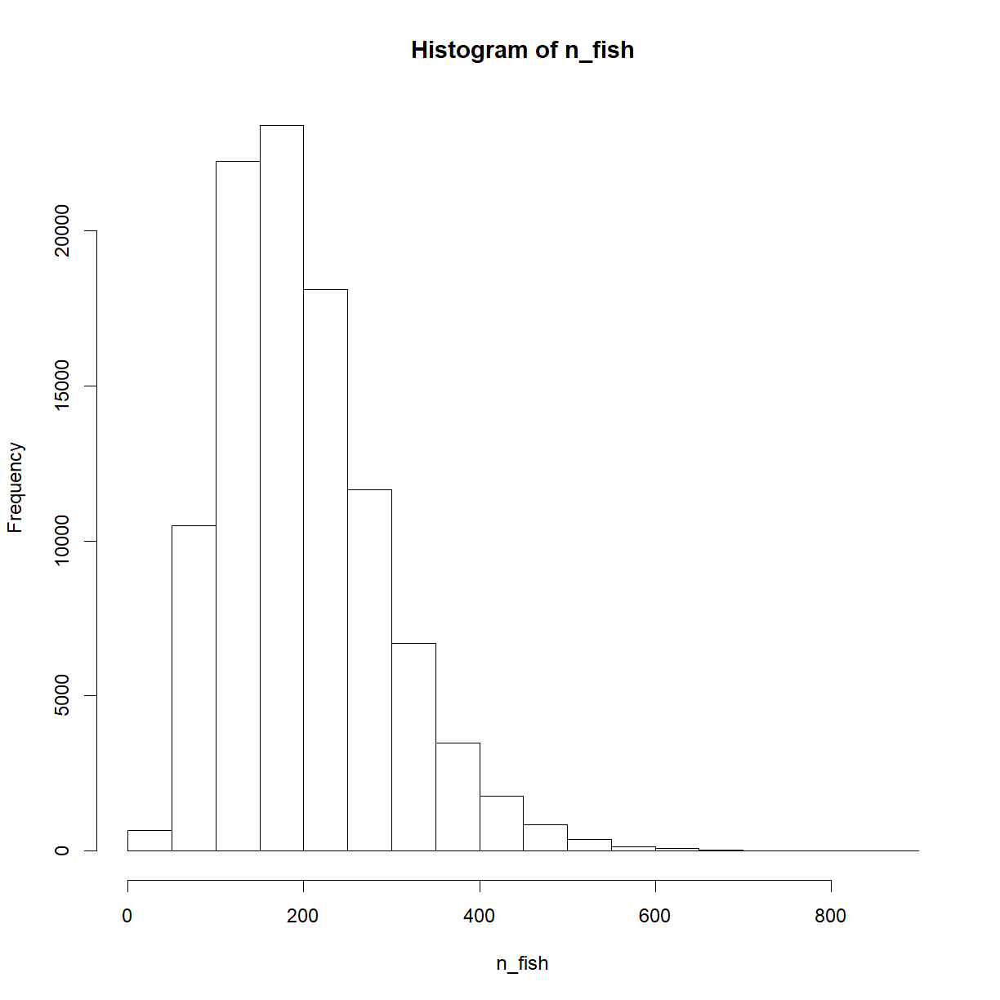
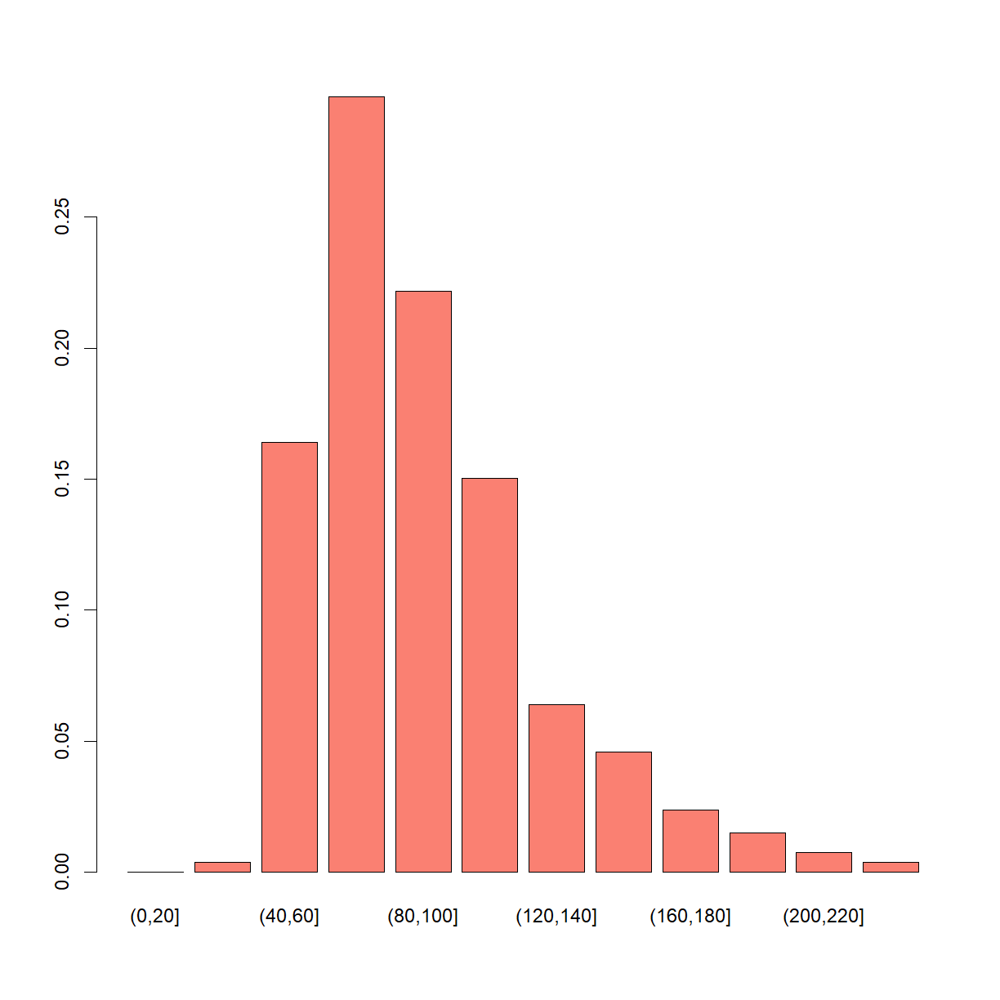

---
# Please do not edit this file directly; it is auto generated.
# Instead, please edit 06-bayesian-statistics.md in _episodes_rmd/
title: "Introduction to Bayesian Statistics"
author: "Dr Tania Prvan"
teaching: 60
exercises: 30
questions:
- ""
objectives:
- ""
keypoints:
- ""
source: "Rmd"
mathjax: true
---


## PDF version

[PDF notes](../files/Introduction to Bayesian Statistics.pdf)


~~~
library(tidyverse)
~~~
{: .language-r}


~~~
Warning: package 'tibble' was built under R version 3.6.1
~~~
{: .error}


~~~
Warning: package 'dplyr' was built under R version 3.6.1
~~~
{: .error}


~~~
library(ggplot2)
library(dplyr)
~~~
{: .language-r}

## 1.1 Introduction

The Bayesian approach to statistics considers parameters as random variables that are characterised by a prior distribution which is combined with the traditional likelihood to obtain the posterior distribution of the parameter of interest on which the statistical inference is based. Obtaining the posterior distribution of the parameter of interest was mostly intractable until the rediscovery of Markov Chain Monte Carlo (MCMC) in the early 1990s.

## 1.2 Definition of statistical models

The construction of probabilistic models that are a good approximation to the true generating mechanism of a phenomenon under study is important. Probabilistic and logical arguments about the nature and function of a given phenomenon is used to construct such models.

**DEFN: Likelihood of the model**

Let the response $Y$ follow a probabilistic rule with density or probability function $f(y,\pmb{\theta})$ where  $\pmb{\theta}$ is the parameter vector. Let $y_1, \dots , y_n$ be independent and identically distributed and write the sample as $\pmb{y}=(y_1,\dots, y_n)^T$. The joint distribution

$$ f(\pmb{y}|\pmb{\theta})=\prod_{i=1}^n f(y_i|\pmb{\theta})$$

is called the likelihood of the model and contains the information provided by the observed sample.

**EXAMPLE** When fitting a multiple regression to data the model is $\pmb{y} \sim N(X\pmb{\beta},\sigma^2I)$ where the parameter vector is given by $\pmb{\theta}=[\pmb{\beta}^T,\sigma^2]$.

## 1.3 Bayes' Theorem

Consider two possible outcomes $A$ and $B$. Assume that $A=A_1 \cup \dots \cup A_n$ for which $A_i \cap A_j = \emptyset$ for every $i \neq j$ (they are mutually exclusive; that is, no elements in common). Baye's theorem gives the conditional probability of $A_i$ given $B$ which is

$$P(A_i|B)=\frac{P(B|A_i)P(A_i)}{P(B)}=\frac{P(B|A_i)P(A_i)}{\sum_{i=1}^n P(B|A_i)P(A_i)}.$$

More generally, for any outcome $A$ and $B$ we can write

$$P(A|B)=\frac{P(B|A)P(A)}{P(B)} \propto P(B|A)P(A).$$

This is also called Bayes' Rule.

We can do inverse inference using the above rule. The idea is as follows (verbatim from Ntzoufras (2009))

*Assume that B is the finally observed outcome and that by $A_i$ we denote possible causes that provoke $B$. Then $P(B\|A_i)$ can be interpreted as the probability that $B$ will appear when $A$ cause is present while $P(A_i\|B)$ is the probability that $A_i$ is responsible for the occurrence of $B$ which we have already observed.*

This is the rationale that Bayesian inference is based on. The above equation, which is deceptively simple, provides a probabilistic mechanism of learning from data. After observing data $(y_1,y_2, \dots, y_n)$ we calculate the **posterior** distribution $f(\pmb{\theta}\|y_1,y_2,\dots,y_n)$, which combines prior and data information. The key element in Bayesian inference is this posterior distribution.

**EXAMPLE** (Ntzoufras (2009)) In a case-control study, we trace 51 smokers in a group of 83 cases of lung cancer and 23 smokers in the control group of 70 disease-free subjects. The prevalence rate (estimate of the proportion of the disease in the population) of lung cancer is equal to 1%. What is the probability that a smoker will have lung cancer?

**Solution** With the information given we can estimate the following probabilities: $P(smoker\|case)=\frac{51}{83}=0.615$, $P(smoker\|control) =\frac{23}{70}=0.329$ and $P(case)=0.01$. From Bayes' theorem

$$P(case/smoker)=\frac{P(smoker|case)P(case)}{P(smoker|case)P(case)+P(smoker|control)P(control)}$$

$$ = \frac{0.615 \times 0.01}{0.615 \times 0.01+0.329 \times 0.99}=0.0185$$

So the probability of a smoker developing lung cancer is equal to 0.0185 which we can write as 1.85% which is approximately 2 people in a 100.

Similarly, we can calculate the probability of a nonsmoker developing lung cancer, which is 0.0099. The relative risk (RR) is

$$ RR=\frac{P(case|smoker)}{P(case|nonsmoker)}=\frac{0.0185}{0.099}=1.87$$

The probability that a smoker will develop lung cancer is 87% higher than the corresponding probability for nonsmokers.

## 1.4 Model-based Bayesian Inference

The difference between Bayesian statistics and classical statistical theory is that in Bayesian statistics **all** unknown parameters are considered to be random variables which is why the *prior distribution* must be defined at the start in Bayesian statistics. This prior distribution encapsulates the information available to the researcher before any "data" are involved in the statistical analysis. Interest lies in  calculating the *posterior distribution* $f(\pmb{\theta}\|\pmb{y})$ of the parameter $\pmb{\theta}$ given the observed data $\pmb{y}$. Using Bayes' theorem, the posterior distribution can be written as

$$ f(\pmb{\theta}|\pmb{y})=\frac{f(\pmb{y}|\pmb{\theta})f(\pmb{\theta})}{f(\pmb{y})} \propto f(\pmb{y}|\pmb{\theta})f(\pmb{\theta}).$$

The posterior distribution has  $f(\pmb{y}\|\pmb{\theta})$, containing the observed data information, multiplied by, $f(\pmb{\theta})$, the prior ditribution. The likelihood is

$$f(\pmb{y}|\pmb{\theta})=\prod_{i=1}^n f(y_i|\pmb{\theta}).$$

Shorthand notation is to suppress $\pmb{\theta}$. For the marginal probability of density function of random variable $X$ evaluated at $x$ this is written as $f(x)$, while the conditional probability or density function of random variable $X$ estimated at $x$ given that $Y=y$ is written as $f(x|y)$.
If the random variable $X$ follows a specific distribution $D$ with parameters $\pmb{\theta}$, the notation  $f_D(x;\pmb{\theta})$ is used to denote the corresponding probability or density function evaluated at $X=x$.

Specification of the prior distribution is important in Bayesian inference because it influences the posterior inference. Noninformative or vague distributions are used when no prior information is available. A common vague improper distribution is $f(\pmb{\theta}) \propto 1$, the uniform prior over the parameter space. Improper is used for distributions that do not integrate to one. Provided the posterior prior is proper such improper priors can be used.

Moments of the posterior distribution can be used for inference about the uncertainty of the parameter vector $\pmb{\theta}$. Measures of central location such as the posterior mean, media, or mode can be used as point estimates, while the $q/2$ and $1-q/2$ posterior quantiles can be used as $(1-q)100\%$ posterior credible intervals. Not going into the details, Bayesian theory provides an easy-to-use mechanism to update our knowledge about the parameter of interest $\pmb{\theta}$.

Both the prior distribution and the likelihood must be fully specified to define a Bayesian model. Once these are specified we focus on describing the posterior distribution using density plots and descriptive measures.

Model-based Bayesian inference can be divided into four stages: model building, calculation of the posterior distribution, and inference followed by final conclusions about the problem under consideration.

**Stage 1:** Consider a model (likelihood/parameters/prior) with reasonable assumptions. To do this

1. Identify the response $Y$ (main variable of the problem) and the corresponding data $\pmb{y}$.

2. Find a distribution that adequately describes $Y$.

3. Identify other variables that may influence $Y$ (called *covariates* or *explanatory variables*).

4. Using deterministic functions build a structure for the parameters of the distribution.

5. Specify a prior distribution (select the distributional family and specify the prior parameters; select between using a noninformative prior or incorporating known information and/or experts' opinion in our prior distribution).

6. Write down the likelihood of the model.

**Stage 2** First identify the method of calculation of the posterior distribution (analytically, asymptotically or using simulation techniques) and use it to estimate the posterior distribtion.

**Stage 3** We may proceed with some or all of the following actions:

1. Visually inspect the marginal posterior distributions of interest. Possible plots are
   1. Marginal posterior density or probability plots if analytical (have a known equation) or asymptotic methods are used.
   1. Marginal posterior histograms (or density estimates) for continuous variables and bar charts for discrete or categorical variables.
   1. Boxplots of the marginal posterior distributions
   1. Bivariate posterior plots (e.g contour plots) to identify and study correlations.

2. Calculate posterior summaries (means, medians, standard deviations, correlations, quantiles) and 95% or 99% credible intervals (what Bayesian Inference uses instead of Confidence Intervals).

3. If possible calculate the posterior mode and the area of highest posterior density.

The above description can be expanded.

We also need to consider the implementation of diagnostic tests or checks of the appropriateness of the adopted model. Many techniques can be used to check if the model assumptions hold and if model fit is adequate.

Robustness of the posterior distribution is another important issue, sensitivity analysis can be used to see how robust the posterior distribution is to the selection of the prior distribution. Sensitivity analysis focuses on different things depending on whether a noninformative prior is being used or not being used.

Prediction is also important, the predictive distribution is used.

## 1.5 Inference using conjugate prior distributions

Conjugate prior distributions were used to avoid using intractable posterior distributions. Conjugate prior distributions lead to posterior distributions from the same distributional family.

If you are interested in finding out more about conjugate prior distributions the reference text I am using *Bayesian Modeling Using WinBUGS* by Ioannis Ntzoufras has more details.

## 1.6 Simple example from Learning statistics with R with an alternative presentation of Bayesian statistics

The material in this section is from Chapter 17 of Learning Statistics with R
(<https://learningstatisticswithr.com/book/bayes.htm>).

*From a Bayesian perspective, statistical inference is all about belief revision. I start out with a set of candidate hypotheses  $h$ about the world. I don’t know which of these hypotheses is true, but I do have some beliefs about which hypotheses are plausible and which are not. When I observe the data  d, I have to revise those beliefs. If the data are consistent with a hypothesis, my belief in that hypothesis is strengthened. If the data inconsistent with the hypothesis, my belief in that hypothesis is weakened.*

The simple example starts with: *I am carrying an umbrella. Do you think it will rain?*

In this problem, you have been presented with a single piece of data ($d$ = I am carrying the umbrella), and you are being ask to tell me your beliefs about whether it’s raining. You have two possible hypotheses, $h$: either it rains today or it does not. How should you solve this problem?

#### Priors: what you believed before

The first thing you need to do is ignore what I told you about the umbrella, and write down your pre-existing beliefs about rain. This is important: if you want to be honest about how your beliefs have been revised in the light of new evidence, then you must say something about what you believed before those data appeared! So, you might know where the author of this question lives (Adelaide) and you might conclude that the probability of January rain in Adelaide is about 15%, and the probability of a dry day is 85%. If this is really what you believe about Adelaide  then what I have written here is your prior distribution, written $P(h)$:

$$\begin{array}{lc}\hline
\mbox{Hypothesis} & \mbox{Degree of belief}\\ \hline
\mbox{Rainy day}       &      0.15\\
\mbox{Dry day}        &     0.85\\ \hline
\end{array}$$

#### Likelihoods: theories about the data

To solve the reasoning problem, you need a theory about my behaviour. When does Dan (the author) carry an umbrella? You might guess that I’m not a complete idiot, and I try to carry umbrellas only on rainy days. On the other hand, you also know that I have young kids, and you wouldn’t be all that surprised to know that I am pretty forgetful about this sort of thing. Let’s suppose that on rainy days I remember my umbrella about 30% of the time (I really am awful at this). But let’s say that on dry days I’m only about 5% likely to be carrying an umbrella. So you might write out a little table like this:

$$\begin{array}{lcc}\hline
\mbox{Hypothesis} &  \mbox{Umbrella} & \mbox{No umbrella}\\ \hline
\mbox{Rainy day}   &    0.30   &       0.70\\
\mbox{Dry day}     &    0.05    &      0.95\\ \hline
\end{array}$$

It is important to remember that each cell in this table describes your beliefs about what data  $d$ will be observed, given the truth of a particular hypothesis $h$. This “conditional probability” is written $P(d\|h)$, which you can read as “the probability of $d$ given $h$”. In Bayesian statistics, this is referred to as likelihood of data $d$ given hypothesis $h$.

#### The joint probability of data and hypothesis

At this point, all the elements are in place. Having written down the priors and the likelihood, you have all the information you need to do Bayesian reasoning. The question now becomes, how do we use this information? As it turns out, there is a very simple equation that we can use here, but it is important that you understand why we use it, so I’m going to try to build it up from more basic ideas.

Let’s start out with one of the rules of probability theory. The rule in question is the one that talks about the probability that two things are true. In our example, you might want to calculate the probability that today is rainy (i.e., hypothesis  $h$ is true) and I’m carrying an umbrella (i.e., data  $d$ is observed). The joint probability of the hypothesis and the data is written  $P(d \cap h)$, and you can calculate it by multiplying the prior  $P(h)$ by the likelihood
$P(d\|h)$. Mathematically, we say that:

$$P(d\cap h)=P(d|h)\cdot P(h)$$

So, what is the probability that today is a rainy day and I remember to carry an umbrella? As we discussed earlier, the prior tells us that the probability of a rainy day is 15%, and the likelihood tells us that the probability of me remembering my umbrella on a rainy day is 30%. So the probability that both of these things are true is calculated by multiplying the two:

$$P(\mbox{rainy} \cap \mbox{umbrella})=P(\mbox{umbrella}|\mbox{rainy})\times P(\mbox{rainy})\\
= 0.30 \times 0.15 = 0.045$$

In other words, before being told anything about what actually happened, you think that there is a 4.5% probability that today will be a rainy day and that I will remember an umbrella. However, there are of course four possible things that could happen, right? So let’s repeat the exercise for all four. If we do that, we end up with the following table:

$$\begin{array}{lcc}\\\hline
  & \mbox{Umbrella} & \mbox{No umbrella}\\ \hline
\mbox{Rainy day} & 0.045 & 0.105\\
\mbox{Dry day} & 0.0425 & 0.8025 \\ \hline \end{array}
$$

This table captures all the information about which of the four possibilities are likely. To really get the full picture, though, it helps to add the row totals and column totals. That gives us this table:

$$\begin{array}{lccc}\\\hline
  & \mbox{Umbrella} & \mbox{No umbrella} & \mbox{Total}\\ \hline
\mbox{Rainy day} & 0.045 & 0.1050 & 0.15\\
\mbox{Dry day} & 0.0425 & 0.8025 & 0.85 \\ \hline
\mbox{Total} & 0.0875 & 0.9125 & 1\\ \hline
\end{array}
$$

This is a very useful table, so it’s worth taking a moment to think about what all these numbers are telling us. First, notice that the row sums aren’t telling us anything new at all. For example, the first row tells us that if we ignore all this umbrella business, the chance that today will be a rainy day is 15%. That’s not surprising, of course: that’s our prior. The important thing isn’t the number itself: rather, the important thing is that it gives us some confidence that our calculations are sensible! Now take a look at the column sums, and notice that they tell us something that we haven’t explicitly stated yet. In the same way that the row sums tell us the probability of rain, the column sums tell us the probability of me carrying an umbrella. Specifically, the first column tells us that on average (i.e., ignoring whether it’s a rainy day or not), the probability of me carrying an umbrella is 8.75%. Finally, notice that when we sum across all four logically-possible events, everything adds up to 1. In other words, what we have written down is a proper probability distribution defined over all possible combinations of data and hypothesis.

Finally, let’s use “proper” statistical notation. In the rainy day problem, the data corresponds to the observation that I do or do not have an umbrella. So we’ll let $d_1$ refer to the possibility that you observe me carrying an umbrella, and $d_2$ refers to you observing me not carrying one. Similarly, $h_1$ is your hypothesis that today is rainy, and $h_2$ is the hypothesis that it is not. Using this notation, the table looks like this:

$$\begin{array}{lccc}\\\hline
  & d_1 & d_2 & \mbox{Total}\\ \hline
h_1 & P(h_1 \cap d_1) & P(h_1 \cap d_2) & P(h_1)\\
h_2 & P(h_2 \cap d_1) & P(h_2 \cap d_2) & P(h_2) \\ \hline
\mbox{Total} & P(d_1) & P(d_2) & \\ \hline
\end{array}
$$

#### Updating beliefs using Bayes' rule

The table above is a very powerful tool for solving the rainy day problem, because it considers all four logical possibilities and states exactly how confident you are in each of them before being given any data. It is now time to consider what happens to our beliefs when we are actually given the data. In the rainy day problem, you are told that I really am carrying an umbrella. This is something of a surprising event: according to our table, the probability of me carrying an umbrella is only 8.75%. But that makes sense, right? A guy carrying an umbrella on a summer day in a hot dry city is pretty unusual, and so you really weren’t expecting that. Nevertheless, the problem tells you that it is true. No matter how unlikely you thought it was, you must now adjust your beliefs to accommodate the fact that you now know that I have an umbrella. To reflect this new knowledge, our revised table must have the following numbers:

$$\begin{array}{lcc}\\\hline
  & \mbox{Umbrella} & \mbox{No umbrella}\\ \hline
\mbox{Rainy day} &  & 0\\
\mbox{Dry day} &  &  0\\ \hline
\mbox{Total} & 1 & 0\\ \hline\end{array}
$$

In other words, the facts have eliminated any possibility of “no umbrella”, so we have to put zeros into any cell in the table that implies that I’m not carrying an umbrella. Also, you know for a fact that I am carrying an umbrella, so the column sum on the left must be 1 to correctly describe the fact that  $P(\mbox{umbrella})=1$.

What two numbers should we put in the empty cells? Again, let’s not worry about the maths, and instead think about our intuitions. When we wrote out our table the first time, it turned out that those two cells had almost identical numbers, right? We worked out that the joint probability of “rain and umbrella” was 4.5%, and the joint probability of “dry and umbrella” was 4.25%. In other words, before I told you that I am in fact carrying an umbrella, you’d have said that these two events were almost identical in probability, yes? But notice that both of these possibilities are consistent with the fact that I actually am carrying an umbrella. From the perspective of these two possibilities, very little has changed. I hope you’d agree that it’s still true that these two possibilities are equally plausible. So what we expect to see in our final table is some numbers that preserve the fact that “rain and umbrella” is slightly more plausible than “dry and umbrella”, while still ensuring that numbers in the table add up. Something like this, perhaps?

$$\begin{array}{lcc}\\\hline
  & \mbox{Umbrella} & \mbox{No umbrella}\\ \hline
\mbox{Rainy day}  & 0.514 & 0\\
\mbox{Dry day} & 0.486 &  0\\ \hline
\mbox{Total} & 1 & 0\\ \hline\end{array}
$$

What this table is telling you is that, after being told that I’m carrying an umbrella, you believe that there’s a 51.4% chance that today will be a rainy day, and a 48.6% chance that it won’t. That’s the answer to our problem! The posterior probability of rain  given that I am carrying an umbrella, $P(h\|d)$, is 51.4%

How did I calculate these numbers? You can probably guess. To work out that there was a 0.514 probability of “rain”, all I did was take the 0.045 probability of “rain and umbrella” and divide it by the 0.0875 chance of “umbrella”. This produces a table that satisfies our need to have everything sum to 1, and our need not to interfere with the relative plausibility of the two events that are actually consistent with the data. To say the same thing using fancy statistical jargon, what I’ve done here is divide the joint probability of the hypothesis and the data $P(d \cap h)$ by the marginal probability of the data $P(d)$, and this is what gives us the posterior probability of the hypothesis given that we know the data have been observed. To write this as an equation:

$$P(h|d)=\frac{P(h \cap d)}{P(d)}$$

However, remember what I said at the start of the last section, namely that the joint probability $P(d \cap h)$ is calculated by multiplying the prior $P(h)$ by the likelihood $P(d\|h)$. In real life, the things we actually know how to write down are the priors and the likelihood, so let’s substitute those back into the equation. This gives us the following formula for the posterior probability:

$$P(h|d)=\frac{P(d|h)\cdot P(h)}{P(d)}$$

This formula is known as Bayes' rule. It describes how a learner starts out with prior beliefs about the plausibility of different hypotheses, and tells you how those beliefs should be revised in the face of data. In the Bayesian paradigm, all statistical inference flows from this one simple rule.

#### Bayesian hypothesis tests

The Bayesian approach to hypothesis testing is  simple. Using a setting that is closely analogous to the classical approach. There are two hypotheses that we want to compare, a null hypothesis  $h_0$
 and an alternative hypothesis $h_1$. Prior to running the experiment we have some beliefs
$P(h)$ about which hypotheses are true. We run an experiment and obtain data $d$. Unlike frequentist statistics, Bayesian statistics does allow us to talk about the probability that the null hypothesis is true. Better yet, it allows us to calculate the posterior probability of the null hypothesis, using Bayes' rule:

$$P(h_0|d)=\frac{P(d|h_0)\cdot P(h_0)}{P(d)}$$

This formula tells us exactly how much belief we should have in the null hypothesis after having observed the data $d$. Similarly, we can work out how much belief to place in the alternative hypothesis using essentially the same equation. All we do is change the subscript:

$$P(h_1|d)=\frac{P(d|h_1)\cdot P(h_1)}{P(d)}$$

### 1.6.2 The Bayes factor

In practice, most Bayesian data analysts tend not to talk in terms of the raw posterior probabilities $P(h_0\|d)$ and $P(h_1\|d)$. Instead, we tend to talk in terms of the posterior odds ratio. Think of it like betting. Suppose, for instance, the posterior probability of the null hypothesis is 25%, and the posterior probability of the alternative is 75%. The alternative hypothesis is three times as probable as the null, so we say that the odds are 3:1 in favour of the alternative. Mathematically, all we have to do to calculate the posterior odds is divide one posterior probability by the other:

$$\frac{P(h_1|d)}{P(h_0|d)}=\frac{0.75}{0.25}=3$$

Or, to write the same thing in terms of the equations above:

$$\frac{P(h_1|d)}{P(h_0|d)}=\frac{P(d|h_1)}{P(d|h_0)}\cdot \frac{P(h_1)}{P(h_0)} $$

Actually, this equation is worth expanding on. There are three different terms here that you should know. On the left hand side, we have the posterior odds, which tells you what you believe about the relative plausibility of the null hypothesis and the alternative hypothesis after seeing the data. On the right hand side, we have the prior odds, which indicates what you thought before seeing the data. In the middle, we have the Bayes factor, which describes the amount of evidence provided by the data.

The Bayes factor (sometimes abbreviated as BF) has a special place in the Bayesian hypothesis testing, because it serves a similar role to the  p-value in orthodox hypothesis testing: it quantifies the strength of evidence provided by the data, and as such it is the Bayes factor that people tend to report when running a Bayesian hypothesis test. The reason for reporting Bayes factors rather than posterior odds is that different researchers will have different priors. Some people might have a strong bias to believe the null hypothesis is true, others might have a strong bias to believe it is false. Because of this, the polite thing for an applied researcher to do is report the Bayes factor. That way, anyone reading the paper can multiply the Bayes factor by their own personal prior odds, and they can work out for themselves what the posterior odds would be. In any case, by convention we like to pretend that we give equal consideration to both the null hypothesis and the alternative, in which case the prior odds equals 1, and the posterior odds becomes the same as the Bayes factor.

#### Interpreting Bayes factors

The Bayes factor numbers are inherently meaningful. If you run an experiment and you compute a Bayes factor of 4, it means that the evidence provided by your data corresponds to betting odds of 4:1 in favour of the alternative. However, there have been some attempts to quantify the standards of evidence that would be considered meaningful in a scientific context. The two most widely used are from Jeffreys (1961) and Kass and Raftery (1995). Of the two, I tend to prefer the Kass and Raftery (1995) table because it’s a bit more conservative. So here it is in words: A Bayes factor 1 - 3 is interpreted as negligible evidence, a Bayes factor of 3-20 is interpreted as positive evidence, a Bayes factor of 20-150 is interpreted as strong evidence, and a Bayes factor greater than 150 is interpreted as very strong evidence.

There are no hard and fast rules here: what counts as strong or weak evidence depends entirely on how conservative you are, and upon the standards that your community insists upon before it is willing to label a finding as “true”.

Note that all the numbers above make sense if the Bayes factor is greater than 1 (i.e., the evidence favours the alternative hypothesis). However, one big practical advantage of the Bayesian approach relative to the orthodox approach is that it also allows you to quantify evidence for the null. When that happens, the Bayes factor will be less than 1. You can choose to report a Bayes factor less than 1. Instead could take reciprocal of BF, call it BF', The statements about the BF given earlier now refer to the evidence in favour of the null hypothesis.

### 1.6.3 EXAMPLE from Rasmus B&aring;&aring;th, Lund University

#### How many fish are in the lake?

This is an actual problem in Abundance estimation which is used in, for example, wildlife management.

- The problem: We can’t catch them all.
- But we can catch some of them...

#### Mark and re-capture

1. Catch a couple of fish.
2. Mark them and throw them back.
3. At a later point, catch a couple of fish again.
4. Count how many are marked.

Twenty were marked and five out of the 20 that were caught the second time were marked.

#### So, how many fish are in the lake?

- What are the probable number of fish in the lake?
- We have almost already described the solution! (If we know about Bayesian Data Analysis, that is...)

some explanation here

For parameters we have number of fish

1. Mark 20 "fish"
2. Sample 20 "fish"
3. Count the number of marked fish

We have 5 marked fish. This is our **Data**.

Our parameters contain uncertainty, we repeat the procedure, the number of marked fish in our new sample can be different from the previous sample.

We could model the prior distribution for the parameters as being `Uniform(0, 250)`.

#### One simple way of fitting the model

1. Draw a large random sample from the “prior” probability distribution on the parameters.
2. Plug in each draw into the generative model which generates a vector of “fake” data.

#### Original capture re-capture using approximate Bayesian Computation

From <http://rpubs.com/rasmusab/live_coding_user_2015_bayes_tutorial>


~~~
n_draw <- 100000

# Defining and drawing from the prior distribution
n_fish <- sample(20:250, n_draw, replace = TRUE)

# Defining the generative model
pick_fish <- function(n_fish) {
  fish <- rep(0:1, c(n_fish - 20, 20))
  sum(sample(fish, 20))
}

# Simulating the data
n_marked <- rep(NA, n_draw)
for(i in 1:n_draw) {
  n_marked[i] <- pick_fish(n_fish[i])
}

# Filtering out those parameter values that didn't result in the
# data that we actually observed
post_fish <- n_fish[n_marked == 5]

hist(post_fish)
~~~
{: .language-r}


~~~
# The posterior distribution showing the probability of different number of fish
# (binning here in bins of 20 just make the graph easier to interpret)
barplot(table(cut(post_fish, seq(0, 250, 20))) / length(post_fish), col = "salmon")
~~~
{: .language-r}


#### Modified model that accounts for that marked fish get “shy”


~~~
n_draw <- 100000
n_fish <- sample(20:250, n_draw, replace = TRUE)

# This is the only part of the code that has changed from the original version above.
pick_fish <- function(n_fish) {
  fish <- rep(0:1, c(n_fish - 20, 20))
  prob_pick <- ifelse(fish == 0, 1.0, 0.5)
  sum(sample(fish, 20, prob = prob_pick))
}

n_marked <- rep(NA, n_draw)
for(i in 1:n_draw) {
  n_marked[i] <- pick_fish(n_fish[i])
}

post_fish <- n_fish[n_marked == 5]

hist(post_fish)
~~~
{: .language-r}


~~~
length(post_fish)
~~~
{: .language-r}


~~~
[1] 4359
~~~
{: .output}


~~~
barplot(table(cut(post_fish, seq(0, 250, 20))) / length(post_fish), col = "salmon")
~~~
{: .language-r}


#### Modified model that accounts for the “expert” opinion of the fisherman


~~~
n_draw <- 100000
# This is the only part of the code that has changed from the original version above.
n_fish <- rnbinom(n_draw, mu = 200 - 20, size = 4) + 20
hist(n_fish)
~~~
{: .language-r}




~~~
pick_fish <- function(n_fish) {
  fish <- rep(0:1, c(n_fish - 20, 20))
  prob_pick <- ifelse(fish == 0, 1.0, 0.5)
  sum(sample(fish, 20, prob = prob_pick))
}

n_marked <- rep(NA, n_draw)
for(i in 1:n_draw) {
  n_marked[i] <- pick_fish(n_fish[i])
}

post_fish <- n_fish[n_marked == 5]

hist(post_fish)
~~~
{: .language-r}


~~~
length(post_fish)
~~~
{: .language-r}


~~~
[1] 1858
~~~
{: .output}


~~~
barplot(table(cut(post_fish, seq(0, 250, 20))) / length(post_fish), col = "salmon")
~~~
{: .language-r}



#### A JAGS implementation of the original model

I couldn't get the JAGS package to work. You might have more luck.

Here the `dhyper` distribution (Hypergeometric distribution) is used as it implements the same process as the fish picking model. Look at above URL for code.

## 1.7 Bayesian versions of various statistical tests

These are brief notes from Chapter 17 of Learning Statistics with R
([<https://learningstatisticswithr.com/book/bayes.htm>](https://learningstatisticswithr.com/book/bayes.htm)). I have removed some of the author's comments and cherry picked what I wanted. Please note that the Creative Commons license is <https://creativecommons.org/licenses/by-sa/4.0/>.

### 1.7.1 Bayesian analysis of contingency tables

She uses a data set that I have saved as `chapek9.csv`.


~~~
chapek9 <- read_csv(file.path("..", "data", "chapek9.csv"))
chapek9
~~~
{: .language-r}


~~~
# A tibble: 180 x 3
      ID species choice
   <dbl> <chr>   <chr> 
 1     1 robot   flower
 2     2 human   data  
 3     3 human   data  
 4     4 human   data  
 5     5 robot   data  
 6     6 human   flower
 7     7 human   data  
 8     8 robot   data  
 9     9 human   puppy 
10    10 robot   flower
# ... with 170 more rows
~~~
{: .output}


~~~
str(chapek9)
~~~
{: .language-r}


~~~
Classes 'spec_tbl_df', 'tbl_df', 'tbl' and 'data.frame':	180 obs. of  3 variables:
 $ ID     : num  1 2 3 4 5 6 7 8 9 10 ...
 $ species: chr  "robot" "human" "human" "human" ...
 $ choice : chr  "flower" "data" "data" "data" ...
 - attr(*, "spec")=
  .. cols(
  ..   ID = col_double(),
  ..   species = col_character(),
  ..   choice = col_character()
  .. )
~~~
{: .output}

In this data set, he supposedly sampled 180 beings and measured two things. First, he checked whether they were humans or robots, as captured by the species variable. Second, he asked them to nominate whether they most preferred flowers, puppies, or data. When we produce the cross-tabulation, we get this as the results:


~~~
species <- as.factor(chapek9$species)
choice <- as.factor(chapek9$choice)

str(species)
~~~
{: .language-r}


~~~
 Factor w/ 2 levels "human","robot": 2 1 1 1 2 1 1 2 1 2 ...
~~~
{: .output}


~~~
str(choice)
~~~
{: .language-r}


~~~
 Factor w/ 3 levels "data","flower",..: 2 1 1 1 1 2 1 1 3 2 ...
~~~
{: .output}


~~~
new1 <- cbind(species, choice)
new1 <- as.data.frame(new1)

str(new1)
~~~
{: .language-r}


~~~
'data.frame':	180 obs. of  2 variables:
 $ species: int  2 1 1 1 2 1 1 2 1 2 ...
 $ choice : int  2 1 1 1 1 2 1 1 3 2 ...
~~~
{: .output}


~~~
new1$species <- as.factor(new1$species)
new1$choice <- as.factor(new1$choice)

str(new1)
~~~
{: .language-r}


~~~
'data.frame':	180 obs. of  2 variables:
 $ species: Factor w/ 2 levels "1","2": 2 1 1 1 2 1 1 2 1 2 ...
 $ choice : Factor w/ 3 levels "1","2","3": 2 1 1 1 1 2 1 1 3 2 ...
~~~
{: .output}

#### The orthodox test


~~~
library(lsr)

crosstab <- xtabs( ~ species + choice, new1)
crosstab
~~~
{: .language-r}


~~~
       choice
species  1  2  3
      1 65 13 15
      2 44 30 13
~~~
{: .output}


~~~
associationTest( ~ species + choice, new1)
~~~
{: .language-r}


~~~

     Chi-square test of categorical association

Variables:   species, choice 

Hypotheses: 
   null:        variables are independent of one another
   alternative: some contingency exists between variables

Observed contingency table:
       choice
species  1  2  3
      1 65 13 15
      2 44 30 13

Expected contingency table under the null hypothesis:
       choice
species    1    2    3
      1 56.3 22.2 14.5
      2 52.7 20.8 13.5

Test results: 
   X-squared statistic:  10.722 
   degrees of freedom:  2 
   p-value:  0.005 

Other information: 
   estimated effect size (Cramer's v):  0.244 
~~~
{: .output}

Because we found a small  p-value (p<0.01), we concluded that the data are inconsistent with the null hypothesis of no association, and we rejected it.

#### The Bayesian test

The `BayesFactor` R package is going to be used.


~~~
library(BayesFactor)
~~~
{: .language-r}


~~~
Warning: package 'BayesFactor' was built under R version 3.6.1
~~~
{: .error}

You need a sampling plan. You can specify the sampling plan using the sampleType argument. The `contingencyTableBF` function distinguishes between four different types of experiment:

*Fixed sample size*. Suppose that in our `chapek9` example, our experiment was designed like this: we deliberately set out to test 180 people, but we didn’t try to control the number of humans or robots, nor did we try to control the choices they made. In this design, the total number of observations  N is fixed, but everything else is random. This is referred to as “joint multinomial” sampling, and if that’s what you did you should specify sampleType = "jointMulti". In the case of the chapek9 data, that’s actually what I had in mind when I invented the data set.

*Fixed row (or column) totals*. A different kind of design might work like this. We decide ahead of time that we want 180 people, but we try to be a little more systematic about it. Specifically, the experimenter constrains it so that we get a predetermined number of humans and robots (e.g., 90 of each). In this design, either the row totals or the column totals are fixed, but not both. This is referred to as “independent multinomial” sampling, and if that’s what you did you should specify sampleType = "indepMulti".

*Both row and column totals fixed*. Another logical possibility is that you designed the experiment so that both the row totals and the column totals are fixed. This doesn’t make any sense at all in the chapek9 example, but there are other deisgns that can work this way. Suppose that I show you a collection of 20 toys, and then given them 10 stickers that say boy and another 10 that say girl. I then give them 10 blue stickers and 10 pink stickers. I then ask you to put the stickers on the 20 toys such that every toy has a colour and every toy has a gender. No matter how you assign the stickers, the total number of pink and blue toys will be 10, as will the number of boys and girls. In this design both the rows and columns of the contingency table are fixed. This is referred to as “hypergeometric” sampling, and if that’s what you’ve done you should specify sampleType = "hypergeom".

*Nothing is fixed*. Finally, it might be the case that nothing is fixed. Not the row columns, not the column totals, and not the total sample size either. For instance, in the chapek9 scenario, suppose what I’d done is run the study for a fixed length of time. By chance, it turned out that I got 180 people to turn up to study, but it could easily have been something else. This is referred to as “Poisson” sampling, and if that’s what you’ve done you should specify sampleType="poisson".

Okay, so now we have enough knowledge to actually run a test. For the chapek9 data, I implied that we designed the study such that the total sample sizeN
  was fixed, so we should set sampleType ="jointMulti".


~~~
contingencyTableBF(crosstab, sampleType = "jointMulti")
~~~
{: .language-r}


~~~
Bayes factor analysis
--------------
[1] Non-indep. (a=1) : 15.92684 ±0%

Against denominator:
  Null, independence, a = 1 
---
Bayes factor type: BFcontingencyTable, joint multinomial
~~~
{: .output}

The Bayes factor is 15.92684. It is  telling you that the odds for the alternative hypothesis against the null are about 16:1. The ± 0% part is not very interesting: essentially, all it’s telling you is that R has calculated an exact Bayes factor, so the uncertainty about the Bayes factor is 0%. In any case, the data are telling us that we have moderate evidence for the alternative hypothesis.

#### Other sampling plans

Up to this point all I’ve shown you is how to use the contingencyTableBF() function for the joint multinomial sampling plan (i.e., when the total sample size N is fixed, but nothing else is). For the Poisson sampling plan (i.e., nothing fixed), the command you need is identical except for the sampleType argument:


~~~
contingencyTableBF(crosstab, sampleType = "poisson" )
~~~
{: .language-r}


~~~
Bayes factor analysis
--------------
[1] Non-indep. (a=1) : 28.20757 ±0%

Against denominator:
  Null, independence, a = 1 
---
Bayes factor type: BFcontingencyTable, poisson
~~~
{: .output}

Notice that the Bayes factor of 28:1 here is not the identical to the Bayes factor of 16:1 that we obtained from the last test. **The sampling plan actually does matter.**

What about the design in which the row columns (or column totals) are fixed? As I mentioned earlier, this corresponds to the “independent multinomial” sampling plan. Again, you need to specify the sampleType argument, but this time you need to specify whether you fixed the rows or the columns. For example, suppose I deliberately sampled 87 humans and 93 robots, then I would need to indicate that the fixedMargin of the contingency table is the "rows". So the command I would use is:


~~~
contingencyTableBF(crosstab, sampleType = "indepMulti", fixedMargin = "rows")
~~~
{: .language-r}


~~~
Bayes factor analysis
--------------
[1] Non-indep. (a=1) : 8.605897 ±0%

Against denominator:
  Null, independence, a = 1 
---
Bayes factor type: BFcontingencyTable, independent multinomial
~~~
{: .output}

Again, the Bayes factor is different, with the evidence for the alternative dropping to a mere 9:1. As you might expect, the answers would be diffrent again if it were the columns of the contingency table that the experimental design fixed.

Finally, if we turn to hypergeometric sampling in which everything is fixed, we get…

```r
contingencyTableBF(crosstab, sampleType = "hypergeom")
```

I haven't run it beause you get an error and RMarkdown won't compile. The hypergeometric in this package is restricted to 2 x 2 tables.

Let's look at the following "toy" example:


~~~
toys <- data.frame(stringsAsFactors = FALSE,
        gender = c("girl", "boy"),
        pink = c(8, 2),
        blue = c(2, 8)
        )
str(toys)
~~~
{: .language-r}


~~~
'data.frame':	2 obs. of  3 variables:
 $ gender: chr  "girl" "boy"
 $ pink  : num  8 2
 $ blue  : num  2 8
~~~
{: .output}

The Bayesian test with hypergeometric sampling gives us this:


~~~
toys$gender <- as.factor(toys$gender)
str(toys)
~~~
{: .language-r}


~~~
'data.frame':	2 obs. of  3 variables:
 $ gender: Factor w/ 2 levels "boy","girl": 2 1
 $ pink  : num  8 2
 $ blue  : num  2 8
~~~
{: .output}

I can't get the Bayesian test with hypergeometric sampling to work.

```r
contingencyTableBF(toys, sampleType = "hypergeom")
```

### 1.7.2 Bayesian t-tests

The BayesFactor package contains a function called ttestBF() that is flexible enough to run several different versions of the  t-test. The Bayesian versions of the independent samples  t-tests and the paired samples t-test in will be demonstrated.

#### Independent samples t-test


~~~
harpo <- read_csv(file.path("..", "data", "harpo.csv"))
harpo
~~~
{: .language-r}


~~~
# A tibble: 33 x 3
      ID grade tutor     
   <dbl> <dbl> <chr>     
 1     1    65 Anastasia 
 2     2    72 Bernadette
 3     3    66 Bernadette
 4     4    74 Anastasia 
 5     5    73 Anastasia 
 6     6    71 Bernadette
 7     7    66 Bernadette
 8     8    76 Bernadette
 9     9    69 Bernadette
10    10    79 Bernadette
# ... with 23 more rows
~~~
{: .output}

In this data set, we have two groups of students, those who received lessons from Anastasia and those who took their classes with Bernadette. The question we want to answer is whether there’s any difference in the grades received by these two groups of student. You could analyse this kind of data using the independentSamples TTest() function in the lsr package.

What does the Bayesian version of the t-test look like? Using the ttestBF() function, we can obtain a Bayesian analog of Student’s independent samples
t-test using the following command:


~~~
ttestBF(formula = grade ~ tutor, data = harpo)
~~~
{: .language-r}


~~~
Warning: data coerced from tibble to data frame
~~~
{: .error}


~~~
Bayes factor analysis
--------------
[1] Alt., r=0.707 : 1.754927 ±0%

Against denominator:
  Null, mu1-mu2 = 0 
---
Bayes factor type: BFindepSample, JZS
~~~
{: .output}

You should focus on the part that reads 1.754927. This is the Bayes factor: the evidence provided by these data are about 1.8:1 in favour of the alternative. Insufficient evidence to suggest a difference in mean grades.

Before moving on, it’s worth highlighting the difference between the orthodox test results and the Bayesian one. According to the orthodox test, we obtained a significant result, though only barely. Nevertheless, many people would happily accept  p=0.043 as reasonably strong evidence for an effect. In contrast, notice that the Bayesian test doesn’t even reach 2:1 odds in favour of an effect, and would be considered very weak evidence at best. In my experience that’s a pretty typical outcome. Bayesian methods usually require more evidence before rejecting the null.

#### Paired samples t-test


~~~
chico <- read_csv(file.path("..", "data", "chico.csv"))
chico
~~~
{: .language-r}


~~~
# A tibble: 20 x 4
     Row id        grade_test1 grade_test2
   <dbl> <chr>           <dbl>       <dbl>
 1     1 student1         42.9        44.6
 2     2 student2         51.8        54  
 3     3 student3         71.7        72.3
 4     4 student4         51.6        53.4
 5     5 student5         63.5        63.8
 6     6 student6         58          59.3
 7     7 student7         59.8        60.8
 8     8 student8         50.8        51.6
 9     9 student9         62.5        64.3
10    10 student10        61.9        63.2
11    11 student11        50.4        51.8
12    12 student12        52.6        52.2
13    13 student13        63          63  
14    14 student14        58.3        60.5
15    15 student15        53.3        57.1
16    16 student16        58.7        60.1
17    17 student17        50.1        51.7
18    18 student18        64.2        65.6
19    19 student19        57.4        58.3
20    20 student20        57.1        60.1
~~~
{: .output}


~~~
str(chico)
~~~
{: .language-r}


~~~
Classes 'spec_tbl_df', 'tbl_df', 'tbl' and 'data.frame':	20 obs. of  4 variables:
 $ Row        : num  1 2 3 4 5 6 7 8 9 10 ...
 $ id         : chr  "student1" "student2" "student3" "student4" ...
 $ grade_test1: num  42.9 51.8 71.7 51.6 63.5 58 59.8 50.8 62.5 61.9 ...
 $ grade_test2: num  44.6 54 72.3 53.4 63.8 59.3 60.8 51.6 64.3 63.2 ...
 - attr(*, "spec")=
  .. cols(
  ..   Row = col_double(),
  ..   id = col_character(),
  ..   grade_test1 = col_double(),
  ..   grade_test2 = col_double()
  .. )
~~~
{: .output}

We will use the `ttestBF` function from the `BayesFactor` package to do test if the $H_0:\mu_D=0$ vs $H_1:\mu_D \neq 0$. The easiest way to do it with this data set is to use the x argument to specify one variable and the y argument to specify the other. All we need to do then is specify `paired = TRUE` to tell R that this is a paired samples test. So here’s our command:


~~~
ttestBF(
    x = chico$grade_test1,
    y = chico$grade_test2,
    paired = TRUE
 )
~~~
{: .language-r}


~~~
Bayes factor analysis
--------------
[1] Alt., r=0.707 : 5992.05 ±0%

Against denominator:
  Null, mu = 0 
---
Bayes factor type: BFoneSample, JZS
~~~
{: .output}

The BF is 5992.05. The data provide evidence of about 6000:1 in favour of the alternative. We could probably reject the null with some confidence!

### 1.7.3 Bayesian regression


~~~
parenthood <- read_csv(file.path("..", "data", "parenthood.csv"))
parenthood
~~~
{: .language-r}


~~~
# A tibble: 100 x 5
      id mySleep babySleep myGrump   day
   <dbl>   <dbl>     <dbl>   <dbl> <dbl>
 1     1    7.59     10.2       56     1
 2     2    7.91     11.7       60     2
 3     3    5.14      7.92      82     3
 4     4    7.71      9.61      55     4
 5     5    6.68      9.75      67     5
 6     6    5.99      5.04      72     6
 7     7    8.19     10.4       53     7
 8     8    7.19      8.27      60     8
 9     9    7.4       6.06      60     9
10    10    6.58      7.09      71    10
# ... with 90 more rows
~~~
{: .output}

A theory is my grumpiness (`myGrump`) on any given day is related to the amount of sleep I got the night before (`mySleep`), and possibly to the amount of sleep our baby got (`babySleep`), though probably not to the day on which we took the measurement. We tested this using a regression model. In order to estimate the regression model we used the `lm` function, like so


~~~
model <- lm( formula = myGrump ~ mySleep + day + babySleep, data = parenthood)
~~~
{: .language-r}

The hypothesis tests for each of the terms in the regression model were extracted using the `summary` function as shown below:


~~~
summary(model)
~~~
{: .language-r}


~~~

Call:
lm(formula = myGrump ~ mySleep + day + babySleep, data = parenthood)

Residuals:
    Min      1Q  Median      3Q     Max 
-10.906  -2.284  -0.295   2.652  11.880 

Coefficients:
              Estimate Std. Error t value Pr(>|t|)    
(Intercept) 126.278707   3.242492  38.945   <2e-16 ***
mySleep      -8.969319   0.560007 -16.016   <2e-16 ***
day          -0.004403   0.015262  -0.288    0.774    
babySleep     0.015747   0.272955   0.058    0.954    
---
Signif. codes:  0 '***' 0.001 '**' 0.01 '*' 0.05 '.' 0.1 ' ' 1

Residual standard error: 4.375 on 96 degrees of freedom
Multiple R-squared:  0.8163,	Adjusted R-squared:  0.8105 
F-statistic: 142.2 on 3 and 96 DF,  p-value: < 2.2e-16
~~~
{: .output}

If the model assumptions hold mySleep is highly significant.


~~~
par(mfrow = c(2, 2))
plot(model)
~~~
{: .language-r}


Might be prepared to say model assumptions hold.

#### The Bayesian version

Okay, so how do we do the same thing using the `BayesFactor` package? The easiest way is to use the `regressionBF` function instead of `lm`. As before, we use formula to indicate what the full regression model looks like, and the data argument to specify the data frame. So the command is:


~~~
parenthood <- as.data.frame(parenthood)

regressionBF(
  formula = myGrump ~ mySleep + day + babySleep,
  data = parenthood
)
~~~
{: .language-r}


~~~
Bayes factor analysis
--------------
[1] mySleep                   : 1.622545e+34 ±0.01%
[2] day                       : 0.2724027    ±0%
[3] babySleep                 : 10018411     ±0%
[4] mySleep + day             : 1.016576e+33 ±0%
[5] mySleep + babySleep       : 9.77022e+32  ±0%
[6] day + babySleep           : 2340755      ±0%
[7] mySleep + day + babySleep : 7.835625e+31 ±0%

Against denominator:
  Intercept only 
---
Bayes factor type: BFlinearModel, JZS
~~~
{: .output}

The output, however, is a little different from what you get from `lm`. The format of this is pretty familiar. What’s new is the fact that we seem to have lots of Bayes factors here. What’s all this about?

The trick to understanding this output is to recognise that if we’re interested in working out which of the 3 predictor variables are related to `myGrump`, there are actually 8 possible regression models that could be considered. One possibility is the intercept only model, in which none of the three variables have an effect. At the other end of the spectrum is the full model in which all three variables matter. So what `regressionBF` does is treat the intercept only model as the null hypothesis, and print out the Bayes factors for all other models when compared against that null. For example, if we look at line 4 in the table, we see that the evidence is about $10^{33}$ to 1 in favour of the claim that a model that includes both mySleep and day is better than the intercept only model. Or if we look at line 1, we can see that the odds are about 1.6 × $10^{34}$ that a model containing the `mySleep` variable (but no others) is better than the intercept only model.

#### Finding the best model

In practice, this isn’t helpful. In most situations the intercept only model is the one that you don’t really care about at all. What I find helpful is to start out by working out which model is the best one, and then seeing how well all the alternatives compare to it. Here’s how you do that. In this case, it’s easy enough to see that the best model is actually the one that contains `mySleep` only (line 1), because it has the largest Bayes factor. However, if you’ve got a lot of possible models in the output, it’s handy to know that you can use the `head` function to pick out the best few models. First, we have to go back and save the Bayes factor information to a variable:


~~~
models <- regressionBF(formula = myGrump ~ mySleep + day + babySleep, data = parenthood)
~~~
{: .language-r}

Let’s say I want to see the best three models. To do this, I use the `head` function specifying `n = 3`, and here’s what I get as the result:


~~~
head(models, n = 3)
~~~
{: .language-r}


~~~
Bayes factor analysis
--------------
[1] mySleep             : 1.622545e+34 ±0.01%
[2] mySleep + day       : 1.016576e+33 ±0%
[3] mySleep + babySleep : 9.77022e+32  ±0%

Against denominator:
  Intercept only 
---
Bayes factor type: BFlinearModel, JZS
~~~
{: .output}

This is telling us that the model in line 1 (i.e., `myGrump ~ mySleep`) is the best one. That’s almost what I’m looking for, but it’s still comparing all the models against the intercept only model. That seems silly. What I’d like to know is how big the difference is between the best model and the other good models. For that, there’s this trick:


~~~
head(models/max(models), n = 3)
~~~
{: .language-r}


~~~
Bayes factor analysis
--------------
[1] mySleep             : 1         ±0%
[2] mySleep + day       : 0.0626532 ±0.01%
[3] mySleep + babySleep : 0.0602154 ±0.01%

Against denominator:
  myGrump ~ mySleep 
---
Bayes factor type: BFlinearModel, JZS
~~~
{: .output}

Notice the bit at the bottom showing that the “denominator” has changed. What that means is that the Bayes factors are now comparing each of those 3 models listed against the `myGrump ~ mySleep` model. Obviously, the Bayes factor in the first line is exactly 1, since that’s just comparing the best model to itself. More to the point, the other two Bayes factors are both less than 1, indicating that they’re all worse than that model. The Bayes factors of 0.06 to 1 imply that the odds for the best model over the second best model are about 16:1. You can work this out by simple arithmetic (i.e., $\frac{1}{0.06} \approx 16$), but the other way to do it is to directly compare the models. To see what I mean, here’s the original output:


~~~
models
~~~
{: .language-r}


~~~
Bayes factor analysis
--------------
[1] mySleep                   : 1.622545e+34 ±0.01%
[2] day                       : 0.2724027    ±0%
[3] babySleep                 : 10018411     ±0%
[4] mySleep + day             : 1.016576e+33 ±0%
[5] mySleep + babySleep       : 9.77022e+32  ±0%
[6] day + babySleep           : 2340755      ±0%
[7] mySleep + day + babySleep : 7.835625e+31 ±0%

Against denominator:
  Intercept only 
---
Bayes factor type: BFlinearModel, JZS
~~~
{: .output}

The best model corresponds to row 1 in this table, and the second best model corresponds to row 4. All you have to do to compare these two models is this:


~~~
models[1] / models[4]
~~~
{: .language-r}


~~~
Bayes factor analysis
--------------
[1] mySleep : 15.96088 ±0.01%

Against denominator:
  myGrump ~ mySleep + day 
---
Bayes factor type: BFlinearModel, JZS
~~~
{: .output}

And there you have it. You’ve found the regression model with the highest Bayes factor (i.e., `myGrump ~ mySleep`), and you know that the evidence for that model over the next best alternative (i.e., `myGrump ~ mySleep + day`) is about 16:1.

Okay, let’s say you’ve settled on a specific regression model. What Bayes factors should you report? In this example, I’m going to pretend that you decided that `myGrump ~ mySleep + babySleep` is the model you think is best. Sometimes it’s sensible to do this, even when it’s not the one with the highest Bayes factor. Usually this happens because you have a substantive theoretical reason to prefer one model over the other. However, in this case I’m doing it because I want to use a model with more than one predictor as my example!

Having figured out which model you prefer, it can be really useful to call the `regressionBF` function and specifying `whichModels = "top"`. You use your “preferred” model as the formula argument, and then the output will show you the Bayes factors that result when you try to drop predictors from this model:


~~~
regressionBF(
    formula = myGrump ~ mySleep + babySleep,
    data = parenthood,
    whichModels = "top"
)
~~~
{: .language-r}


~~~
Bayes factor top-down analysis
--------------
When effect is omitted from mySleep + babySleep , BF is...
[1] Omit babySleep : 16.60705     ±0.01%
[2] Omit mySleep   : 1.025403e-26 ±0.01%

Against denominator:
  myGrump ~ mySleep + babySleep 
---
Bayes factor type: BFlinearModel, JZS
~~~
{: .output}

Okay, so now you can see the results a bit more clearly. The Bayes factor when you try to drop the mySleep predictor is about  $10^{−26}$, which is very strong evidence that you shouldn’t drop it. On the other hand, the Bayes factor actually goes up to 17 if you drop `babySleep`, so you’d usually say that’s pretty strong evidence for dropping that one.

## 1.8 Bayesian ANOVA

The BayesFactor package is pretty flexible, and can do more things. There’s only one other topic I want to cover: Bayesian ANOVA.


~~~
mydata <- read_csv(file.path("..", "data", "clinicaltrial.csv"))
mydata
~~~
{: .language-r}


~~~
# A tibble: 18 x 4
     Run drug     therapy    mood.gain
   <dbl> <chr>    <chr>          <dbl>
 1     1 placebo  no.therapy       0.5
 2     2 placebo  no.therapy       0.3
 3     3 placebo  no.therapy       0.1
 4     4 anxifree no.therapy       0.6
 5     5 anxifree no.therapy       0.4
 6     6 anxifree no.therapy       0.2
 7     7 joyzepam no.therapy       1.4
 8     8 joyzepam no.therapy       1.7
 9     9 joyzepam no.therapy       1.3
10    10 placebo  CBT              0.6
11    11 placebo  CBT              0.9
12    12 placebo  CBT              0.3
13    13 anxifree CBT              1.1
14    14 anxifree CBT              0.8
15    15 anxifree CBT              1.2
16    16 joyzepam CBT              1.8
17    17 joyzepam CBT              1.3
18    18 joyzepam CBT              1.4
~~~
{: .output}


~~~
clin.trial <- as.data.frame(mydata)
str(clin.trial)
~~~
{: .language-r}


~~~
'data.frame':	18 obs. of  4 variables:
 $ Run      : num  1 2 3 4 5 6 7 8 9 10 ...
 $ drug     : chr  "placebo" "placebo" "placebo" "anxifree" ...
 $ therapy  : chr  "no.therapy" "no.therapy" "no.therapy" "no.therapy" ...
 $ mood.gain: num  0.5 0.3 0.1 0.6 0.4 0.2 1.4 1.7 1.3 0.6 ...
 - attr(*, "spec")=
  .. cols(
  ..   Run = col_double(),
  ..   drug = col_character(),
  ..   therapy = col_character(),
  ..   mood.gain = col_double()
  .. )
~~~
{: .output}

#### Traditional ANOVA


~~~
library(car)
~~~
{: .language-r}


~~~
Warning: package 'car' was built under R version 3.6.1
~~~
{: .error}


~~~
model <- aov(mood.gain ~ drug * therapy, data = clin.trial)

Anova(model)
~~~
{: .language-r}


~~~
Anova Table (Type II tests)

Response: mood.gain
             Sum Sq Df F value    Pr(>F)    
drug         3.4533  2 31.7143 1.621e-05 ***
therapy      0.4672  1  8.5816   0.01262 *  
drug:therapy 0.2711  2  2.4898   0.12460    
Residuals    0.6533 12                      
---
Signif. codes:  0 '***' 0.001 '**' 0.01 '*' 0.05 '.' 0.1 ' ' 1
~~~
{: .output}

Provided model assumptions hold, we conclude that there is evidence for a main effect of drug at p<0.001, an effect of therapy at p<0.05 and no interaction.

#### The Bayesian version

How do we do the same thing using Bayesian methods? The `BayesFactor` package contains a function called `anovaBF`) that does this for you. It uses a pretty standard formula and data structure, so the command should look really familiar. Just like we did with regression, it will be useful to save the output to a variable:


~~~
clin.trial$drug <- as.factor(clin.trial$drug)
clin.trial$therapy <- as.factor(clin.trial$therapy)

models <- anovaBF(formula = mood.gain ~ drug * therapy, data = clin.trial)
~~~
{: .language-r}

The output is quite different to the traditional ANOVA, but it’s not too bad once you understand what you’re looking for. Let’s take a look:


~~~
models
~~~
{: .language-r}


~~~
Bayes factor analysis
--------------
[1] drug                          : 245.9026  ±0%
[2] therapy                       : 0.7316007 ±0%
[3] drug + therapy                : 692.9066  ±1.26%
[4] drug + therapy + drug:therapy : 689.588   ±1.13%

Against denominator:
  Intercept only 
---
Bayes factor type: BFlinearModel, JZS
~~~
{: .output}

This looks very similar to the output we obtained from the `regressionBF` function, and with good reason. ANOVA is no different to regression, and both are just different examples of a linear model. Becasue of this, the `anovaBF` reports the output in much the same way. For instance, if we want to identify the best model we could use the same commands that we used in the last section. One variant that I find quite useful is this:


~~~
models/max(models)
~~~
{: .language-r}


~~~
Bayes factor analysis
--------------
[1] drug                          : 0.3548856   ±1.26%
[2] therapy                       : 0.001055843 ±1.26%
[3] drug + therapy                : 1           ±0%
[4] drug + therapy + drug:therapy : 0.9952106   ±1.69%

Against denominator:
  mood.gain ~ drug + therapy 
---
Bayes factor type: BFlinearModel, JZS
~~~
{: .output}

By “dividing” the models output by the best model (i.e., `max(models))`, what R is doing is using the best model (which in this case is `drugs + therapy`) as the denominator, which gives you a pretty good sense of how close the competitors are. For instance, the model that contains the interaction term is almost as good as the model without the interaction, since the Bayes factor is 0.98. In other words, the data do not clearly indicate whether there is or is not an interaction.

## REFERENCES

Ntzoufras, I. (2009) *Bayesian Modeling Using WinBUGS.* New Jersey: John Wiley and Sons.

Navarro, D. (2019) *Learning statistics with R: A tutorial for psychology students and other beginners. (Version 0.6.1)*
<https://learningstatisticswithr.com/book/bayes.html#bayescontingency>

Baath, R. (2015) "Introduction to Bayesian Data Analysis using R." UseR! Conference 2015.
<https://analisereal.files.wordpress.com/2015/07/user_2015_tutorial_bayesian_data_analysis_short_version.pdf>


