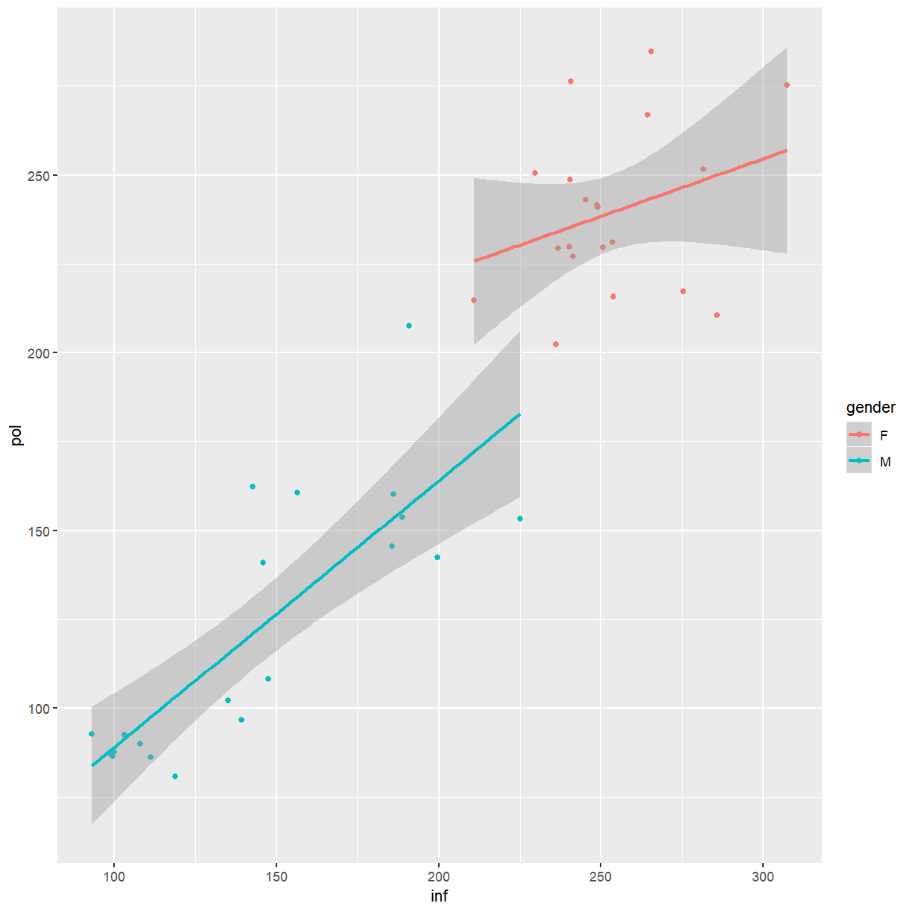
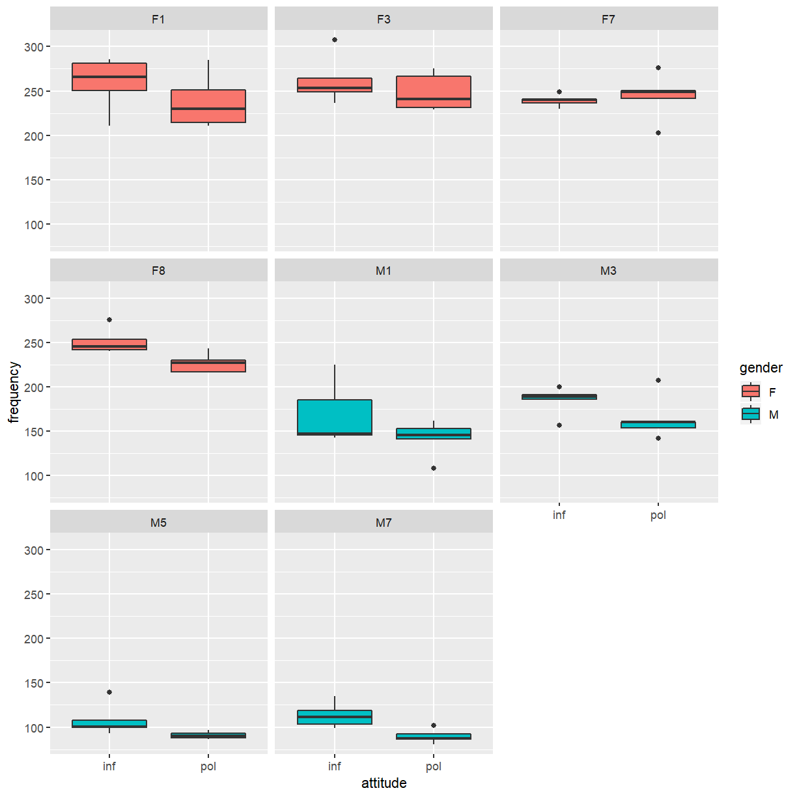
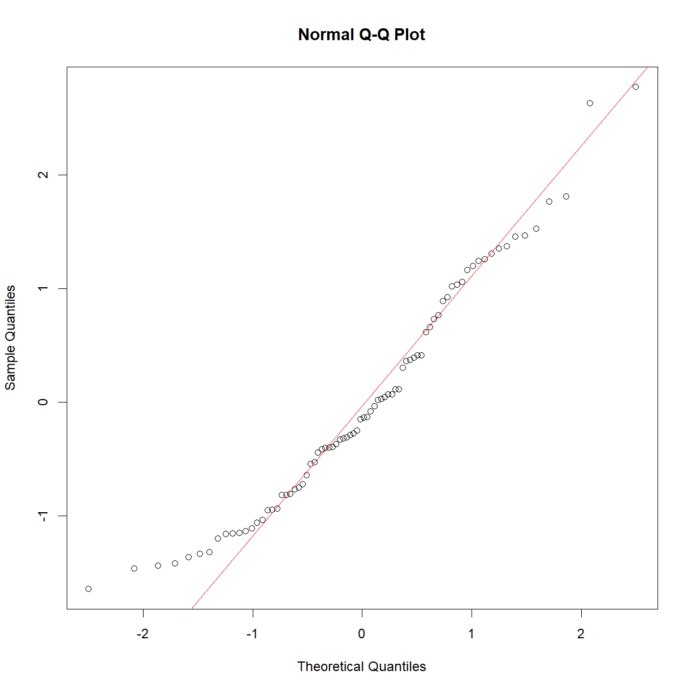
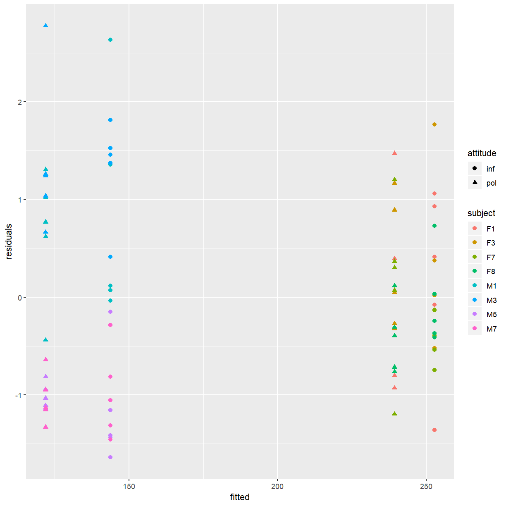
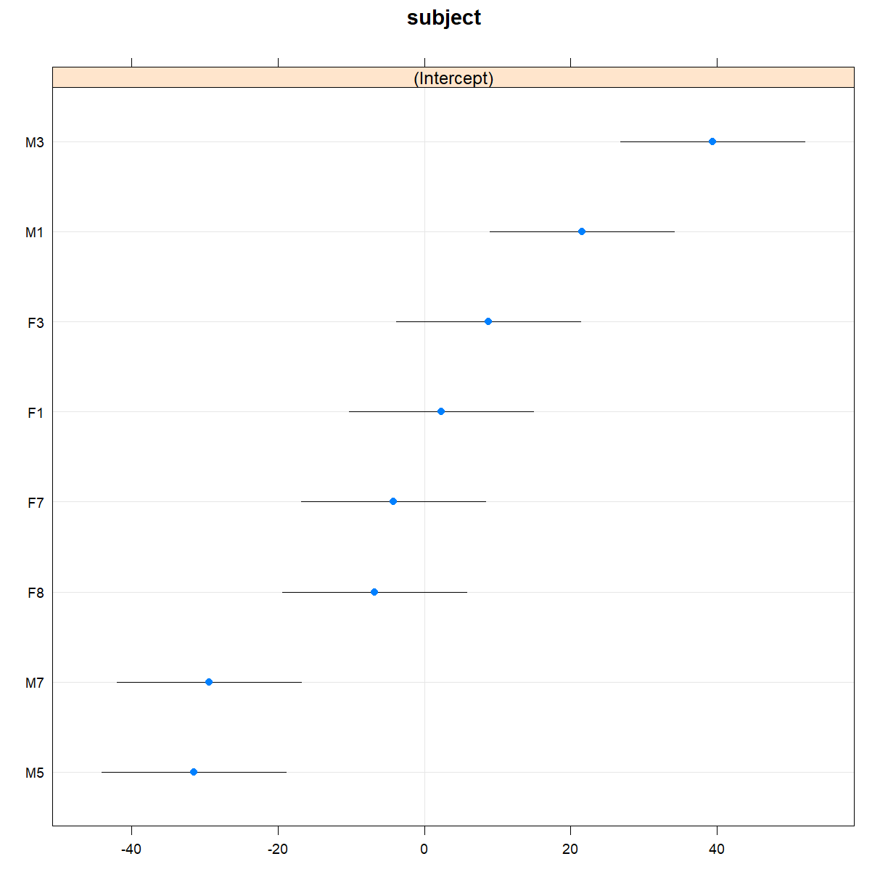
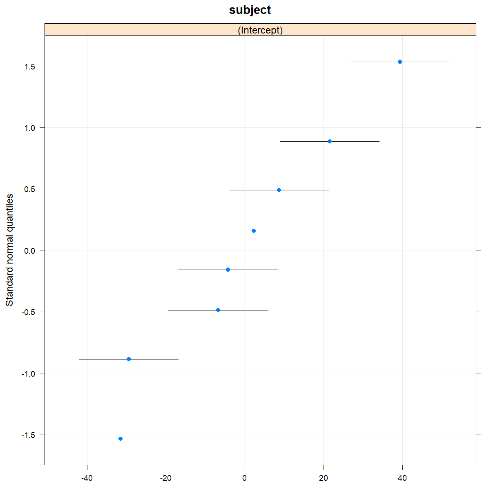
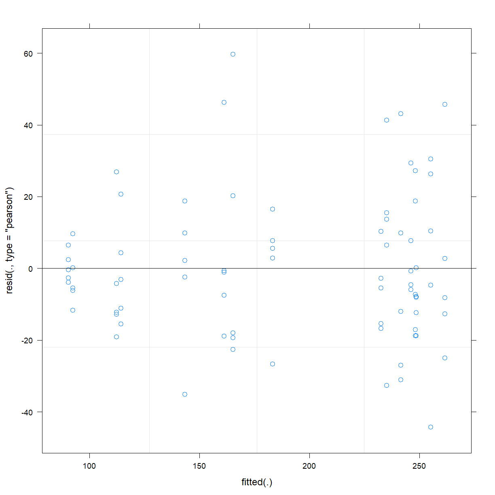

---
# Please do not edit this file directly; it is auto generated.
# Instead, please edit politeness.md in _episodes_rmd/
title: "Investigating the relationship between politeness and voice pitch"
author: "Peter Humburg"
output: html_document
---

~~~
library(ggplot2)
library(lattice)
library(lme4)
~~~
{: .language-r}

~~~
Loading required package: Matrix
~~~
{: .output}

~~~
library(lmerTest)
~~~
{: .language-r}

~~~

Attaching package: 'lmerTest'
~~~
{: .output}

~~~
The following object is masked from 'package:lme4':

    lmer
~~~
{: .output}

~~~
The following object is masked from 'package:stats':

    step
~~~
{: .output}

~~~
library(readr)
library(tidyr)
~~~
{: .language-r}

~~~

Attaching package: 'tidyr'
~~~
{: .output}

~~~
The following objects are masked from 'package:Matrix':

    expand, pack, unpack
~~~
{: .output}

~~~
library(dplyr)
~~~
{: .language-r}

~~~

Attaching package: 'dplyr'
~~~
{: .output}

~~~
The following objects are masked from 'package:stats':

    filter, lag
~~~
{: .output}

~~~
The following objects are masked from 'package:base':

    intersect, setdiff, setequal, union
~~~
{: .output}

## Data exploration

* Load the pitch and politeness data.

~~~
politeness_data <- read_csv(file.path("..", "..", "data", "politeness_data.csv"))
~~~
{: .language-r}

~~~
Parsed with column specification:
cols(
  subject = col_character(),
  gender = col_character(),
  scenario = col_double(),
  attitude = col_character(),
  total_duration = col_double(),
  frequency = col_double()
)
~~~
{: .output}

* Examine the data. Some questions you should be able to answer after examining the data are:
    - How many individuals are in the study?
    - How many conditions?
    - How many observations did each individual contribute per condition?

~~~
politeness_data
~~~
{: .language-r}

~~~
# A tibble: 80 x 6
   subject gender scenario attitude total_duration frequency
   <chr>   <chr>     <dbl> <chr>             <dbl>     <dbl>
 1 F1      F             1 pol               18.4       215.
 2 F1      F             1 inf               13.6       211.
 3 F1      F             2 pol                5.22      285.
 4 F1      F             2 inf                4.25      266.
 5 F1      F             3 pol                6.79      211.
 6 F1      F             3 inf                4.13      286.
 7 F1      F             4 pol                6.24      252.
 8 F1      F             4 inf                3.24      282.
 9 F1      F             5 pol                5.62      230.
10 F1      F             5 inf                3.95      250.
# ... with 70 more rows
~~~
{: .output}

~~~
# Use 'View()' when examining data interactively
# View(politeness_data)

table(politeness_data$subject)
~~~
{: .language-r}

~~~

F1 F3 F7 F8 M1 M3 M5 M7 
10 10 10 10 10 10 10 10 
~~~
{: .output}

~~~
table(politeness_data$subject, politeness_data$attitude)
~~~
{: .language-r}

~~~
    
     inf pol
  F1   5   5
  F3   5   5
  F7   5   5
  F8   5   5
  M1   5   5
  M3   5   5
  M5   5   5
  M7   5   5
~~~
{: .output}

* Create a scatterplot of pitch in the informal and polite conditions. Colour points by the speaker's gender and add a regression line.
    - **Hint**: Use `geom_smooth(method="lm")` to add regression lines to your scatter plot.

~~~
politeness_wide <- politeness_data %>% select(-total_duration) %>% spread(key=attitude, value=frequency)
ggplot(politeness_wide, aes(x=inf, y=pol, colour=gender)) + geom_point() + geom_smooth(method="lm")
~~~
{: .language-r}

* What do you observe?

As expected, female participants tend to have higher pitched voices than male participants. Considering the slopes of the regression lines in the plot, an interaction between attitude and gender seems plausible and should be investigated.

* Create a plot showing frequency by attitude for each subject.

~~~
ggplot(politeness_data, aes(x=attitude, y=frequency, fill=gender)) + geom_boxplot() + facet_wrap(~subject)
~~~
{: .language-r}

* What trends do you observe in the data?

As expected, the female participants have higher pitched voices and there is considerable
variation in pitch between participants. There is also evidence that the samples produced by participants
in the polite condition tend to have lower pitch compared to the informal samples from the same participant.

## Multiple linear regression

* Fit a multiple linear regression model to the data, using `frequency` as dependent variable and `attitude` and `gender`
  as independent variables. Based on the plots of the data above, does it seem necessary to include an interaction between attitude and gender?

The scatter plot suggests that the effects of attitude for male and female participants may differ somewhat, suggesting that an interaction should be considered.

~~~
fit_lm <- lm(frequency ~ attitude*gender, data=politeness_data)
~~~
{: .language-r}

* Why is this model likely to be inappropriate?

Since each subject gave multiple responses (a repeated measures design) this model is inappropriate because the multiple responses made by one subject are not independent from each other. For example, every person has a slightly different pitch (frequency) which is a factor that affects all responses from the same subject so these responses will be correlated within the subject.

* Examine the model fit using a Q-Q plot and a residual plot.

~~~
qqnorm(rstandard(fit_lm))
qqline(rstandard(fit_lm), col=2)
~~~
{: .language-r}

The Q-Q plot shows that the distribution of residuals is skewed slightly to the right, with fewer residuals than expected in the left tail and one or two unexpectedly large residuals in the right tail.

* Create a plot of residuals and fitted values. Distinguish between the two attitudes and between subjects.

~~~
politeness_lm_fit <- politeness_data %>% mutate(residuals=rstandard(fit_lm), fitted=fitted(fit_lm))
ggplot(politeness_lm_fit, aes(x=fitted, y=residuals, shape=attitude, colour=subject)) + geom_point(size=2)
~~~
{: .language-r}

Note how the residuals for the same subject tend to cluster together. This is especially pronounced for the males.

* Use a linear mixed effects model to account for the clustering of the data. In the height example, we used a *Family* random effect to model the structure of the data. Here a *subject* random effect seems appropriate.

~~~
fit_me <- lmer(frequency ~ attitude*gender + (1|subject), data=politeness_data)
~~~
{: .language-r}

* Use the `ranova()` function to check whether the subject random effect is justified.

~~~
ranova(fit_me)
~~~
{: .language-r}

~~~
ANOVA-like table for random-effects: Single term deletions

Model:
frequency ~ attitude + gender + (1 | subject) + attitude:gender
              npar  logLik    AIC    LRT Df Pr(>Chisq)    
<none>           6 -353.55 719.10                         
(1 | subject)    5 -376.34 762.69 45.589  1  1.459e-11 ***
---
Signif. codes:  0 '***' 0.001 '**' 0.01 '*' 0.05 '.' 0.1 ' ' 1
~~~
{: .output}

* Create diagnostic plots to examine the model fit.

~~~
dotplot(ranef(fit_me))
~~~
{: .language-r}

~~~
$subject
~~~
{: .output}

~~~
qqmath(ranef(fit_me))
~~~
{: .language-r}

~~~
$subject
~~~
{: .output}

~~~
plot(fit_me)
~~~
{: .language-r}

* Take a look at the model summary.

~~~
summary(fit_me)
~~~
{: .language-r}

~~~
Linear mixed model fit by REML. t-tests use Satterthwaite's method [
lmerModLmerTest]
Formula: frequency ~ attitude * gender + (1 | subject)
   Data: politeness_data

REML criterion at convergence: 707.1

Scaled residuals: 
    Min      1Q  Median      3Q     Max 
-2.1121 -0.5958 -0.1297  0.4716  2.8488 

Random effects:
 Groups   Name        Variance Std.Dev.
 subject  (Intercept) 711.7    26.68   
 Residual             438.6    20.94   
Number of obs: 80, groups:  subject, 8

Fixed effects:
                    Estimate Std. Error       df t value Pr(>|t|)    
(Intercept)          252.860     14.137    6.715  17.886 6.48e-07 ***
attitudepol          -13.530      6.623   70.000  -2.043  0.04483 *  
genderM             -109.075     19.993    6.715  -5.456  0.00109 ** 
attitudepol:genderM   -8.375      9.366   70.000  -0.894  0.37430    
---
Signif. codes:  0 '***' 0.001 '**' 0.01 '*' 0.05 '.' 0.1 ' ' 1

Correlation of Fixed Effects:
            (Intr) atttdp gendrM
attitudepol -0.234              
genderM     -0.707  0.166       
atttdpl:gnM  0.166 -0.707 -0.234
~~~
{: .output}

* How do the estimates for the fixed effects from this model compare to the estimates from the multiple regression model?

The estimates themselves are the same but the standard errors (and as a consequence of that, the p-values) have changed. The estimate for the effect of politeness (the within subject effect) has a much lower standard error in the mixed effects model but the standard error for gender (the between subject effect) has increased.

* In addition to repeated measures from each *subject* the data also contain multiple observations for each *scenario*. This may create another layer of clustering, separately from the one based on subjects. Try adding a second random effect to the model.

~~~
fit_me2 <- lmer(frequency ~ attitude*gender + (1|subject) + (1|scenario), data=politeness_data)
summary(fit_me2)
~~~
{: .language-r}

~~~
Linear mixed model fit by REML. t-tests use Satterthwaite's method [
lmerModLmerTest]
Formula: frequency ~ attitude * gender + (1 | subject) + (1 | scenario)
   Data: politeness_data

REML criterion at convergence: 697.1

Scaled residuals: 
    Min      1Q  Median      3Q     Max 
-1.9900 -0.5817 -0.1213  0.4320  2.8881 

Random effects:
 Groups   Name        Variance Std.Dev.
 subject  (Intercept) 721.2    26.86   
 scenario (Intercept) 104.1    10.20   
 Residual             343.5    18.53   
Number of obs: 80, groups:  subject, 8; scenario, 5

Fixed effects:
                    Estimate Std. Error       df t value Pr(>|t|)    
(Intercept)          252.860     14.775    7.805  17.114 1.81e-07 ***
attitudepol          -13.530      5.861   66.001  -2.308  0.02412 *  
genderM             -109.075     19.874    6.556  -5.488  0.00114 ** 
attitudepol:genderM   -8.375      8.289   66.001  -1.010  0.31600    
---
Signif. codes:  0 '***' 0.001 '**' 0.01 '*' 0.05 '.' 0.1 ' ' 1

Correlation of Fixed Effects:
            (Intr) atttdp gendrM
attitudepol -0.198              
genderM     -0.673  0.147       
atttdpl:gnM  0.140 -0.707 -0.209
~~~
{: .output}

~~~
ranova(fit_me2)
~~~
{: .language-r}

~~~
ANOVA-like table for random-effects: Single term deletions

Model:
frequency ~ attitude + gender + (1 | subject) + (1 | scenario) + 
    attitude:gender
               npar  logLik    AIC    LRT Df Pr(>Chisq)    
<none>            7 -348.53 711.06                         
(1 | subject)     6 -375.67 763.33 54.276  1  1.742e-13 ***
(1 | scenario)    6 -353.55 719.10 10.046  1   0.001527 ** 
---
Signif. codes:  0 '***' 0.001 '**' 0.01 '*' 0.05 '.' 0.1 ' ' 1
~~~
{: .output}
